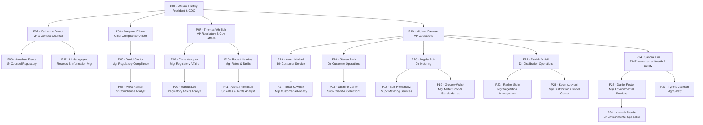

# Rockridge Power & Light Company — Organizational Chart

**As of:** 2025 Q1  
**Fictional entity — all persons and contacts are synthetic**

---

## Indented Hierarchy

- **P01 — William Hartley** · President & Chief Operating Officer · Executive · LAF
  - **P02 — Catherine Brandt** · VP & General Counsel · Legal · LAF
    - **P03 — Jonathan Pierce** · Senior Counsel, Regulatory · Legal · LAF
    - **P12 — Linda Nguyen** · Records & Information Manager · Legal · LAF
  - **P04 — Margaret Ellison** · Chief Compliance Officer · Compliance · LAF
    - **P05 — David Okafor** · Manager, Regulatory Compliance · Compliance · LAF
      - **P06 — Priya Raman** · Senior Compliance Analyst · Compliance · LAF
  - **P07 — Thomas Whitfield** · VP, Regulatory & Government Affairs · Regulatory Affairs · LAF
    - **P08 — Elena Vasquez** · Manager, Regulatory Affairs · Regulatory Affairs · LAF
      - **P09 — Marcus Lee** · Regulatory Affairs Analyst · Regulatory Affairs · LAF
    - **P10 — Robert Haskins** · Manager, Rates & Tariffs · Regulatory Affairs · LAF
      - **P11 — Aisha Thompson** · Senior Rates & Tariffs Analyst · Regulatory Affairs · LAF
  - **P16 — Michael Brennan** · VP, Operations · Operations · LAF
    - **P13 — Karen Mitchell** · Director, Customer Service · Customer Operations · LAF
      - **P17 — Brian Kowalski** · Manager, Customer Advocacy & Complaint Resolution · Customer Operations · LAF
    - **P14 — Steven Park** · Director, Customer Operations · Customer Operations · LAF
      - **P15 — Jasmine Carter** · Supervisor, Credit & Collections · Customer Operations · LAF
    - **P20 — Angela Ruiz** · Director, Metering · Metering · LAF
      - **P18 — Luis Hernandez** · Supervisor, Metering Services · Metering · THT
      - **P19 — Gregory Walsh** · Manager, Meter Shop & Standards Laboratory · Metering · LAF
    - **P21 — Patrick O'Neill** · Director, Distribution Operations · Distribution Operations · LAF
      - **P22 — Rachel Stein** · Manager, Vegetation Management Program · Distribution Operations · CRW
      - **P23 — Kevin Adeyemi** · Manager, Distribution Control Center · Distribution Operations · LAF
    - **P24 — Sandra Kim** · Director, Environmental, Health & Safety · EHS · LAF
      - **P25 — Daniel Foster** · Manager, Environmental Services · EHS · LAF
        - **P26 — Hannah Brooks** · Senior Environmental Specialist · EHS · LAF
      - **P27 — Tyrone Jackson** · Manager, Safety · EHS · LAF

---

## Mermaid Org Chart

---

## Document Ownership Matrix

> **Route key:** Owner submits draft → Reviewer comments → Approver signs off.  
> Two-signature documents (RPL-CS-PRO-007, RPL-CS-PRO-011) require both Owner and Reviewer signatures; no separate Approver.

| Doc ID | Title | Owner | Reviewer | Approver | Default Route |
|--------|-------|-------|----------|----------|---------------|
| RPL-CMP-REG-001 | Regulatory Obligations Register | P06 · Priya Raman | P05 · David Okafor | P04 · Margaret Ellison | P06 → P05 → P04 |
| RPL-REG-CAL-2025 | Regulatory Reporting Calendar 2025 | P09 · Marcus Lee | P08 · Elena Vasquez | P07 · Thomas Whitfield | P09 → P08 → P07 |
| RPL-LEG-RRS-001 | Records Retention Schedule | P12 · Linda Nguyen | P03 · Jonathan Pierce | P02 · Catherine Brandt | P12 → P03 → P02 |
| RPL-TAR-GRR-012 | Tariff for Electric Service IURC No. 12 — General Rules & Regulations | P11 · Aisha Thompson | P10 · Robert Haskins | P03 · Jonathan Pierce | P11 → P10 → P03 |
| RPL-CS-PRO-004 | Disconnection Reconnection & Winter Protection Procedure | P15 · Jasmine Carter | P13 · Karen Mitchell | P03 · Jonathan Pierce | P15 → P13 → P03 |
| RPL-CS-PRO-007 | Meter Test Request & Billing Adjustment Procedure | P18 · Luis Hernandez | P14 · Steven Park | *(two-sig: P18 + P14)* | P18 → P14 (co-sign) |
| RPL-DO-PLN-002 | Vegetation Management Plan 2025 | P22 · Rachel Stein | P21 · Patrick O'Neill | P03 · Jonathan Pierce | P22 → P21 → P03 |
| RPL-CS-PRO-011 | Customer Complaint & Dispute Resolution Procedure | P17 · Brian Kowalski | P13 · Karen Mitchell | *(two-sig: P17 + P13)* | P17 → P13 (co-sign) |
| RPL-MTR-PGM-001 | Meter Testing Program Plan | P19 · Gregory Walsh | P20 · Angela Ruiz | P16 · Michael Brennan | P19 → P20 → P16 |
| RPL-DCC-PRO-003 | Service Interruption Reporting Procedure | P23 · Kevin Adeyemi | P21 · Patrick O'Neill | P08 · Elena Vasquez | P23 → P21 → P08 |
| RPL-ENV-PRO-005 | Spill Response & Reporting Procedure | P26 · Hannah Brooks | P25 · Daniel Foster | P24 · Sandra Kim | P26 → P25 → P24 |
| RPL-SAF-PRO-009 | Electrical Accident & Incident Reporting Procedure | P27 · Tyrone Jackson | P24 · Sandra Kim | P08 · Elena Vasquez | P27 → P24 → P08 |

---

## On-Call Roles Summary

| OMS Paging Group | Primary | Alternate | Notes |
|-----------------|---------|-----------|-------|
| ENV-ONCALL | P26 · Hannah Brooks | P25 · Daniel Foster | Weekly rotation Mon 08:00; pool includes two additional unnamed specialists (Lafayette and Terre Haute); ultimate backup P24 Sandra Kim |
| SAF-ONCALL | P27 · Tyrone Jackson | P24 · Sandra Kim | Safety Manager on-call for Tier 1–2 incidents |
| REG-ONCALL | P08 · Elena Vasquez | P07 · Thomas Whitfield | Regulatory escalation for urgent IURC / reporting deadlines |
| DCC-ESCALATION | P23 · Kevin Adeyemi | P21 · Patrick O'Neill | DCC is staffed 24/7; P23 is on-call escalation manager |

---

*All personnel, extensions, and contact information are fictional and generated for corpus testing purposes only.*
