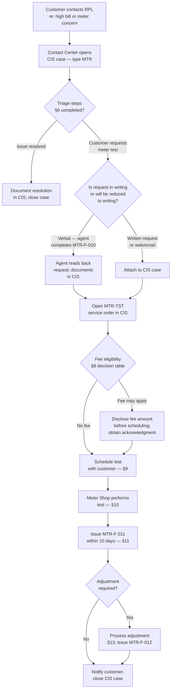

<!-- DOCUMENT CONTROL BLOCK — Uncontrolled when printed — verify current version in DCS -->

| Field | Value |
|---|---|
| **Document ID** | RPL-CS-PRO-007 |
| **Title** | Meter Test Request & Billing Adjustment Procedure |
| **Version** | 3.0 |
| **Effective Date** | 2025-02-17 |
| **Approved Date** | 2025-02-12 |
| **Law As-Of** | 2024-12-31 |
| **Prepared and Approved By** | Luis Hernandez — Supervisor, Metering Services |
| **Reviewed and Approved By** | Steven Park — Director, Customer Operations |
| **Classification** | Internal |
| **Review Cycle** | Annual |
| **Supersedes** | RPL-CS-PRO-007 v2.1 (2023-11-06) |
| **Owner Department** | Metering Services |
| **DCS Location** | Metering / Procedures |

> **Uncontrolled when printed — verify the current version in DCS before use.**

---

## Table of Contents

1. Purpose
2. Scope
3. Definitions
4. Regulatory Basis
5. Roles and Responsibilities
6. High-Bill Triage Before a Test
7. Customer Request Intake
8. Eligibility and Fees
9. Scheduling, Removal, and Chain of Custody
10. Test Execution and Accuracy Determination
11. Reporting Results to the Customer
12. Commission-Supervised Tests
13. Billing Adjustments
14. Adjustment Approval Authority
15. Worked Examples
16. Records and Retention
17. Training
18. Related Documents
19. Revision History
20. Approval Block

**Appendices**

- App-A: MTR-F-010 Meter Test Request Form
- App-B: MTR-F-011 Meter Test Report Letter
- App-C: MTR-F-012 Billing Adjustment Letter
- App-D: MTR-F-013 Meter Chain-of-Custody Tag
- App-E: CS-S-07 Contact Center Script — High Bill to Meter Test Request

---

## 1. Purpose

<!-- clause: RPL-CS-PRO-007:1.1 -->
1.1 This procedure establishes the steps that Contact Center agents, Billing Adjustment Analysts, and Meter Technicians at Rockridge Power & Light Company ("RPL" or "Company") follow when a customer questions the accuracy of a meter or disputes a bill, from initial high-bill triage through meter testing, results reporting, and any required billing adjustment. It operationalizes the Company's obligations under 170 IAC 4-1-4 through 4-1-14 and the corresponding provisions of Tariff Rule 9 (Sheets 27–29) and Rule 12 (Sheets 35–36) of RPL-TAR-GRR-012.

<!-- clause: RPL-CS-PRO-007:1.2 -->
1.2 This procedure does not govern periodic in-service testing or quality-control sampling under RPL's Meter Testing Program Plan (RPL-MTR-PGM-001), which is a separate controlled document. Standards laboratory calibration and equipment certification requirements are addressed in both RPL-MTR-PGM-001 and cross-referenced in §10 of this procedure.

---

## 2. Scope

<!-- clause: RPL-CS-PRO-007:2.1 -->
2.1 **Residential customers.** This procedure applies to all residential customers of RPL who request a meter accuracy test or dispute a bill, regardless of meter technology (AMI solid-state, AMR solid-state, or electromechanical).

<!-- clause: RPL-CS-PRO-007:2.2 -->
2.2 **Non-residential customers.** This procedure applies to commercial, industrial, and public-authority customers who request a meter test or dispute a bill. Where a provision of 170 IAC 4-1 limits a right or obligation to residential customers (see §3, definition of "Customer" and the applicability note at 170 IAC 4-1-1(c)), this procedure identifies that limitation explicitly.

<!-- clause: RPL-CS-PRO-007:2.3 -->
2.3 **Meter technology classes.** This procedure covers RPL's three metered-fleet technologies as of 2024-12-31: 371,200 solid-state AMI meters, 31,400 solid-state AMR meters, and 7,350 electromechanical (legacy) meters. AMI communications and firmware checks specific to solid-state meters are addressed as company practice in §10.

<!-- clause: RPL-CS-PRO-007:2.4 -->
2.4 **Demand meters.** This procedure covers demand register accuracy, multiplier verification, and demand billing adjustments for all customers billed on demand-rate schedules.

<!-- clause: RPL-CS-PRO-007:2.5 -->
2.5 **Exclusions.** This procedure does not cover: (a) periodic or sample testing under RPL-MTR-PGM-001; (b) initial installation testing for new meters; or (c) meter tampering and unauthorized use investigations, which are handled under the revenue-protection process described at §13.6 and in accordance with Tariff Rule 16, Sheet 45 (F-8).

---

## 3. Definitions

<!-- clause: RPL-CS-PRO-007:3.1 -->
3.1 **As-found accuracy.** The measured average percentage registration of a meter at the time of test, before any adjustment is made. Calculated per 170 IAC 4-1-8: average accuracy = (full load accuracy + light load accuracy) ÷ 2.

<!-- clause: RPL-CS-PRO-007:3.2 -->
3.2 **As-left accuracy.** The average percentage registration of a meter after any calibration adjustment has been made and before the meter is returned to service. The as-left must be determined by tests at each load as required by 170 IAC 4-1-8(c).

<!-- clause: RPL-CS-PRO-007:3.3 -->
3.3 **Average accuracy.** The arithmetic mean of the percentage registration at full load (FL) and at light load (LL): average accuracy = (FL + LL) ÷ 2. (170 IAC 4-1-8(a))

<!-- clause: RPL-CS-PRO-007:3.4 -->
3.4 **Back-bill.** An invoice to the customer for electric service that was consumed but not billed, or underbilled, due to a meter error or billing error.

<!-- clause: RPL-CS-PRO-007:3.5 -->
3.5 **Billing error.** Any error in a customer bill other than a meter registration error, including but not limited to: application of an incorrect tariff rate, an incorrect multiplier, crossed meters, or errors resulting from estimated reads.

<!-- clause: RPL-CS-PRO-007:3.6 -->
3.6 **Commission-supervised test.** A meter accuracy or demand test performed by RPL or its contractor under the supervision of an Indiana Utility Regulatory Commission (IURC) employee, pursuant to a customer's application to the IURC under 170 IAC 4-1-12.

<!-- clause: RPL-CS-PRO-007:3.7 -->
3.7 **Creep (no-load registration).** Registration by a watthour meter when all load wires are disconnected, evidenced by the moving element making more than one (1) complete revolution. A meter exhibiting creep when the applied voltage is less than 110% of standard service voltage shall not be placed in service or allowed to remain in service. (170 IAC 4-1-9(a))

<!-- clause: RPL-CS-PRO-007:3.8 -->
3.8 **Customer.** For purposes of §§8, 11, and 12 of this procedure (fee rules, report timing, and appeals), "customer" means any person, firm, corporation, municipality, or other government agency that has agreed, orally or otherwise, to pay for electric service received from RPL; provided that for purposes of the test request rights in §7, §8, and §11, the term is limited to persons who have agreed to pay for service exclusively for residential purposes where that limitation is stated in 170 IAC 4-1-1(c). (170 IAC 4-1-1(c))

<!-- clause: RPL-CS-PRO-007:3.9 -->
3.9 **Fast meter.** A watthour meter whose as-found average accuracy exceeds 100%, meaning it registers more energy than was actually consumed, resulting in overcharges to the customer. A billing adjustment is required when the positive average error is greater than 3%. (170 IAC 4-1-14(A)(1))

<!-- clause: RPL-CS-PRO-007:3.10 -->
3.10 **Full load (FL).** The test point at approximately 100% of the rated test amperes of the meter, or, for current-transformer (CT) metered installations, approximately 100% of either the meter test amperes or the secondary current rating of the current transformers. (170 IAC 4-1-8(a))

<!-- clause: RPL-CS-PRO-007:3.11 -->
3.11 **Light load (LL).** The test point at approximately 10% of the rated test amperes of the meter, or, for CT-metered installations, approximately 10% of the selected full load current. (170 IAC 4-1-8(a))

<!-- clause: RPL-CS-PRO-007:3.12 -->
3.12 **Meter seal.** A one-time-use tamper-evident seal, identified by a unique seal number, applied to the meter at installation or after shop service. The seal number is recorded in WAM.

<!-- clause: RPL-CS-PRO-007:3.13 -->
3.13 **Multiplier.** The factor applied to the meter register reading to convert it to billed units (kWh or kW). For meters that do not read directly in kWh or demand units, the multiplier shall be checked and plainly marked on the meter or on a tag attached to the meter. (170 IAC 4-1-6(d))

<!-- clause: RPL-CS-PRO-007:3.14 -->
3.14 **Non-registering meter.** A meter that has stopped registering entirely, or registers only partially (e.g., a stuck disk on an electromechanical meter or a failed register on a solid-state meter). Treated as a stopped meter for adjustment purposes under 170 IAC 4-1-14(A)(2).

<!-- clause: RPL-CS-PRO-007:3.15 -->
3.15 **Power factor test point.** For watthour meters to be installed on circuits supplying inductive load (except self-contained meters), an additional test at 100% of manufacturer's rated test current at 50% lagging power factor, performed before installation. (170 IAC 4-1-9(b)(5))

<!-- clause: RPL-CS-PRO-007:3.16 -->
3.16 **Refund.** A credit issued to the customer's account, or a check payment, for electric service billed but not consumed due to a fast or incorrectly programmed meter.

<!-- clause: RPL-CS-PRO-007:3.17 -->
3.17 **Slow meter.** A watthour meter whose as-found average accuracy is below 100%, meaning it registers less energy than was actually consumed, resulting in undercharges to the customer. A billing adjustment is required when the negative average error exceeds 3% (i.e., accuracy below 97%). A stopped meter is treated as a special case of a slow meter. (170 IAC 4-1-14(A)(2))

<!-- clause: RPL-CS-PRO-007:3.18 -->
3.18 **Written request.** A request submitted in writing by the customer via U.S. mail to Rockridge Power, 400 Wabash Commons Drive, Lafayette, IN 47901; by email to customercare@rockridge-pl.example; through the customer web portal at www.rockridge-pl.example; or by completing MTR-F-010. A verbal request recorded by a Contact Center agent into CIS form MTR-F-010 and read back to the customer for confirmation constitutes a written request under this procedure. (170 IAC 4-1-11(a))

---

## 4. Regulatory Basis

<!-- clause: RPL-CS-PRO-007:4.1 -->
4.1 The following table lists the Indiana Administrative Code sections and RPL tariff rules that govern the processes in this procedure. All citations reflect the law as of 2024-12-31.

<!-- table: RPL-CS-PRO-007:T4 -->

| ID | Citation | Heading | Governs Section(s) |
|---|---|---|---|
| T4-1 | 170 IAC 4-1-2 | Applicability of rules | §2 |
| T4-2 | 170 IAC 4-1-4 | Records and reports of meter purchases and tests | §10, §16 |
| T4-3 | 170 IAC 4-1-5 | Location of meters; accessibility | §6 |
| T4-4 | 170 IAC 4-1-6 | Service watthour meters; inspection and repair; installation tests | §10, §13.5 |
| T4-5 | 170 IAC 4-1-7 | Meter testing equipment and facilities; reference and portable standards | §10 |
| T4-6 | 170 IAC 4-1-8 | Average accuracy of watthour meters; tests | §10, §3 |
| T4-7 | 170 IAC 4-1-9 | Accuracy of meters | §10, §13 |
| T4-8 | 170 IAC 4-1-10 | In-service tests; watthour meters, self-contained | §8 |
| T4-9 | 170 IAC 4-1-11 | Customer requests for tests; application to utility | §7, §8, §11 |
| T4-10 | 170 IAC 4-1-12 | Customer requests for tests; application to commission | §12 |
| T4-11 | 170 IAC 4-1-13 | Bills | §6, §13.5 |
| T4-12 | 170 IAC 4-1-14 | Billing adjustments | §13 |
| T4-13 | RPL-TAR-GRR-012 Rule 9 Sheets 27–29 | Metering | §9, §10 |
| T4-14 | RPL-TAR-GRR-012 Rule 12 Sheets 35–36 | Billing Adjustments | §13 |

> **Out-of-scope references (§2.7):** IC 8-1-2-34 and IC 8-1-2-35 establish the customer's statutory rights regarding meter accessibility and testing standards. RPL complies with both statutes. No values from these statutes are restated in this procedure; operational obligations under them are carried by this procedure through the 170 IAC 4-1 implementing rules listed above.

---

## 5. Roles and Responsibilities

<!-- clause: RPL-CS-PRO-007:5.1 -->
5.1 The following table assigns responsibilities for the processes in this procedure.

<!-- table: RPL-CS-PRO-007:T5 -->

| ID | Role | Person (if named) | Responsibilities |
|---|---|---|---|
| T5-1 | Supervisor, Metering Services | Luis Hernandez (P18) | Procedure owner; billing adjustment approvals $500.01–$5,000; escalation point for complex test requests |
| T5-2 | Director, Customer Operations | Steven Park (P14) | Procedure reviewer; billing adjustment approvals above $5,000 |
| T5-3 | Manager, Meter Shop & Standards Laboratory | Gregory Walsh (P19) | Commission-supervised test coordination; meter shop operations; test equipment certification |
| T5-4 | Director, Metering | Angela Ruiz (P20) | Departmental oversight of metering operations; standards laboratory accountability |
| T5-5 | Manager, Customer Advocacy & Complaint Resolution | Brian Kowalski (P17) | Receives copy of all adjustment notices on accounts with an open IURC complaint; liaison with IURC Consumer Affairs Division |
| T5-6 | Contact Center Agent | (staffed position) | High-bill triage (§6); intake of test requests (§7); CIS entry of MTR-TST service orders |
| T5-7 | Billing Adjustment Analyst | (staffed position) | Billing adjustment calculation and processing for amounts up to $500; issues MTR-F-012 letters; enters CIS adjustment codes |
| T5-8 | Meter Technician | (staffed position) | Physical meter removal, replacement, transport, test execution, and MTR-F-011 preparation |
| T5-9 | Customer (residential) | N/A | Initiates written test request; entitled to witness test (see §9); receives results per §11 |

---

## 6. High-Bill Triage Before a Test

> **Note:** High-bill triage is a company-practice diagnostic step, not a regulatory prerequisite. Triage must not delay or replace a meter test the customer is entitled to under 170 IAC 4-1-11. If the customer requests a test at any point during triage, the Contact Center agent proceeds immediately to §7.

<!-- clause: RPL-CS-PRO-007:6.1 -->
6.1 **Register read verification.** The Contact Center agent confirms the current and prior meter reads in CIS against the customer's stated reading. If the customer disputes the read, the agent verifies it against the most recent field read or AMI/AMR transmission. If the read appears incorrect (transposed digits, missed read), the agent initiates a reread work order (WAM work type `MTR-RRD`) before scheduling a full test. On AMI meters, the agent pulls the latest hourly register from the AMI HES portal and reviews it with the customer. Upon request by a residential customer, the agent provides the meter number from CIS so the customer may verify reads at the meter. (170 IAC 4-1-5(C))

<!-- clause: RPL-CS-PRO-007:6.2 -->
6.2 **AMI interval data review.** For AMI-metered accounts, the Contact Center agent accesses the AMI HES usage dashboard and reviews daily and hourly kWh data for the disputed period. The agent identifies: (a) any single-day usage spike exceeding 200% of the account's 30-day average; (b) nighttime base load inconsistent with the account type; and (c) gaps in hourly data that may indicate a communications or firmware issue. The agent explains the usage pattern to the customer in plain language and documents findings in the CIS case.

<!-- clause: RPL-CS-PRO-007:6.3 -->
6.3 **Weather normalization.** For residential accounts, the agent compares the disputed billing period degree-day count (available in CIS) against the same period in the prior year and the same customer's historical usage. A 15% or greater year-over-year increase in heating or cooling degree-days explains a proportional increase in energy consumption and the agent conveys this to the customer.

<!-- clause: RPL-CS-PRO-007:6.4 -->
6.4 **Crossed meters and multiplier check.** The agent confirms in WAM that the meter serial number on the bill matches the meter installed at the service address. The agent also confirms the billing multiplier in CIS against the multiplier in WAM. Any discrepancy between the CIS multiplier and WAM multiplier is treated as a billing error and escalated immediately to a Billing Adjustment Analyst.

<!-- clause: RPL-CS-PRO-007:6.5 -->
6.5 **Estimated bills.** The agent confirms whether any bill in the disputed period was estimated (CIS bill type "E"). An estimated bill issued by RPL is permissible only for good cause (customer request, inclement weather, labor or union disputes, inaccessibility after a reasonable read attempt, or other circumstances beyond the control of the utility). (170 IAC 4-1-13(d)) If estimated reads appear excessive or unjustified, the agent initiates a billing review and may propose a corrected actual-read bill without requiring a meter test.

<!-- clause: RPL-CS-PRO-007:6.6 -->
6.6 **Customer usage education and test offer.** After completing triage steps 6.1–6.5, the Contact Center agent summarizes findings for the customer and, in all cases where a triage step has not conclusively explained the high bill, offers the customer a formal meter test under §7. The agent reads CS-S-07 (App-E) for guidance on presenting the test option. Triage findings are documented in the CIS case (type MTR) as supporting detail for the test request or case closure.

---

## 7. Customer Request Intake

<!-- clause: RPL-CS-PRO-007:7.1 -->
7.1 **Written request requirement.** A customer request for a meter accuracy test must be in writing. (170 IAC 4-1-11(a)) The Contact Center agent records a verbal request on form MTR-F-010 (App-A), reads the recorded information back to the customer, and documents the call date, time, and agent ID in the CIS case. The completed MTR-F-010 constitutes the written request. The agent attaches the completed form to the CIS case before opening a service order.

<!-- clause: RPL-CS-PRO-007:7.2 -->
7.2 **Intake channels.** A customer may submit a test request by: (a) telephone to 1-800-555-0142 (24/7); (b) web portal at www.rockridge-pl.example (generates a secure message and MTR-F-010 pre-fill); (c) email to customercare@rockridge-pl.example; or (d) written letter mailed to Rockridge Power, Customer Advocacy, 400 Wabash Commons Drive, Lafayette IN 47901. The Contact Center agent confirms receipt of written submissions within one business day and opens the CIS case at that time.

<!-- clause: RPL-CS-PRO-007:7.3 -->
7.3 **CIS service order.** The Contact Center agent opens a CIS service order with type code `MTR-TST` and attaches the account number, service address, meter number (from CIS), customer-stated reason for the request, preferred contact method, and a flag for whether the customer wishes to witness the test (see §9.4). The agent documents all triage steps taken in the case notes before saving.

<!-- clause: RPL-CS-PRO-007:7.4 -->
7.4 **Acknowledgment.** The Contact Center agent confirms to the customer (verbally, or in the web portal confirmation) that a test will be scheduled and that the customer will receive a written test report (MTR-F-011) within ten (10) days after the test is completed. (170 IAC 4-1-11(d))

<!-- clause: RPL-CS-PRO-007:7.5 -->
7.5 **IURC complaint hold.** Before creating the service order, the agent checks CIS for an active hold code `HIURC`. If present, the agent applies a `HDSP` hold and copies Brian Kowalski (P17) on the case. All subsequent communications on the account are routed per RPL-CS-PRO-011.

<!-- clause: RPL-CS-PRO-007:7.6 -->
7.6 **Training reference.** Contact Center agents handling high-bill calls and meter test intake use script CS-S-07 (App-E) and are trained under CS-T-07. (See §17.)

---

## 8. Eligibility and Fees

<!-- clause: RPL-CS-PRO-007:8.1 -->
8.1 The following decision table determines whether a fee is charged for a customer-requested meter test. Fee amounts are set by Tariff Rule 16, Sheet 45 (§1.6 Table F, F-9): $40.00 for residential/single-phase meters; $95.00 for polyphase/demand meters. A fee may not be charged until RPL discloses the fee amount to the customer prior to the test being performed. (170 IAC 4-1-11(c)) If the customer declines to pay, the Contact Center agent documents the declination in CIS and the test is not scheduled unless the customer subsequently agrees.

<!-- table: RPL-CS-PRO-007:T8 -->

| ID | Request Situation | Fee Charged? | Condition / Basis | Fee Refunded If Test Finds Meter Non-Compliant? | Citation | CIS Code |
|---|---|---|---|---|---|---|
| T8-1 | First test at customer's request, any reason | **No** | The first test of a customer's meter is at no cost. | N/A — no fee charged | 170 IAC 4-1-11(a) | MTR-TST |
| T8-2 | Second test at customer's request, ≥12 months after the first customer-requested test | **No** | The second test is at no cost; may be requested after 12 months. | N/A — no fee charged | 170 IAC 4-1-11(a) | MTR-TST |
| T8-3 | Second test at customer's request, <12 months after the first customer-requested test | **No** | Company position: RPL performs the second test at no charge regardless of the interval since the first request; the 12-month language in 170 IAC 4-1-11(a) sets the customer's right, not a prohibition on earlier tests. | N/A — no fee charged | Company practice | MTR-TST |
| T8-4 | Third or subsequent test at customer's request or for a billing dispute, where all three fee conditions are met: (1) meter was tested within the prior 36 months at the customer's request AND found to comply with 170 IAC 4-1-10(c)(4)–(c)(5); (2) this test is at the customer's request or due to a billing dispute; and (3) this test finds the meter compliant with 170 IAC 4-1-10(c)(4)–(c)(5) | **Yes** — $40.00 residential / $95.00 polyphase | All three conditions under 170 IAC 4-1-11(b) must be met. Company position: RPL applies the 10(c)(4)–(c)(5) accuracy limits (98%–102% at full load) on a single-meter basis as the individual accuracy standard when assessing compliance for fee purposes, since those lot-level limits represent the standard accuracy specification. | Not applicable — fee confirmed by test outcome | 170 IAC 4-1-11(b); Company practice (single-meter application) | MTR-TST |
| T8-5 | Third or subsequent test meeting conditions (1) and (2) in T8-4, but the meter is found non-compliant (fails accuracy limits) | **No** — or fee refunded if already collected | Condition (3) is not met; the customer bears no cost. If a fee was collected before the outcome was known, it is refunded or credited. | Yes — refunded | 170 IAC 4-1-11(b) | MTR-TST; ADJ-BE |
| T8-6 | Test initiated by RPL as part of normal operations (not at customer request) | **No** | Customer bears no cost for utility-initiated tests. | N/A | Company practice | MTR-TST |
| T8-7 | Commission-supervised test (§12) under 170 IAC 4-1-12 | **No**, except as under T8-4 conditions | No fee is payable by the customer for a commission-supervised test, except as charged under 170 IAC 4-1-11(b) (T8-4 conditions). | Yes, if T8-4 conditions applied but meter found non-compliant | 170 IAC 4-1-12(a) | MTR-TST |

> **Caution:** A meter that fails the in-service accuracy standard of 170 IAC 4-1-9(b) (average error >2%, full load error >1%, or light load error >3%) but has average error ≤3% does not trigger a billing adjustment under 170 IAC 4-1-14(A). Such a meter must be adjusted or replaced, but no billing change is required. The Billing Adjustment Analyst documents this outcome in CIS with code `ADJ-BE` (no net adjustment, reason noted).

---

## 9. Scheduling, Removal, and Chain of Custody

<!-- clause: RPL-CS-PRO-007:9.1 -->
9.1 **In-place versus shop test.** The Supervisor, Metering Services (P18) determines whether the test will be performed in place (for AMI meters where the head-end can command a self-test) or in the Meter Shop & Standards Laboratory at Lafayette HQ (for all electromechanical meters and solid-state meters when an in-place test is not technically feasible). Shop testing requires physical removal of the meter from the service entrance.

<!-- clause: RPL-CS-PRO-007:9.2 -->
9.2 **Scheduling.** The Contact Center agent or Meter Technician contacts the customer within three (3) business days of opening the MTR-TST service order to schedule the test. Internal performance target: test appointment offered within five (5) calendar days of receipt of written request. At least two available appointment windows must be offered. The appointment date, time window, and technician name are recorded in WAM.

<!-- clause: RPL-CS-PRO-007:9.3 -->
9.3 **Customer right to witness.** The customer is entitled to be present during the test, both for the meter removal and for the shop test. (Company practice in alignment with customer-service standards; the IURC has observed utility practice on this point.) The Contact Center agent records the customer's witness election on MTR-F-010, field F010.F7.

<!-- clause: RPL-CS-PRO-007:9.4 -->
9.4 **IURC complaint hold — meter preservation.** Upon receiving notice from the IURC of a customer's written application to the IURC for a supervised test under 170 IAC 4-1-12, RPL shall not remove, interfere with, or discard the customer's meter until the test is completed without the prior written consent of the customer, unless the removal of the meter is required in order to perform the requested test. (170 IAC 4-1-12(c)) Gregory Walsh (P19) places a WAM hold on the meter record immediately upon receiving IURC notification.

<!-- clause: RPL-CS-PRO-007:9.5 -->
9.5 **Meter removal.** The Meter Technician disconnects and removes the customer meter using standard tools and EHS procedures. The technician photographs the meter in place before removal (WAM work order photo attachment, type MTR-PRE-REMOVAL) and records the meter serial number, seal numbers (both original and replacement), and the as-installed multiplier from the nameplate.

<!-- clause: RPL-CS-PRO-007:9.6 -->
9.6 **Replacement meter installation.** The Meter Technician installs a temporary replacement meter at the time of removal to restore service. The replacement meter is drawn from the tested-meter pool in WAM (only meters with a current in-service accuracy certification may be used). The replacement meter serial number and seal number are recorded in WAM and entered into CIS by the end of the same business day.

<!-- clause: RPL-CS-PRO-007:9.7 -->
9.7 **Chain-of-custody tag.** The Meter Technician affixes form MTR-F-013 (App-D) to the removed meter immediately after removal. The tag records the account number, service address, meter serial number, removal date and time, technician name and ID, seal numbers, and a unique custody tag number generated by WAM. No further handling of the meter is permitted without the tag attached.

<!-- clause: RPL-CS-PRO-007:9.8 -->
9.8 **Sealed container.** The removed meter is placed in a sealed transit container (RPL-approved plastic storage container with a numbered security seal) for transport to Lafayette HQ. The container seal number is recorded on MTR-F-013 and in WAM. The container is sealed in the presence of the customer if the customer is present and has elected to witness the test.

<!-- clause: RPL-CS-PRO-007:9.9 -->
9.9 **Transport.** The container is transported in the Meter Technician's RPL service vehicle directly to the Meter Shop & Standards Laboratory at Lafayette HQ. The meter shall not be stored in the vehicle overnight. On the same business day as removal, the Meter Technician delivers the sealed container to the Meter Shop cage and records the delivery in the WAM custody log (work type MTR-DELIVERY).

<!-- clause: RPL-CS-PRO-007:9.10 -->
9.10 **Secure storage.** The Meter Shop cage at Lafayette HQ is the designated secure storage location for all customer-requested test meters pending test. Access is limited to Meter Technicians and the Manager, Meter Shop & Standards Laboratory (P19). The cage is locked when unattended. The WAM custody log records every access (in/out, date, time, employee ID).

<!-- clause: RPL-CS-PRO-007:9.11 -->
9.11 **Meter retention.** The removed meter is retained in the Meter Shop until: (a) the test is complete and the five (5)-day IURC appeal window under 170 IAC 4-1-11(e) has expired without appeal; or (b) in the case of a commission-supervised test, until the IURC notifies RPL that the test is complete. The meter shall not be disposed of, retired, or returned to inventory during this retention period without written authorization from P19.

> **Caution:** Premature disposal of a test meter may violate 170 IAC 4-1-12(c) and compromise an IURC proceeding. When in doubt, retain. P19 is the final authority on disposal timing.

---

## 10. Test Execution and Accuracy Determination

<!-- clause: RPL-CS-PRO-007:10.1 -->
10.1 **Standards traceability.** All test equipment used for customer-requested meter tests is maintained and certified under RPL-MTR-PGM-001. Reference standards shall be tested and adjusted, if needed, at least once every two (2) years by a recognized standardizing laboratory. (170 IAC 4-1-7(C)) Portable watthour meter standards are checked against the corresponding reference standards; if any portable standard shows error greater than one percent (1%) plus or minus at any load at which the standard will be used, the portable standard shall be tested, adjusted, and certified before being used. (170 IAC 4-1-7(D)) Portable indicating electrical instruments are checked against reference standards; if found to be in error at zero of more than one percent (1%) of full scale value at commonly used scale deflection, they shall be adjusted and certified. (170 IAC 4-1-7(E)) Records of all certification and calibration are kept on file at the Meter Shop. (170 IAC 4-1-7(F))

<!-- clause: RPL-CS-PRO-007:10.2 -->
10.2 **As-found test — no adjustment before testing.** The Meter Technician performs the as-found accuracy test before making any adjustment to the meter. The as-found condition is the legally operative accuracy for billing adjustment calculations. Any adjustment made before the as-found test invalidates the test result for adjustment purposes.

<!-- clause: RPL-CS-PRO-007:10.3 -->
10.3 **Test points — watthour meters.** The Meter Technician tests at: (a) full load (FL): approximately 100% of rated test amperes; and (b) light load (LL): approximately 10% of rated test amperes. For CT-metered installations, full load is approximately 100% of meter test amperes or the secondary current rating of the current transformers, and light load is approximately 10% of the selected full load current. (170 IAC 4-1-8(a))

<!-- clause: RPL-CS-PRO-007:10.4 -->
10.4 **Number of test runs.** The accuracy at light load is determined by taking the average of at least two (2) tests, which must agree within one-half of one percent (0.5%), unless the meter is tested by an automated device, in which case one (1) test is sufficient. The accuracy at full load is determined in the same manner. (170 IAC 4-1-8(b)) Exception: the average as-found accuracy may be determined from one (1) light load test and one (1) full load test if (1) the average accuracy is less than 103% and (2) the meter is to be adjusted. (170 IAC 4-1-8(b))

<!-- clause: RPL-CS-PRO-007:10.5 -->
10.5 **Average accuracy calculation.** Average accuracy = (FL + LL) ÷ 2. The Meter Technician records FL accuracy, LL accuracy, and average accuracy in MTR-F-011. (170 IAC 4-1-8(a))

<!-- clause: RPL-CS-PRO-007:10.6 -->
10.6 **Accuracy limits and pass/fail determination.** A watthour meter passes if all of the following limits are met: (1) average error not over two percent (2%), plus or minus; (2) full load error not over one percent (1%), plus or minus; (3) light load error not over three percent (3%), plus or minus. (170 IAC 4-1-9(b)(1)) A meter exceeding any of these limits has failed the in-service accuracy standard and must be adjusted or replaced. A meter's billing adjustment eligibility under §13.1 or §13.2 is determined separately, using the 3% average error threshold under 170 IAC 4-1-14(A).

> **Note:** A meter may fail the 170 IAC 4-1-9(b) in-service accuracy standard (average error >2%) but not meet the billing adjustment threshold (average error ≤3%). In that case, the meter must be adjusted or replaced, but no billing adjustment is made. The Meter Technician documents this outcome on MTR-F-011 and notifies the Billing Adjustment Analyst.

<!-- clause: RPL-CS-PRO-007:10.7 -->
10.7 **No-load creep test.** The Meter Technician verifies that the meter does not register with all load wires disconnected (i.e., the moving element does not make more than one complete revolution when at no load), with applied voltage less than 110% of standard service voltage. A meter exhibiting creep in this condition shall not be returned to service. (170 IAC 4-1-9(a))

<!-- clause: RPL-CS-PRO-007:10.8 -->
10.8 **Demand register and integrating demand meter tests.** For meters with integrating demand registers, the Meter Technician verifies: (a) the electrical element meets the watthour meter limits in §10.6; (b) timing element cumulative error does not exceed 2% for the billing period; and (c) for time-of-use (TOU) demand registers, the register indicates correct time within ten (10) minutes under normal service conditions; any TOU error caused by temporary loss of utility service is corrected by the end of the following work day. (170 IAC 4-1-9(b)(3)) For lagged demand meters, electromagnetic type error shall not exceed 2%, and thermal type error shall not exceed 4%, of full scale indication. (170 IAC 4-1-9(b)(4))

<!-- clause: RPL-CS-PRO-007:10.9 -->
10.9 **Power factor test for inductive load circuits.** For watthour meters, except self-contained meters, to be used on circuits supplying inductive load, the Meter Technician tests the meter before installation at 100% of manufacturer's rated test current at 50% lagging power factor. The error under these conditions shall not exceed 2%, plus or minus. (170 IAC 4-1-9(b)(5)) This test is performed at the time of replacement meter installation, not during the test of the removed meter.

<!-- clause: RPL-CS-PRO-007:10.10 -->
10.10 **CT instrument transformer verification.** For CT-metered installations, the Meter Technician confirms that the ratio of transformation and phase angle error of the instrument transformers are on file in WAM before any test result is accepted as final. (170 IAC 4-1-9(c)) If transformer data is missing from WAM, P19 obtains it before the test report is issued.

<!-- clause: RPL-CS-PRO-007:10.11 -->
10.11 **AMI solid-state meter — communications and firmware check.** For AMI meters (company practice): the Meter Technician confirms that the head-end in the AMI HES shows a successful two-way communication session within the last 24 hours for the account, and that the firmware version matches the approved firmware table in WAM. Any firmware anomaly is escalated to the AMI Systems team before the test report is finalized.

<!-- clause: RPL-CS-PRO-007:10.12 -->
10.12 **As-left accuracy.** After any adjustment is made, the Meter Technician determines the as-left accuracy at each load as outlined in §10.4. (170 IAC 4-1-8(c)) The as-left accuracy is recorded on MTR-F-011 alongside the as-found results.

<!-- clause: RPL-CS-PRO-007:10.13 -->
10.13 **Test record (MTR-F-011).** The Meter Technician prepares form MTR-F-011 (App-B) at the time of test. The record must contain, at minimum: the meter identifier; the reason for the test; the meter reading before the test; the as-found FL and LL results and average accuracy; the pass/fail determination; the adjustment action taken (if any); and the as-left results. (170 IAC 4-1-4(a)) The completed MTR-F-011 is filed in WAM under the meter record and attached to the CIS case.

---

## 11. Reporting Results to the Customer

<!-- clause: RPL-CS-PRO-007:11.1 -->
11.1 **Written report timing.** The Meter Technician or Billing Adjustment Analyst issues a written test report to the customer, using form MTR-F-011 formatted as a letter (App-B), within ten (10) days after the test is complete. (170 IAC 4-1-11(d)) Internal performance target: issue within five (5) calendar days of the test completion date. The report date and method of delivery (mail, email, portal) are recorded in CIS.

<!-- clause: RPL-CS-PRO-007:11.2 -->
11.2 **Required content of the report.** The written report must include: (a) the account number and service address; (b) the meter serial number and type; (c) the test date and location; (d) the as-found FL and LL results and average accuracy; (e) the pass/fail determination under §10.6; (f) whether a billing adjustment was made and the amount; (g) the customer's appeal rights and the appeal deadline under §11.3; and (h) RPL contact information and the IURC contact block. (170 IAC 4-1-11(d); 170 IAC 4-1-4(a))

<!-- clause: RPL-CS-PRO-007:11.3 -->
11.3 **Appeal rights.** The customer may appeal the results of the meter test to the IURC by filing an appeal with the Commission under 170 IAC 4-1-12 within five (5) days of the date of the report. (170 IAC 4-1-11(e)) The written report includes the following IURC contact block verbatim:

> **Indiana Utility Regulatory Commission (IURC) — Consumer Affairs Division**
> 1-800-851-4268 (toll-free) · 317-232-2712
> PNC Center, 101 W. Washington Street, Suite 1500E, Indianapolis, IN 46204
> Hours: 8:15 a.m.–4:45 p.m. ET, Monday–Friday
> Online complaints: iurc.portal.in.gov

<!-- clause: RPL-CS-PRO-007:11.4 -->
11.4 **No adjustment required — closure.** If the test determines that no billing adjustment is required (meter passed accuracy limits and no billing error found), the Billing Adjustment Analyst updates CIS with the test outcome, closes the MTR-TST service order, and mails or emails the MTR-F-011 report letter to the customer.

<!-- clause: RPL-CS-PRO-007:11.5 -->
11.5 **Adjustment required.** If a billing adjustment is required under §13, the Billing Adjustment Analyst processes the adjustment in CIS before issuing the MTR-F-011 report. The MTR-F-011 and MTR-F-012 (Billing Adjustment Letter) are issued to the customer together. See §13 for adjustment procedures.

<!-- clause: RPL-CS-PRO-007:11.6 -->
11.6 **Record retention.** The complete test record, including the MTR-F-011, is kept on file in WAM under the meter record and in CIS under the customer account, in record series RRS-MTR-002. (170 IAC 4-1-11(d)) See §16 for retention periods.

---

## 12. Commission-Supervised Tests

<!-- clause: RPL-CS-PRO-007:12.1 -->
12.1 **IURC notification to RPL.** Upon application of any customer to the IURC, and at the IURC's discretion, a test of the customer's watthour meter or an electric demand test may be ordered to be made by RPL or its contractor under the supervision of an IURC employee. The IURC shall promptly notify RPL of any such application. (170 IAC 4-1-12(a), (b)) The Contact Center agent forwards IURC notification to Gregory Walsh (P19) on the same business day received.

<!-- clause: RPL-CS-PRO-007:12.2 -->
12.2 **Meter hold.** Upon receiving IURC notification, P19 immediately places a WAM preservation hold on the customer's meter (hold type MTR-HOLD-IURC). RPL shall not remove, interfere with, or discard the customer's meter until the test is completed, without the prior written consent of the customer, unless removal is required in order to perform the requested test. (170 IAC 4-1-12(c)) Brian Kowalski (P17) is notified and a `HIURC` hold is confirmed in CIS.

<!-- clause: RPL-CS-PRO-007:12.3 -->
12.3 **Test conditions for demand tests.** When an IURC-supervised demand test is ordered, the test is made as soon as practicable after receipt of the application and under exactly similar conditions of installation and operation as may be mutually agreed upon in writing by the customer and RPL. (170 IAC 4-1-12(b)) P19 coordinates the written agreement with the customer and the IURC before scheduling.

<!-- clause: RPL-CS-PRO-007:12.4 -->
12.4 **Fee for commission-supervised tests.** No fee is payable by the customer for a commission-supervised test, except as may be charged under 170 IAC 4-1-11(b) (the three-condition fee rule in §8, T8-4). (170 IAC 4-1-12(a)) If a fee may apply, P18 reviews the eligibility conditions before the test and communicates the determination to the customer in writing, prior to the test.

<!-- clause: RPL-CS-PRO-007:12.5 -->
12.5 **Records.** The Meter Technician prepares MTR-F-011 as required by §10.13. P19 prepares a memo for the CIS case documenting the IURC coordination, the IURC representative's name and badge number, and the test completion date. The memo is attached to the case record in RRS-MTR-002.

---

## 13. Billing Adjustments

> **Note:** Adjustments are calculated on the basis of metered quantities (kWh and/or demand units) or billed charges, as specified in each subsection. Interest is not included in RPL's standard adjustment calculation; this is company practice. Payment arrangements for back-bills are available under RPL's standard installment plan policy (company practice); contact the Billing Adjustment Analyst.

### 13.1 Fast Meter

<!-- clause: RPL-CS-PRO-007:13.1.1 -->
13.1.1 **Trigger.** When a watthour meter is found to have a positive average error greater than three percent (3%), the meter is "fast" and a refund or account credit is required. (170 IAC 4-1-14(A)(1)) CIS code: `ADJ-MF`.

<!-- clause: RPL-CS-PRO-007:13.1.2 -->
13.1.2 **Adjustment period.** The Billing Adjustment Analyst determines the period for which the meter was fast. If the start date of the fast condition can be determined from AMI interval data, WAM fault records, or other evidence, the period is the determinable fast period or one (1) year, whichever is shorter. If the start date cannot be determined, the adjustment covers one (1) year preceding the test date. (170 IAC 4-1-14(A)(1))

<!-- clause: RPL-CS-PRO-007:13.1.3 -->
13.1.3 **Refund calculation.** RPL refunds the customer the excess charges for the adjustment period. The excess for each billing period is calculated as: excess = billed_amount × (accuracy − 100) ÷ accuracy. An average bill basis may be used if individual period adjustment is not feasible. The average bill is calculated from kilowatthours and/or demand units registered over corresponding periods either prior or subsequent to the fast period. (170 IAC 4-1-14(A)(1)) No part of a minimum service charge is refunded. (170 IAC 4-1-14(A)(1))

<!-- clause: RPL-CS-PRO-007:13.1.4 -->
13.1.4 **Refund method.** The Billing Adjustment Analyst issues a credit to the customer's account, reflected on the next bill, or, if the customer has closed the account or requests a check, issues a refund check within thirty (30) calendar days of the adjustment calculation. MTR-F-012 (App-C) is mailed or emailed to the customer with the MTR-F-011 report.

<!-- clause: RPL-CS-PRO-007:13.1.5 -->
13.1.5 **Approval.** Adjustments up to $500 are approved by a Billing Adjustment Analyst. Adjustments from $500.01 to $5,000 require approval by Luis Hernandez (P18), Supervisor, Metering Services. Adjustments above $5,000 require approval by Steven Park (P14), Director, Customer Operations. See §14 for the full authority table.

### 13.2 Slow Meter

<!-- clause: RPL-CS-PRO-007:13.2.1 -->
13.2.1 **Trigger.** When a watthour meter is found to have a negative average error greater than three percent (3%) (i.e., as-found accuracy below 97%), the meter is "slow" and RPL may charge the customer for the underregistered energy. (170 IAC 4-1-14(A)(2)) CIS code: `ADJ-MS`.

<!-- clause: RPL-CS-PRO-007:13.2.2 -->
13.2.2 **Adjustment period.** The back-bill period is the shorter of: (a) one-half of the period since the last previous test; or (b) one (1) year. (170 IAC 4-1-14(A)(2)) The Billing Adjustment Analyst obtains the date of the last previous test from WAM before calculating.

<!-- clause: RPL-CS-PRO-007:13.2.3 -->
13.2.3 **Back-bill calculation.** The back-bill is estimated on the basis of kilowatthours and/or demand units registered over corresponding periods either prior or subsequent to the slow period (average bill method), or by individual period adjustment for the percent of error. (170 IAC 4-1-14(A)(2))

<!-- clause: RPL-CS-PRO-007:13.2.4 -->
13.2.4 **Negligence exception.** RPL shall not charge the customer for a slow meter adjustment if RPL negligently allowed the slow meter to remain in service. (170 IAC 4-1-14(A)(2)) The Billing Adjustment Analyst documents in the CIS case whether any utility-initiated inspection or in-service test should have detected the slow condition earlier. If evidence of negligence exists, P18 reviews before any back-bill is issued.

<!-- clause: RPL-CS-PRO-007:13.2.5 -->
13.2.5 **Payment arrangements.** If the back-bill exceeds the customer's average monthly bill, the Billing Adjustment Analyst offers a payment arrangement. The arrangement is documented in CIS under code `HPAY` (company practice).

### 13.3 Non-Registering or Partially Registering Meter

<!-- clause: RPL-CS-PRO-007:13.3.1 -->
13.3.1 **Trigger.** A meter that has fully stopped registering (zero reads on AMR/CIS, or confirmed stopped disk on electromechanical) or is partially registering (consistent undercount) is treated as a stopped or slow meter under 170 IAC 4-1-14(A)(2). CIS code: `ADJ-NR`.

<!-- clause: RPL-CS-PRO-007:13.3.2 -->
13.3.2 **Adjustment period and estimation basis.** The adjustment period and estimation method follow §13.2.2 and §13.2.3. For a fully stopped meter, the estimate of unbilled consumption is based on corresponding prior-period usage or subsequent-period usage after the replacement meter is installed. Minimum service charges already billed and paid are credited against the estimated charges, not double-collected.

<!-- clause: RPL-CS-PRO-007:13.3.3 -->
13.3.3 **AMR zero-read alert.** Meter Shop personnel review the AMR/AMI head-end weekly for accounts showing zero reads or anomalous downward trends. Discovery via zero-read alert is documented in WAM as the trigger for a field order (WAM work type `MTR-ZRO`). The Meter Technician investigates on the same business day for residential accounts and within two (2) business days for non-residential accounts (Internal performance target).

### 13.4 Demand Register Error

<!-- clause: RPL-CS-PRO-007:13.4.1 -->
13.4.1 **Trigger.** A demand meter that, after testing, is found to have an error greater than four percent (4%) for integrating demand, or the applicable limit for lagged demand types (see §10.8), requires a billing adjustment. (170 IAC 4-1-14(A), applying the 4% threshold for demand meters) CIS code: `ADJ-MF` (fast) or `ADJ-MS` (slow) as applicable.

<!-- clause: RPL-CS-PRO-007:13.4.2 -->
13.4.2 **Calculation.** Adjustment is made to both the energy (kWh) component and the demand (kW) component for the adjustment period, using the error percentage as found. The Billing Adjustment Analyst recalculates affected bills individually for each billing period in the adjustment window.

### 13.5 Other Billing Errors

<!-- clause: RPL-CS-PRO-007:13.5.1 -->
13.5.1 **Scope.** All billing errors other than meter registration errors — including incorrect tariff rate application, incorrect multiplier, crossed meters, and estimated-read errors — are adjusted under 170 IAC 4-1-14(B). CIS codes: `ADJ-RT` (wrong rate), `ADJ-MX` (multiplier error), `ADJ-BE` (other billing error).

<!-- clause: RPL-CS-PRO-007:13.5.2 -->
13.5.2 **Adjustment period.** The adjustment covers the period from the known date of error to the date the error was corrected, or one (1) year, whichever period is shorter. (170 IAC 4-1-14(B)) The Billing Adjustment Analyst documents the known date of error in the CIS case with supporting evidence (installation records, WAM work order, CIS rate-change history).

<!-- clause: RPL-CS-PRO-007:13.5.3 -->
13.5.3 **Wrong multiplier.** If the multiplier applied in CIS does not match the multiplier marked on the meter or the multiplier confirmed by WAM instrument-transformer records (170 IAC 4-1-6(d)), the Billing Adjustment Analyst calculates the corrected charges by applying the correct multiplier to each billing period in the adjustment window. The adjustment may be a refund (multiplier too high) or a back-bill (multiplier too low).

<!-- clause: RPL-CS-PRO-007:13.5.4 -->
13.5.4 **Estimated-read corrections.** If an estimated bill was issued for a period when RPL did not have good cause under 170 IAC 4-1-13(d), and the estimate overstated consumption, the customer is refunded the overcharge upon correction. If the estimate understated consumption and the account accumulates a balance, RPL issues a corrected bill but does not treat the balance as a penalty or back-bill beyond the actual consumption adjustment.

### 13.6 Tampering-Related Registration

<!-- clause: RPL-CS-PRO-007:13.6.1 -->
13.6.1 **Exclusion from standard adjustment.** Meter registration discrepancies that result from tampering or unauthorized use are excluded from the standard billing adjustment process in this procedure. Such cases are routed to the revenue-protection process via WAM work order type `MTR-INV`. The customer is subject to the minimum investigation charge under Tariff Rule 16, Sheet 45, F-8 ($100.00 minimum, plus actual costs and unbilled energy). Contact P18 for escalation.

<!-- clause: RPL-CS-PRO-007:13.6.2 -->
13.6.2 **Indicator flags.** The Meter Technician documents on MTR-F-013 any visible evidence of tampering (broken seals, meter bypass, unauthorized conductors). The Contact Center agent applies hold code `HIURC` if the account is subject to an active IURC complaint, and documents the tampering evidence in CIS. Brian Kowalski (P17) is notified of all accounts where a tampering investigation is open and an IURC complaint also exists.

---

## 14. Adjustment Approval Authority

<!-- clause: RPL-CS-PRO-007:14.1 -->
14.1 The following table sets adjustment approval authority. These are company practice thresholds and do not reflect a separate regulatory requirement.

<!-- table: RPL-CS-PRO-007:T14 -->

| ID | Adjustment Amount | Approving Authority | Title |
|---|---|---|---|
| T14-1 | Up to $500.00 | Billing Adjustment Analyst | Staffed position, Customer Operations |
| T14-2 | $500.01 – $5,000.00 | Luis Hernandez (P18) | Supervisor, Metering Services |
| T14-3 | Above $5,000.00 | Steven Park (P14) | Director, Customer Operations |
| T14-4 | Any amount — account with open IURC complaint (`HIURC` hold in CIS) | Primary approver per T14-1 through T14-3, **plus** copy to Brian Kowalski (P17) | Manager, Customer Advocacy & Complaint Resolution |

---

## 15. Worked Examples

> These examples are computed by `scripts/worked_examples.py`. Account numbers are fictional. All dates are on or before 2025-02-12.

### Example 1 — Fast Residential AMI Meter (Account 4156789012-3)

<!-- clause: RPL-CS-PRO-007:15.1 -->
**Scenario:** Account 4156789012-3, service address 142 Fieldstone Court, Frankfort, IN 46041. Customer reported unusually high bills for 2024. Test date: 2025-01-15. Meter type: AMI solid-state.

**As-found test results:**
- Full load (FL): 104.8%
- Light load (LL): 103.6%
- Average accuracy: (104.8 + 103.6) ÷ 2 = **104.2%**
- Average error: +4.2% (fast) — **exceeds 3% threshold** → billing adjustment required under 170 IAC 4-1-14(A)(1)
- CIS code: `ADJ-MF`

**Adjustment period:** Fast period cannot be determined from AMI interval data. Adjustment covers one (1) year: 2024-01-15 through 2025-01-14 (12 billing months).

**Refund calculation:** Excess per period = billed_amount × (104.2 − 100) ÷ 104.2 = billed_amount × 0.040307

| Billing Month | Billed Amount | Refund (= Bill × 4.2/104.2) |
|---|---|---|
| 2024-01 | $72.40 | $2.92 |
| 2024-02 | $68.20 | $2.75 |
| 2024-03 | $95.30 | $3.84 |
| 2024-04 | $112.80 | $4.55 |
| 2024-05 | $143.50 | $5.78 |
| 2024-06 | $187.30 | $7.55 |
| 2024-07 | $204.60 | $8.25 |
| 2024-08 | $196.40 | $7.92 |
| 2024-09 | $158.20 | $6.38 |
| 2024-10 | $108.30 | $4.37 |
| 2024-11 | $89.40 | $3.60 |
| 2024-12 | $76.10 | $3.07 |
| **Total** | **$1,512.50** | **$60.98** |

**Approval:** $60.98 ≤ $500 → Billing Adjustment Analyst (T14-1). CIS credit applied 2025-01-17. No minimum service charge included in refund. No IURC complaint hold on account.

### Example 2 — Non-Registering Electromechanical Meter (Account 4287634501-7)

<!-- clause: RPL-CS-PRO-007:15.2 -->
**Scenario:** Account 4287634501-7, service address 8821 County Road 200 N, Fountain County. AMR zero-read alert detected 2025-01-20 by Meter Shop. Field inspection same day confirmed stopped disk. Meter type: electromechanical (legacy). Last previous test: 2020-09-22 (WAM record).

**As-found test results:** Average accuracy = 0.0% (non-registering — stopped). Error: −100%. CIS code: `ADJ-NR`.

**Adjustment period:** Time since last previous test = 2020-09-22 to 2025-01-20 = 4 years, 3 months, 29 days ≈ 51.9 months. One-half = approximately 25.95 months. This exceeds one (1) year, so the adjustment period is capped at one (1) year: 2024-01-20 through 2025-01-19. (170 IAC 4-1-14(A)(2))

**Negligence review:** Meter Shop confirms the prior AMR schedule for this rural account called for a read every 90 days; no zero-read condition was flagged in prior reads. Discovery timeline does not indicate negligence. P18 reviewed and approved back-bill.

**Estimation basis:** Average bill calculated from corresponding months in the prior year (Jan 2023 – Dec 2023), per 170 IAC 4-1-14(A)(2). Minimum service charge ($8.50/month) already collected during the non-registration period is credited.

| Billing Month | Prior-Year Bill | Min. Charge Already Collected | Back-Bill |
|---|---|---|---|
| 2024-01 | $68.20 | $8.50 | $59.70 |
| 2024-02 | $64.10 | $8.50 | $55.60 |
| 2024-03 | $88.40 | $8.50 | $79.90 |
| 2024-04 | $104.50 | $8.50 | $96.00 |
| 2024-05 | $131.20 | $8.50 | $122.70 |
| 2024-06 | $172.40 | $8.50 | $163.90 |
| 2024-07 | $188.60 | $8.50 | $180.10 |
| 2024-08 | $181.30 | $8.50 | $172.80 |
| 2024-09 | $146.80 | $8.50 | $138.30 |
| 2024-10 | $98.50 | $8.50 | $90.00 |
| 2024-11 | $83.20 | $8.50 | $74.70 |
| 2024-12 | $71.10 | $8.50 | $62.60 |
| **Total** | **$1,398.30** | **$102.00** | **$1,296.30** |

**Approval:** $1,296.30 is between $500.01 and $5,000 → Luis Hernandez (P18), Supervisor, Metering Services (T14-2). Payment arrangement offered. No IURC complaint hold on account.

### Example 3 — Wrong Multiplier, Commercial Demand Account (Account 4398201467-2)

<!-- clause: RPL-CS-PRO-007:15.3 -->
**Scenario:** Account 4398201467-2, commercial demand customer. During a WAM CT record audit in November 2024, Billing Adjustment Analyst found that the CT ratio applied in CIS was 10, but the instrument-transformer records in WAM show the correct ratio is 20. Meter multiplier tag on meter: "CTR = 20". CIS billing multiplier: 10. Error start: installation records confirm multiplier 10 was entered into CIS when the meter was set 2024-02-01. Discovery date: 2024-11-01. CIS code: `ADJ-MX`.

**Adjustment period under 170 IAC 4-1-14(B):** Known date of error = 2024-02-01. Known date of correction = 2024-11-01. Period = 9 months (< 1 year) → adjust full period 2024-02-01 through 2024-10-31. (170 IAC 4-1-14(B))

**Calculation:** Correct multiplier (20) ÷ applied multiplier (10) = 2.0. Actual charges should have been 2.0× what was billed. Under-billed additional charges per month = billed_amount × (20 − 10) ÷ 10 = billed_amount × 1.0.

| Billing Month | Billed (Multiplier=10) | Additional Back-Bill (×1.0) |
|---|---|---|
| 2024-02 | $412.50 | $412.50 |
| 2024-03 | $387.60 | $387.60 |
| 2024-04 | $458.30 | $458.30 |
| 2024-05 | $521.40 | $521.40 |
| 2024-06 | $623.80 | $623.80 |
| 2024-07 | $698.20 | $698.20 |
| 2024-08 | $734.10 | $734.10 |
| 2024-09 | $641.30 | $641.30 |
| 2024-10 | $528.70 | $528.70 |
| **Total** | **$5,005.90** | **$5,005.90** |

**Approval:** $5,005.90 > $5,000 → Steven Park (P14), Director, Customer Operations (T14-3). Payment arrangement offered. MTR-F-012 back-bill version issued.

---

## 16. Records and Retention

<!-- clause: RPL-CS-PRO-007:16.1 -->
16.1 The following records are created by this procedure and retained in the systems and series indicated. Retention periods are established by RPL-LEG-RRS-001 (Records Retention Schedule).

| Record | System | Record Series | Minimum Retention |
|---|---|---|---|
| MTR-F-010 Meter Test Request | CIS (attached to case) | RRS-CS-001 | Per RPL-LEG-RRS-001 |
| MTR-F-011 Meter Test Report | WAM (meter record); CIS (case) | RRS-MTR-002 | Per RPL-LEG-RRS-001 |
| MTR-F-012 Billing Adjustment Letter | CIS (case) | RRS-CS-007 | Per RPL-LEG-RRS-001 |
| MTR-F-013 Chain-of-Custody Tag | WAM (work order) | RRS-MTR-001 | Per RPL-LEG-RRS-001 |
| Meter test data (raw FL/LL readings) | WAM (meter record) | RRS-MTR-002 | Per RPL-LEG-RRS-001 |
| Billing adjustment records | CIS | RRS-CS-007 | Per RPL-LEG-RRS-001 |
| Standards calibration records | WAM (lab records) | RRS-MTR-003 | Per RPL-LEG-RRS-001 |

<!-- clause: RPL-CS-PRO-007:16.2 -->
16.2 Permanent records shall be kept in WAM, systematically arranged, for each meter owned or used by RPL, giving the year of purchase, meter identification, and the record of the last test with date and general results. These records apply to all meters purchased after the effective date of 170 IAC 4-1-4 and to all other meters insofar as the information is available. (170 IAC 4-1-4(b)) If required by the IURC, annual tabulations of test results arranged according to average accuracy shall be produced. (170 IAC 4-1-4(c))

---

## 17. Training

<!-- clause: RPL-CS-PRO-007:17.1 -->
17.1 **Contact Center training.** All Contact Center agents handling high-bill calls and meter test intake are required to complete training module CS-T-07, which covers the CS-S-07 script (App-E), triage steps (§6), intake procedures (§7), and fee eligibility (§8). CS-T-07 is completed upon hire and reviewed annually when this procedure is updated. Completion is recorded in the Training Management module of the CIS platform under record series RRS-TRN-001.

<!-- clause: RPL-CS-PRO-007:17.2 -->
17.2 **Meter Technician training.** All Meter Technicians performing customer-requested meter tests are required to complete training module MTR-T-03, which covers test execution (§10), chain-of-custody procedures (§9), and form completion (MTR-F-011, MTR-F-013). MTR-T-03 is completed upon assignment to customer-requested test duties and reviewed when a major revision to this procedure is issued. Completion is recorded in RRS-TRN-001.

---

## 18. Related Documents

<!-- clause: RPL-CS-PRO-007:18.1 -->
18.1 The following documents are referenced by or operate in conjunction with this procedure.

| Document ID | Title | Relationship |
|---|---|---|
| RPL-TAR-GRR-012 | Tariff for Electric Service, IURC No. 12 — General Rules and Regulations | Rule 9 (Sheets 27–29): Metering; Rule 12 (Sheets 35–36): Billing Adjustments; Rule 16 (Sheets 45–46): Test fee F-9, tampering fee F-8 |
| RPL-MTR-PGM-001 | Meter Testing Program Plan | Test equipment standards, in-service and quality-control sampling programs (cross-referenced in §10) |
| RPL-CS-PRO-011 | Customer Complaint & Dispute Resolution Procedure | Governs handling of accounts with an active IURC complaint (`HIURC` hold) |
| RPL-LEG-RRS-001 | Records Retention Schedule | Sets retention periods for all record series in §16 |

---

## 19. Revision History

| Version | Effective Date | Author | Change Summary |
|---|---|---|---|
| 1.0 | 2019-03-15 | Supervisor, Metering Services | Initial release; replaced informal billing adjustment guidelines |
| 2.0 | 2022-06-01 | Supervisor, Metering Services | Added AMI-specific triage steps (§6.2); updated form numbers to MTR-F-010/011/012/013; added §13 subsections for demand and multiplier errors |
| 2.1 | 2023-11-06 | Supervisor, Metering Services | Revised §8 fee-eligibility decision table to incorporate 170 IAC 4-1-11(b) three-condition rule; added CS-S-07 script (App-E); minor corrections to §9.9 chain-of-custody language following internal audit finding (Audit Finding AF-2023-44) |
| 3.0 | 2025-02-17 | Supervisor, Metering Services | Updated accuracy limits in §10.6 and §10.8 to reflect 170 IAC 4-1-9 as amended effective 2019-04-11; added no-load creep clause (§10.7); expanded §13.3 for AMR zero-read alert workflow; updated adjustment approval authority table (§14) to reflect current organizational structure |

---

## 20. Approval Block

| | |
|---|---|
| **Prepared and Approved By** | |
| Name | Luis Hernandez |
| Title | Supervisor, Metering Services |
| Department | Metering |
| Date | 2025-02-12 |
| Signature | ___________________________ |
| | |
| **Reviewed and Approved By** | |
| Name | Steven Park |
| Title | Director, Customer Operations |
| Department | Customer Operations |
| Date | 2025-02-12 |
| Signature | ___________________________ |

---

## Appendix A — MTR-F-010 Meter Test Request (Rev. 02/2025)

**ROCKRIDGE POWER & LIGHT COMPANY**
400 Wabash Commons Drive, Lafayette, IN 47901 · 1-800-555-0142 · www.rockridge-pl.example

---

**PART A — CUSTOMER INFORMATION**

<!-- clause: RPL-CS-PRO-007:App-A -->

| Field ID | Field Label | Type |
|---|---|---|
| App-A.F1 | Account Number | Text (12 characters, format 4XXXXXXXXX-X) |
| App-A.F2 | Customer Name (as on account) | Text |
| App-A.F3 | Service Address | Text |
| App-A.F4 | City, State, ZIP | Text |
| App-A.F5 | Mailing Address (if different from service address) | Text |
| App-A.F6 | Preferred Contact: ☐ Phone ☐ Email ☐ Mail | Checkbox |
| App-A.F7 | Contact Phone Number | Text |
| App-A.F8 | Contact Email Address | Text |

**PART B — REQUEST DETAILS**

| Field ID | Field Label | Type |
|---|---|---|
| App-A.F9 | Meter Number (from bill or meter nameplate, if known) | Text |
| App-A.F10 | Billing Period(s) in Dispute | Date range (YYYY-MM-DD to YYYY-MM-DD) |
| App-A.F11 | Reason for Request: ☐ High bill ☐ Meter accuracy concern ☐ Billing error ☐ Other | Checkbox |
| App-A.F12 | Description of Concern | Text (free field) |
| App-A.F13 | I wish to be present during the test: ☐ Yes ☐ No | Checkbox |
| App-A.F14 | Preferred Test Appointment Window (optional) | Text |

**PART C — FEE ACKNOWLEDGMENT** *(Complete only if a fee may apply per §8)*

| Field ID | Field Label | Type |
|---|---|---|
| App-A.F15 | RPL has disclosed that a test fee of $ ______ may apply if conditions in 170 IAC 4-1-11(b) are met and the meter is found accurate. ☐ I acknowledge and agree to pay if the fee is assessed. | Checkbox + dollar amount |
| App-A.F16 | Customer Signature | Signature |
| App-A.F17 | Date | Date (YYYY-MM-DD) |

**PART D — OFFICE USE ONLY**

| Field ID | Field Label | Type |
|---|---|---|
| App-A.F18 | CIS Case Number | Text |
| App-A.F19 | MTR-TST Service Order Number | Text |
| App-A.F20 | Agent ID / Date Entered | Text / Date |
| App-A.F21 | Fee Eligibility Determination (T8-1 through T8-7) | Text |
| App-A.F22 | Fee Disclosed: ☐ Yes ☐ No ☐ N/A | Checkbox |

---

## Appendix B — MTR-F-011 Meter Test Report Letter (Rev. 02/2025)

**ROCKRIDGE POWER & LIGHT COMPANY**
400 Wabash Commons Drive, Lafayette, IN 47901 · 1-800-555-0142

---

*[RPL Letterhead]*

Date: ________________

Re: Meter Test Report — Account [App-B.F1]

<!-- clause: RPL-CS-PRO-007:App-B -->

**PART A — ACCOUNT AND METER IDENTIFICATION**

| Field ID | Field Label | Type |
|---|---|---|
| App-B.F1 | Account Number | Text |
| App-B.F2 | Customer Name | Text |
| App-B.F3 | Service Address | Text |
| App-B.F4 | Meter Serial Number | Text |
| App-B.F5 | Meter Type (AMI / AMR / Electromechanical) | Text |
| App-B.F6 | Test Date | Date (YYYY-MM-DD) |
| App-B.F7 | Test Location (In-place / Meter Shop, Lafayette HQ) | Text |
| App-B.F8 | Technician Name and ID | Text |

**PART B — AS-FOUND TEST RESULTS**

| Field ID | Test Point | % Registration |
|---|---|---|
| App-B.F9 | Full Load (FL) — approximately 100% rated test amperes | ______% |
| App-B.F10 | Light Load (LL) — approximately 10% rated test amperes | ______% |
| App-B.F11 | Average Accuracy [(FL + LL) ÷ 2] | ______% |
| App-B.F12 | Average Error (Average Accuracy − 100%) | ______% |
| App-B.F13 | No-Load Creep Test: ☐ Pass ☐ Fail | Checkbox |
| App-B.F14 | Power Factor Test (if applicable): ☐ Pass ☐ Fail ☐ N/A | Checkbox |

**PART C — DETERMINATION**

| Field ID | Field Label | Type |
|---|---|---|
| App-B.F15 | In-Service Accuracy Standard (170 IAC 4-1-9): ☐ Pass ☐ Fail | Checkbox |
| App-B.F16 | Billing Adjustment Threshold (170 IAC 4-1-14): ☐ Exceeded — adjustment made ☐ Not exceeded — no billing adjustment | Checkbox |
| App-B.F17 | Adjustment Type and Amount (if applicable) | Text / Dollar |
| App-B.F18 | As-Left Accuracy (if adjusted): FL ______% LL ______% Average ______% | Text |

**PART D — APPEAL RIGHTS**

| Field ID | Field Label | Type |
|---|---|---|
| App-B.F19 | Appeal Deadline: 5 days from the date of this report (date: ________________) | Date |
| App-B.F20 | IURC Contact Block (verbatim — see §11.3) | Pre-printed text |

**PART E — OFFICE USE ONLY**

| Field ID | Field Label | Type |
|---|---|---|
| App-B.F21 | CIS Case Number | Text |
| App-B.F22 | WAM Work Order Number | Text |
| App-B.F23 | Report Issued By | Text |
| App-B.F24 | Report Issue Date | Date |

---

## Appendix C — MTR-F-012 Billing Adjustment Letter (Rev. 02/2025)

**ROCKRIDGE POWER & LIGHT COMPANY**
400 Wabash Commons Drive, Lafayette, IN 47901 · 1-800-555-0142

---

*[RPL Letterhead — two versions: REFUND and BACK-BILL]*

<!-- clause: RPL-CS-PRO-007:App-C -->

**PART A — ACCOUNT IDENTIFICATION**

| Field ID | Field Label | Type |
|---|---|---|
| App-C.F1 | Account Number | Text |
| App-C.F2 | Customer Name | Text |
| App-C.F3 | Service Address | Text |

**PART B — ADJUSTMENT SUMMARY**

| Field ID | Field Label | Type |
|---|---|---|
| App-C.F4 | Adjustment Type: ☐ Refund/Credit ☐ Back-Bill | Checkbox |
| App-C.F5 | CIS Adjustment Code (ADJ-MF / ADJ-MS / ADJ-NR / ADJ-RT / ADJ-MX / ADJ-BE) | Text |
| App-C.F6 | Adjustment Period: From ________________ To ________________ | Date |
| App-C.F7 | Basis of Calculation (error %, average bill, multiplier ratio) | Text |
| App-C.F8 | Total Adjustment Amount: $ ______________ | Dollar |
| App-C.F9 | Refund Method: ☐ Account credit (next bill) ☐ Refund check mailed within 30 days | Checkbox |
| App-C.F10 | Back-Bill Payment Due Date (if back-bill): ________________ | Date |
| App-C.F11 | Payment Arrangement Offered: ☐ Yes — see enclosed agreement ☐ No | Checkbox |

**PART C — OFFICE USE ONLY**

| Field ID | Field Label | Type |
|---|---|---|
| App-C.F12 | Approving Authority (per §14) | Text |
| App-C.F13 | Approval Date | Date |
| App-C.F14 | Issued By | Text |

---

## Appendix D — MTR-F-013 Meter Chain-of-Custody Tag (Rev. 02/2025)

*[Durable tag — affixed to removed meter at time of removal; detaches only at Meter Shop]*

<!-- clause: RPL-CS-PRO-007:App-D -->

| Field ID | Field Label | Type |
|---|---|---|
| App-D.F1 | Custody Tag Number (WAM-generated) | Text (printed barcode) |
| App-D.F2 | Account Number | Text |
| App-D.F3 | Service Address | Text |
| App-D.F4 | Meter Serial Number | Text |
| App-D.F5 | Original Seal Number(s) (removed at time of pull) | Text |
| App-D.F6 | Replacement Meter Serial Number | Text |
| App-D.F7 | Removal Date and Time | Date + Time (YYYY-MM-DD hh:mm) |
| App-D.F8 | Removing Technician Name and ID | Text |
| App-D.F9 | Transit Container Seal Number | Text |
| App-D.F10 | Customer Witness Present: ☐ Yes ☐ No | Checkbox |
| App-D.F11 | Meter Shop Receipt — Received By / Date | Text / Date |

---

## Appendix E — CS-S-07 Contact Center Script: High Bill to Meter Test Request (Rev. 02/2025)

**Training reference:** CS-T-07 · **CIS case type:** MTR

<!-- clause: RPL-CS-PRO-007:App-E -->

**Opening:**
"Thank you for calling Rockridge Power. My name is [Agent Name]. I see your account at [Service Address]. You mentioned a concern about your bill — may I take a few minutes to review your account with you?"

**Step E.1 — Review recent usage in CIS.**
Pull AMI/AMR interval data (if AMI: last 30 days hourly; if AMR: last 3 months monthly). Compare to same period prior year. If gap >15% not explained by degree-days: "Our records show your usage in [month] was higher than the same period last year. Let me check whether any billing parameters changed."

**Step E.2 — Check for estimated bills.**
"I see [X] of your recent bills were estimated. Let me confirm the reads were corrected on the next actual read." If estimated reads appear unjustified, initiate review per §6.5 before offering a test.

**Step E.3 — Explain findings.**
Summarize triage findings in plain language. "Based on what I can see in your account, [explanation]." If the issue is explained: "This appears to explain the higher bill. Is there anything else you would like me to check?"

**Step E.4 — Offer a meter test.**
"If you would still like a formal test of your meter, you have the right to request one in writing. Your first test is at no charge. Shall I process that request for you now?"

**Step E.5 — Intake test request.**
If yes: "I'll complete the Meter Test Request form with you now [complete MTR-F-010 App-A]. Let me read back what I've recorded to confirm it's correct." Proceed to §7 of the procedure.

**Step E.6 — Fee disclosure (if applicable).**
If fee may apply per T8-4: "Before I schedule the test, I need to let you know that a test fee of $[amount] may apply if this is your third or later request within the past 36 months and the meter is found to be accurate. Would you like to proceed?" Document acknowledgment in CIS per App-A.F15.

**Step E.7 — Closing.**
"You will receive a written test report within ten days after the test is completed, showing the results and your rights if you wish to appeal. Is there anything else I can help you with today?"

> **Note:** If the customer mentions they have already filed a complaint with the IURC, apply CIS hold code `HIURC` immediately and notify Brian Kowalski (P17) before continuing.

---

*End of RPL-CS-PRO-007 v3.0*
