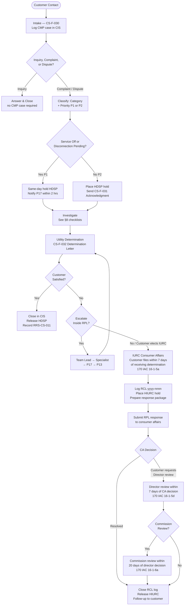

<!-- ============================================================ -->
<!-- DOCUMENT CONTROL BLOCK                                        -->
<!-- ============================================================ -->

| Field | Value |
|---|---|
| **Document Title** | Customer Complaint & Dispute Resolution Procedure |
| **Document ID** | RPL-CS-PRO-011 |
| **Version** | 2.3 |
| **Effective Date** | 2025-03-03 |
| **Approved Date** | 2025-02-26 |
| **Owner** | Brian Kowalski, Manager, Customer Advocacy & Complaint Resolution (P17) |
| **Reviewer** | Karen Mitchell, Director, Customer Service (P13) |
| **Review Cycle** | Annual |
| **Classification** | Internal |
| **Supersedes** | RPL-CS-PRO-011 v2.2 (2024-03-18) |

> **Uncontrolled when printed — verify the current version in DCS before use.**

---

## Table of Contents

1. Purpose
2. Scope
3. Definitions
4. Regulatory Basis
5. Roles and Responsibilities
6. Intake and Classification
7. Protection During a Dispute
8. Investigation
9. Utility Determination and Customer Notice
10. Escalation Inside RPL
11. IURC Consumer Affairs Referrals and Responses
12. Payment Arrangements Arising from Disputes
13. Root Cause and Corrective Action
14. Reporting
15. Records and Retention
16. Training
17. Related Documents
18. Revision History
19. Approval Block

**Appendices:**  App-A CS-F-030 Complaint Intake | App-B CS-F-031 Acknowledgment Letter | App-C CS-F-032 Determination Letter | App-D CS-F-033 IURC Referral Information Sheet | App-E Complaint Category and Priority Code Table | App-F Monthly Complaint KPI Report Template

---

## Process Flow

---

## 1. Purpose

<!-- clause: RPL-CS-PRO-011:1.1 -->
1.1 This procedure establishes the process by which Rockridge Power & Light Company (RPL) receives, classifies, investigates, and resolves customer complaints and disputes regarding its electric distribution service. It defines the steps RPL takes to protect customers during an open dispute, communicate determinations, advise customers of their right to contact the Indiana Utility Regulatory Commission (IURC) Consumer Affairs Division, and respond when the IURC forwards a complaint to RPL.

<!-- clause: RPL-CS-PRO-011:1.2 -->
1.2 This procedure supports RPL's obligations under 170 IAC 16-1 (Customer Complaints, Disputes, and Informal Complaints) and related provisions of 170 IAC 4-1. It applies as of law-as-of date 2024-12-31.

---

## 2. Scope

<!-- clause: RPL-CS-PRO-011:2.1 -->
2.1 **Customers covered.** This procedure applies to all residential and non-residential customers receiving electric distribution service from RPL under its tariffs. (170 IAC 4-1-2; 170 IAC 16-1-1)

<!-- clause: RPL-CS-PRO-011:2.2 -->
2.2 **Channels covered.** Complaints received through any channel — telephone, web form, email, written letter, in person at any RPL service center, executive office referral, or IURC Consumer Affairs portal referral — are governed by this procedure. (170 IAC 16-1-4(a))

<!-- clause: RPL-CS-PRO-011:2.3 -->
2.3 **IURC-forwarded complaints.** This procedure governs RPL's receipt, logging, investigation, and response to complaints received from the IURC Consumer Affairs Division (§11).

<!-- clause: RPL-CS-PRO-011:2.4 -->
2.4 **Exclusion — Formal Commission proceedings.** Complaints and controversies filed as formal petitions or complaints under IC 8-1-2-54 are outside this procedure's scope. The Contact Center supervisor routes such matters to Jonathan Pierce (P03), Senior Counsel, Regulatory (IC 8-1-2-54, `out_of_scope_reference`).

<!-- clause: RPL-CS-PRO-011:2.5 -->
2.5 **Exclusion — OUCC case comments.** Written submissions from the Office of Utility Consumer Counselor (OUCC) in the context of a pending rate case or other docketed proceeding are outside this procedure's scope. The Contact Center supervisor routes such submissions to Elena Vasquez (P08), Manager, Regulatory Affairs.

---

## 3. Definitions

<!-- clause: RPL-CS-PRO-011:3.1 -->
3.1 **Complaint.** A grievance raised by a customer regarding any aspect of RPL's utility service or billing, including but not limited to billing accuracy, metering, disconnection, deposit, service reliability, power quality, vegetation, line extension, or employee conduct. A complaint that RPL has not yet tried to resolve at the customer service level may be submitted to consumer affairs as an informal complaint. (170 IAC 16-1-3(a))

<!-- clause: RPL-CS-PRO-011:3.2 -->
3.2 **Dispute.** A complaint regarding any utility service or billing matter that has not been resolved at the utility level and that meets the threshold in 170 IAC 16-1-3(a) for referral to consumer affairs. (170 IAC 16-1-3(a))

<!-- clause: RPL-CS-PRO-011:3.3 -->
3.3 **Inquiry.** A customer contact requesting information, account status, service scheduling, or other assistance that does not allege a failure of service or billing error. An inquiry is resolved by answering the customer; it does not create a CMP case unless it escalates.

<!-- clause: RPL-CS-PRO-011:3.4 -->
3.4 **Informal complaint.** A complaint submitted by a customer to the IURC Consumer Affairs Division under 170 IAC 16-1-5 when the customer is dissatisfied with RPL's proposed resolution. (170 IAC 16-1-5(a))

<!-- clause: RPL-CS-PRO-011:3.5 -->
3.5 **Consumer affairs.** The Consumer Affairs Division of the Indiana Utility Regulatory Commission. (170 IAC 16-1-2(2))

<!-- clause: RPL-CS-PRO-011:3.6 -->
3.6 **Determination.** RPL's written proposed resolution of a complaint, communicated to the customer per §9 and documented on CS-F-032.

<!-- clause: RPL-CS-PRO-011:3.7 -->
3.7 **Service-off complaint.** A complaint received when the customer's electric service is already disconnected or when a disconnection order is scheduled for execution within the current business day. Service-off complaints carry Priority P1 (§6.5).

<!-- clause: RPL-CS-PRO-011:3.8 -->
3.8 **Escalated complaint.** A complaint that has been elevated beyond the initial Complaint Resolution Specialist to a Team Lead, Brian Kowalski (P17), or Karen Mitchell (P13) per the escalation path in §10.

<!-- clause: RPL-CS-PRO-011:3.9 -->
3.9 **Executive complaint.** A complaint received at RPL's executive offices or referred directly to P17 or above by a senior RPL officer, an elected official, or a regulatory staff member.

<!-- clause: RPL-CS-PRO-011:3.10 -->
3.10 **IURC referral.** A complaint or inquiry forwarded by the IURC Consumer Affairs Division to RPL via the IURC Online Portal (iurc.portal.in.gov) or in writing. Each IURC referral receives a Regulatory Complaint Log ID (RCL-2025-nnnn) in RPL's Regulatory Complaint Log.

<!-- clause: RPL-CS-PRO-011:3.11 -->
3.11 **Undisputed amount.** The portion of a bill that the customer does not dispute. A customer who has an open dispute must pay undisputed amounts by the date due on the bill to avoid disconnection for nonpayment. (170 IAC 16-1-4(c)(1); 170 IAC 16-1-7)

<!-- clause: RPL-CS-PRO-011:3.12 -->
3.12 **Root cause.** The primary process failure or system condition that caused a complaint. Root-cause codes are maintained in CIS and used for monthly trend analysis (§13).

<!-- clause: RPL-CS-PRO-011:3.13 -->
3.13 **CIS hold code.** A flag placed on a customer account in the Customer Information System (CIS) to prevent or delay an adverse action. Hold codes used under this procedure: `HDSP` (dispute pending at RPL) and `HIURC` (IURC complaint open).

<!-- clause: RPL-CS-PRO-011:3.14 -->
3.14 **Complaint category.** A classification code assigned at intake from the set defined in §1.6 Table K of RPL's corpus spec and listed in App-E: `BIL` billing · `MTR` metering · `DSC` disconnection/collections · `DEP` deposit · `REL` outage/reliability · `PQ` power quality · `VEG` vegetation · `EXT` line extension/new service · `CON` employee conduct · `OTH` other.

<!-- clause: RPL-CS-PRO-011:3.15 -->
3.15 **Complaint priority.** A level assigned at intake: `P1` (service off, disconnection pending, or safety concern) or `P2` (all other complaints).

---

## 4. Regulatory Basis

<!-- table: RPL-CS-PRO-011:T4 -->

| ID | Citation | Heading | What It Governs in This Procedure | Section(s) |
|---|---|---|---|---|
| T4-1 | 170 IAC 4-1-1 | Definitions | Customer and disconnection definitions | §3 |
| T4-2 | 170 IAC 4-1-2 | Applicability of rules | Confirms RPL is subject to IURC commission rules | §2 |
| T4-3 | 170 IAC 4-1-13 | Bills | Delinquency period (17 days); undisputed bill obligations | §7, §12 |
| T4-4 | 170 IAC 4-1-16 | Disconnection; prohibited disconnections; reconnection | Service-off complaints; dispute-hold mechanics; hardship payment arrangements | §7, §8, §12 |
| T4-5 | 170 IAC 4-1-17 | Customer complaints | Repealed; not applicable | — |
| T4-6 | 170 IAC 16-1-1 | Scope and applicability | Applies to RPL as an electric utility | §2 |
| T4-7 | 170 IAC 16-1-2 | Definitions | Commission, consumer affairs, customer, utility definitions | §3 |
| T4-8 | 170 IAC 16-1-3 | Customer dispute process; time periods | Time period computation (exclude start day; extend for weekends/holidays) | §6–§11 |
| T4-9 | 170 IAC 16-1-4 | Disputes; utility responsibilities | Access channels; record requirements; investigation; customer notification; 7-day appeal window; annual report | §6–§9, §14 |
| T4-10 | 170 IAC 16-1-5 | Consumer affairs review | 7-day filing window; 14-day info-response; 30-day decision; director review | §11 |
| T4-11 | 170 IAC 16-1-6 | Request for commission review | 20-day commission review request; 7-day copy distribution | §11 |
| T4-12 | 170 IAC 16-1-7 | Continuation of service; undisputed charges | No disconnect while review pending; 10-day post-decision window; 1/12 formula | §7, §11 |

> **Note:** 170 IAC 4-1-17 was repealed effective 2010-05-25. It creates no obligation and is not cited anywhere in this procedure.

---

## 5. Roles and Responsibilities

<!-- table: RPL-CS-PRO-011:T5 -->

| Role | Person (ID) | Responsibility Under This Procedure |
|---|---|---|
| Manager, Customer Advocacy & Complaint Resolution | Brian Kowalski (P17) | Owns this procedure; approves all IURC referral responses; escalation destination for unresolved P1 complaints and executive complaints; signs determinations on high-profile cases |
| Director, Customer Service | Karen Mitchell (P13) | Final internal escalation; receives monthly KPI reports; approves procedure revisions |
| Complaint Resolution Specialists | (role titles only) | Investigate and draft determinations for assigned CMP cases; coordinate with subject-matter liaisons |
| Contact Center Team Leads | (role titles only) | First-level escalation; authorize P1 same-day actions; place/release HDSP holds |
| Contact Center Agents | (role titles only) | Receive complaints via all channels; complete CS-F-030 intake in CIS; triage P1/P2 |
| Supervisor, Credit & Collections | Jasmine Carter (P15) | Collection-hold coordination (HDSP/HIURC interlock with DNP and DNP-R orders); payment arrangement execution (CS-F-016) |
| Supervisor, Metering Services | Luis Hernandez (P18) | Subject-matter liaison for MTR category complaints; AMI interval data retrieval |
| Manager, Meter Shop & Standards Laboratory | Gregory Walsh (P19) | Subject-matter liaison for complex meter test disputes |
| Manager, Vegetation Management Program | Rachel Stein (P22) | Subject-matter liaison for VEG category complaints; furnishes vegetation work records |
| Manager, Distribution Control Center | Kevin Adeyemi (P23) | Subject-matter liaison for REL category complaints; furnishes OMS event records |
| Senior Counsel, Regulatory | Jonathan Pierce (P03) | Advises on legal or litigation risk; receives formal-proceeding referrals |
| Manager, Regulatory Affairs | Elena Vasquez (P08) | Receives OUCC docket referrals; supports IURC annual complaint report filing (§14) |

---

## 6. Intake and Classification

<!-- clause: RPL-CS-PRO-011:6.1 -->
6.1 **Access channels.** RPL provides the following means for customers to raise complaints and disputes, consistent with 170 IAC 16-1-4(a):

| Channel | How to Reach RPL | Hours |
|---|---|---|
| Telephone | 1-800-555-0142 | 24/7 |
| Spanish-language line | 1-800-555-0143 | 24/7 |
| Website | www.rockridge-pl.example | 24/7 |
| Email | customercare@rockridge-pl.example | 24/7 (response next business day) |
| Written letter | Customer Advocacy, 400 Wabash Commons Dr, Lafayette IN 47901 | Mail receipt |
| In person | Any of the five RPL service centers (Lafayette, Crawfordsville, Terre Haute, Frankfort, Danville) | Regular business hours |
| Executive office | Referred by RPL officer to P17; treated as executive complaint | — |
| IURC portal referral | iurc.portal.in.gov (forwarded by IURC to RPL) | See §11 |

<!-- clause: RPL-CS-PRO-011:6.2 -->
6.2 **Language access.** Customers who prefer to speak Spanish are directed to the Spanish-language line 1-800-555-0143. For languages other than English or Spanish, the Contact Center agent connects to a third-party telephonic interpreter service within 5 minutes of the customer request. TTY users dial 711 (Relay Indiana). Company practice: language access services are documented on the CMP case record in CIS.

<!-- clause: RPL-CS-PRO-011:6.3 -->
6.3 **Inquiry vs. complaint vs. dispute decision table.** The receiving agent applies the following criteria at the start of every contact:

| Contact Type | Criteria | Action |
|---|---|---|
| **Inquiry** | Customer seeks information, requests service, or asks about account status; no allegation of RPL error or failure | Answer the customer; no CMP case opened unless it escalates |
| **Complaint** | Customer alleges billing error, metering issue, improper disconnection, deposit dispute, outage/reliability failure, vegetation damage, conduct issue, or similar; OR any contact categorized by script CS-S-11 as a grievance | Open CMP case in CIS; complete CS-F-030; classify per §6.4 |
| **Dispute** | Complaint on which RPL has proposed a resolution and the customer remains dissatisfied | CMP case already exists; advance to determination (§9) and advise of IURC right (§9.7) |

<!-- clause: RPL-CS-PRO-011:6.4 -->
6.4 **Category and priority assignment.** The receiving agent assigns one category code and one priority level to every CMP case at intake, using App-E:

- **Category codes (from §1.6 Table K):** `BIL` billing · `MTR` metering · `DSC` disconnection/collections · `DEP` deposit · `REL` outage/reliability · `PQ` power quality · `VEG` vegetation · `EXT` line extension/new service · `CON` employee conduct · `OTH` other.
- **Priority:** `P1` — service is currently off, a disconnection order is active, or a safety condition exists. `P2` — all other complaints.

The assigned category and priority are recorded in CIS on the CMP case. Changes after initial assignment require a note in the CMP case log and supervisor approval.

<!-- clause: RPL-CS-PRO-011:6.5 -->
6.5 **P1 service-off and disconnection-pending handling.** For any P1 complaint, the receiving agent:

1. Places a hold code `HDSP` on the customer account in CIS within 15 minutes of classifying the complaint as P1.
2. Notifies the Contact Center Team Lead verbally and by CIS queue flag.
3. Assigns the CMP case to a Complaint Resolution Specialist within 30 minutes.

Internal performance target: The assigned Complaint Resolution Specialist acknowledges the P1 case and initiates investigation within 2 hours of case creation. Where service is off, the specialist contacts the customer and the relevant operational department (P23 for outage-related, P15 for disconnection-related) within 2 hours.

<!-- clause: RPL-CS-PRO-011:6.6 -->
6.6 **Intake record — CS-F-030.** The receiving agent completes form CS-F-030 (App-A) in CIS simultaneously with the contact. The case is assigned CIS case type `CMP`. The CMP case number is communicated to the customer verbally or by the channel through which the complaint was received.

<!-- clause: RPL-CS-PRO-011:6.7 -->
6.7 **Required record fields.** Every CMP case record must contain at minimum the following, per 170 IAC 16-1-4(b): (1) customer name; (2) service address; (3) customer contact telephone number, if available; (4) customer account number; (5) general nature of the dispute.

<!-- clause: RPL-CS-PRO-011:6.8 -->
6.8 **Script CS-S-11.** Contact Center agents use script CS-S-11 (Complaints) when receiving a complaint or dispute by telephone. The script prompts the agent through all CS-F-030 required fields and the priority/category decision.

<!-- clause: RPL-CS-PRO-011:6.9 -->
6.9 **Acknowledgment — CS-F-031.** Within 1 business day of opening a P2 CMP case, the Complaint Resolution Specialist sends the customer a CS-F-031 Acknowledgment Letter (App-B) by the same channel through which the complaint was received (email, mail, or phone callback). The acknowledgment confirms the CMP case number, the complaint category, and the specialist's direct contact information. Internal performance target: acknowledgment within 1 business day.

<!-- clause: RPL-CS-PRO-011:6.10 -->
6.10 **IURC referral intake.** Complaints forwarded from the IURC Consumer Affairs Division arrive via the IURC Online Portal (iurc.portal.in.gov) or by letter. The Complaint Resolution Specialist designated for IURC matters receives and processes IURC referrals per the procedures in §11.

---

## 7. Protection During a Dispute

<!-- clause: RPL-CS-PRO-011:7.1 -->
7.1 **Scope of protection.** If a customer paying and continuing to pay all undisputed charges has an open dispute with RPL or an informal complaint pending before consumer affairs or the commission, RPL shall not disconnect any service related to the disputed charges: (1) while RPL's proposed resolution is under review by consumer affairs or the commission; or (2) sooner than 10 days after a decision by consumer affairs or the commission. (170 IAC 16-1-7(a))

<!-- clause: RPL-CS-PRO-011:7.2 -->
7.2 **Undisputed amounts must be paid.** RPL informs the customer at the outset of every dispute that any portion of a bill that is undisputed must be paid by the date due stated on the bill in order to avoid disconnection of service for nonpayment. Failure to pay undisputed amounts removes the protection in §7.1. (170 IAC 16-1-4(c)(1))

> **Note:** A bill is considered delinquent unless payment is received within 17 days after the initial bill is postmarked. (170 IAC 4-1-13(c))

<!-- clause: RPL-CS-PRO-011:7.3 -->
7.3 **Agreed undisputed amount — computation.** When a customer and RPL cannot agree on what portion of a bill is undisputed, the customer avoids disconnection by paying an amount equal to one-twelfth (1/12) of the estimated annual billing for service to that customer. For a customer who has been RPL's customer for at least 12 months, the estimate is based on the customer's average bill for the 12 months immediately preceding the disputed bill. (170 IAC 16-1-7(b))

<!-- clause: RPL-CS-PRO-011:7.4 -->
7.4 **CIS hold — HDSP.** The Contact Center Team Lead or Complaint Resolution Specialist places hold code `HDSP` (dispute pending at RPL) on the CIS account at the same time a complaint is classified as a dispute. The `HDSP` hold prevents execution of any pending `DNP` (disconnect non-pay) or `DNP-R` (remote disconnect) order. Jasmine Carter (P15) is notified of the hold via CIS workflow so that credit-and-collections activity is suspended on the disputed charges.

<!-- clause: RPL-CS-PRO-011:7.5 -->
7.5 **CIS hold — HIURC.** When RPL receives an IURC Consumer Affairs referral under §11, the Complaint Resolution Specialist places hold code `HIURC` (IURC complaint open) on the CIS account immediately upon logging the case in the Regulatory Complaint Log (§11.2). The `HIURC` hold remains in place until the IURC complaint is finally resolved (§11.9).

<!-- clause: RPL-CS-PRO-011:7.6 -->
7.6 **Release of HDSP hold.** The Complaint Resolution Specialist releases the `HDSP` hold in CIS only after one of the following: (a) the complaint is resolved to the customer's satisfaction and the case is closed; (b) RPL's determination is issued and the 7-day customer appeal period to consumer affairs has elapsed with no filing; or (c) a consumer affairs or commission decision has been issued and any post-decision disconnection restriction period has passed. Coordination with Jasmine Carter (P15) is required before releasing a hold on an account with a pending `DNP` order.

> **Caution:** Do not release `HDSP` while any active `HIURC` hold is on the same account. The more protective hold governs.

---

## 8. Investigation

<!-- clause: RPL-CS-PRO-011:8.1 -->
8.1 **Investigator assignment.** Each CMP case is assigned to a Complaint Resolution Specialist by the Contact Center Team Lead within 2 hours of case creation (P1) or by the end of the next business day (P2). The specialist owns the case through determination and closure or IURC referral.

<!-- clause: RPL-CS-PRO-011:8.2 -->
8.2 **General investigation steps.** For every CMP case, the assigned Complaint Resolution Specialist:

1. Reviews the CMP case record, CS-F-030, account history, and prior contact notes in CIS.
2. Pulls the applicable category checklist from §8.3–§8.10.
3. Requests any needed documentation from the subject-matter liaison identified in §5.
4. Contacts the customer by phone (or the channel of the complaint) to clarify the facts if the record is incomplete. Internal performance target: initial customer contact within 1 business day of assignment.
5. Records all investigation steps, documents obtained, and contacts made as CIS notes on the CMP case.

<!-- clause: RPL-CS-PRO-011:8.3 -->
8.3 **Billing complaints (BIL).** Evidence retrieved: 12 months of billing history from CIS; meter read data from AMI HES or meter read file; estimated-bill good-cause records; rate code vs. tariff. The specialist verifies that the bill was issued as a net bill and that the 17-day nonpenalty period was correctly applied. If a meter issue is suspected, a cross-reference MTR case is opened and P18 is notified. (170 IAC 4-1-13(a), (c))

<!-- clause: RPL-CS-PRO-011:8.4 -->
8.4 **Metering complaints (MTR).** Evidence retrieved from CIS and AMI HES: meter serial number, model, and installation date; AMI interval data for the disputed period; meter test records (MTR-F-011) from P19. Customer meter-test requests are routed to P18 per RPL-CS-PRO-007.

<!-- clause: RPL-CS-PRO-011:8.5 -->
8.5 **Disconnection/collections complaints (DSC).** Evidence retrieved from CIS: disconnection notice (CS-F-012), door tag (CS-F-012-DT) if applicable, 12 months of payment history, field order records, active hold codes (`HMED`, `HEAP`, `HPAY`, `HLGL`). The specialist confirms: disconnection occurred between 8:00 a.m. and 3:00 p.m. prevailing local time, on a day the RPL office was open to the public, and a 14-day written notice was sent to residential customers. (170 IAC 4-1-16(d), (e))

<!-- clause: RPL-CS-PRO-011:8.6 -->
8.6 **Deposit complaints (DEP).** Evidence retrieved: deposit amount and basis from CIS; payment history; credit assessment records. Verified against tariff Rule 11 (Sheets 32–34).

<!-- clause: RPL-CS-PRO-011:8.7 -->
8.7 **Outage/reliability complaints (REL).** Evidence retrieved from Kevin Adeyemi (P23) via OMS: outage event record (OE-20YY-######), cause code, duration, customers affected, and restoration steps. AMI interval data confirms zero-consumption period.

<!-- clause: RPL-CS-PRO-011:8.8 -->
8.8 **Vegetation complaints (VEG).** Evidence retrieved from Rachel Stein (P22): vegetation work orders, tree trimming notices (VM-F-004), and consent or easement documentation (RRS-DO-002). The specialist notes whether the disputed activity was within RPL's right-of-way.

<!-- clause: RPL-CS-PRO-011:8.9 -->
8.9 **Employee conduct complaints (CON).** The specialist coordinates with the relevant department supervisor to obtain: call recording or field report from the contact in question; employee account of the contact (obtained by the supervisor); any field visit documentation. Findings are communicated to the customer without disclosing disciplinary action.

<!-- clause: RPL-CS-PRO-011:8.10 -->
8.10 **Power quality, extension, and other complaints (PQ, EXT, OTH).** The specialist consults the relevant department — Distribution Control Center (P23) for PQ; Engineering for EXT — to obtain technical data (voltage readings, construction cost estimates, applicable tariff rules). All evidence is logged as CIS notes on the CMP case.

<!-- clause: RPL-CS-PRO-011:8.11 -->
8.11 **Service-off same-day target.** For any P1 complaint where service is off or a disconnection order is pending, the Complaint Resolution Specialist completes investigation and delivers an initial determination to the customer on the same calendar day as case creation. Internal performance target: determination delivered by end of the business day on which the P1 case was created.

---

## 9. Utility Determination and Customer Notice

<!-- clause: RPL-CS-PRO-011:9.1 -->
9.1 **Determination document.** The Complaint Resolution Specialist drafts the determination on form CS-F-032 (App-C). The Team Lead reviews every determination before it is communicated. Brian Kowalski (P17) reviews all P1 determinations and any determination involving a billing adjustment exceeding $500 or an offer to waive a reconnection charge.

<!-- clause: RPL-CS-PRO-011:9.2 -->
9.2 **Communication method.** RPL advises the customer of its proposed resolution by one of the following methods reasonably calculated to reach the customer: (a) telephone; (b) written notice mailed to the customer's billing address; (c) email; or (d) another means agreed upon by the customer. (170 IAC 16-1-4(c)(4))

<!-- clause: RPL-CS-PRO-011:9.3 -->
9.3 **Required content of the determination.** The CS-F-032 Determination Letter must state: (a) a plain-language summary of RPL's findings; (b) the action RPL has taken or will take (adjustment, corrective work order, reconnection, explanation); (c) the amount of any billing adjustment and its effective date; (d) a statement of whether RPL agrees or disagrees with the customer's complaint; (e) the customer's right to submit an informal complaint to IURC Consumer Affairs within 7 days of the date the customer receives this determination; (f) IURC Consumer Affairs contact information per §9.4; (g) RPL customer service contact (1-800-555-0142) and written-dispute address (Customer Advocacy, 400 Wabash Commons Dr, Lafayette IN 47901). (170 IAC 16-1-4(c)(4), (c)(5), (c)(6))

<!-- clause: RPL-CS-PRO-011:9.4 -->
9.4 **IURC Consumer Affairs contact block.** Every CS-F-032 determination letter must include the following contact information for IURC Consumer Affairs, verbatim (170 IAC 16-1-4(c)(6)):

> **Indiana Utility Regulatory Commission — Consumer Affairs Division**
> Toll-free: 1-800-851-4268 · Direct: 317-232-2712 · Fax: 317-233-2410
> PNC Center, 101 W. Washington Street, Suite 1500E, Indianapolis, IN 46204
> Hours: 8:15 a.m.–4:45 p.m. ET, Monday–Friday
> Online: iurc.portal.in.gov · Paper complaint form: State Form 50488

<!-- clause: RPL-CS-PRO-011:9.5 -->
9.5 **Customer appeal window.** RPL advises the customer in the determination that, if the customer is not satisfied with RPL's proposed resolution, the customer may submit an informal complaint to consumer affairs within 7 days of the date the proposed resolution is received. (170 IAC 16-1-4(c)(5); 170 IAC 16-1-5(a))

> **Note:** In computing the 7-day period, the day on which the customer receives the determination is not counted. If the seventh day falls on a Saturday, Sunday, legal holiday, or a day when the commission office is closed, the period runs until the end of the next day that is not one of those days. (170 IAC 16-1-3(b), (c))

<!-- clause: RPL-CS-PRO-011:9.6 -->
9.6 **Accessibility statement.** The CS-F-032 letter includes: "Para servicio en español, llame al 1-800-555-0143. TTY users dial 711 (Relay Indiana). For energy assistance information, dial 211."

<!-- clause: RPL-CS-PRO-011:9.7 -->
9.7 **CIS closure or hold.** After the determination is communicated: (a) the Complaint Resolution Specialist records the determination outcome on the CMP case in CIS; (b) if the customer accepts the resolution, the case is closed in CIS and the `HDSP` hold is released per §7.6; (c) if the customer indicates intent to contact the IURC or does not respond within 7 calendar days, the case remains open and the `HDSP` hold remains. The case is formally closed in CIS only when the `HDSP` hold is released.

<!-- clause: RPL-CS-PRO-011:9.8 -->
9.8 **Billing adjustments.** Where the determination includes a billing adjustment, the Complaint Resolution Specialist creates the appropriate CIS adjustment transaction on the date the determination is issued, using one of the codes in §1.6 Table K (ADJ-MF, ADJ-MS, ADJ-NR, ADJ-BE, ADJ-RT, ADJ-MX). A billing adjustment letter (MTR-F-012) is sent concurrently with CS-F-032 for metering-related adjustments.

---

## 10. Escalation Inside RPL

<!-- clause: RPL-CS-PRO-011:10.1 -->
10.1 **Escalation triggers.** The Complaint Resolution Specialist escalates a CMP case when: (a) the investigation cannot be completed within 3 business days; (b) the customer explicitly requests escalation; (c) the specialist's authority to offer a resolution is exceeded; (d) a threat of litigation, reference to an attorney, or claim for property damage or personal injury is made.

<!-- clause: RPL-CS-PRO-011:10.2 -->
10.2 **Escalation path.** Cases escalate in the following sequence: Complaint Resolution Specialist → Contact Center Team Lead (day 1–2) → Brian Kowalski, P17 (day 3 or customer request) → Karen Mitchell, P13 (day 5 or P17 escalation). Each step is documented in the CMP case in CIS with timestamp and reason for escalation.

<!-- clause: RPL-CS-PRO-011:10.3 -->
10.3 **Legal escalation.** When a customer or a third party makes a written or verbal threat of litigation, references legal counsel, or asserts a personal injury or property damage claim exceeding $1,000, the Complaint Resolution Specialist immediately notifies Brian Kowalski (P17) and copies Jonathan Pierce (P03) by email. P03 reviews the case within 1 business day and advises on whether RPL's proposed resolution requires legal clearance before being communicated to the customer.

<!-- clause: RPL-CS-PRO-011:10.4 -->
10.4 **Executive complaints.** Executive complaints are assigned directly to a Complaint Resolution Specialist by P17 and are treated as P2 unless P1 criteria apply. Internal performance target: determination within 2 business days. P17 reviews and approves all executive complaint determinations before they are communicated.

<!-- clause: RPL-CS-PRO-011:10.5 -->
10.5 **Media-related complaints.** If a complaint is reported to or by a news media outlet, or if the customer or a third party indicates media contact, the Complaint Resolution Specialist notifies P17 within 30 minutes. P17 coordinates with the relevant department and, if needed, with the Vice President, Operations (P16) per RPL-COM-PRO-002.

<!-- clause: RPL-CS-PRO-011:10.6 -->
10.6 **Escalation records.** Every escalation step is recorded in the CMP case in CIS. The record states the escalating specialist's name and role, the reason for escalation, the date and time, and the name of the recipient. Records are retained per §15.

---

## 11. IURC Consumer Affairs Referrals and Responses

<!-- clause: RPL-CS-PRO-011:11.1 -->
11.1 **Receipt of IURC referral.** IURC Consumer Affairs forwards complaints to RPL via the IURC Online Portal (iurc.portal.in.gov) or by written notice. The designated IURC Complaint Resolution Specialist monitors the portal every business day by 9:00 a.m. and retrieves any new referrals.

<!-- clause: RPL-CS-PRO-011:11.2 -->
11.2 **Regulatory Complaint Log.** The specialist logs every IURC referral in RPL's Regulatory Complaint Log using ID format `RCL-2025-nnnn` (year-sequence). The log entry records: referral date, customer account number, complaint category, IURC case reference number (if provided), assigned specialist, and current status. The log is maintained in CIS and is available to Elena Vasquez (P08) for the annual IURC complaint report.

<!-- clause: RPL-CS-PRO-011:11.3 -->
11.3 **HIURC hold.** The specialist places hold code `HIURC` on the CIS account immediately upon receipt of the IURC referral, regardless of whether an `HDSP` hold is already present.

<!-- clause: RPL-CS-PRO-011:11.4 -->
11.4 **Notification of receipt.** The specialist notifies Brian Kowalski (P17) of every new IURC referral by email within 4 business hours of retrieving it from the portal. P17 acknowledges within 1 business day and assigns a priority and response deadline.

<!-- clause: RPL-CS-PRO-011:11.5 -->
11.5 **Response package contents.** RPL's response to consumer affairs includes: (a) a cover letter signed by P17; (b) a complete account history printout from CIS for the preceding 24 months; (c) a chronological case timeline from the date of the first customer contact through the date of RPL's determination; (d) copies of all relevant documents (CS-F-030, CS-F-032, billing records, field orders, meter test reports if applicable); (e) RPL's proposed resolution or action taken; (f) any billing adjustment transaction confirmation.

<!-- clause: RPL-CS-PRO-011:11.6 -->
11.6 **Response timeline.** When consumer affairs requests additional information or documentation from RPL during the informal review, RPL must respond within 14 days unless consumer affairs directs otherwise. (170 IAC 16-1-5(c)(3)) Internal performance target: RPL submits its initial response package within 5 business days of receiving the IURC referral.

<!-- clause: RPL-CS-PRO-011:11.7 -->
11.7 **Draft and sign-off chain.** The assigned Complaint Resolution Specialist drafts the response package. Brian Kowalski (P17) reviews and approves all IURC responses before submission. For cases involving potential liability, a threat of litigation, or billing adjustments exceeding $1,000, P17 routes the draft to Jonathan Pierce (P03) for legal review before finalizing.

<!-- clause: RPL-CS-PRO-011:11.8 -->
11.8 **Consumer affairs decision.** Consumer affairs provides its decision to the customer and RPL within 30 days of the complaint submission date; if additional time is required, consumer affairs notifies the parties within 30 days that additional time is needed. (170 IAC 16-1-5(c)(5)) RPL records the consumer affairs decision in the RCL log within 1 business day of receipt.

<!-- clause: RPL-CS-PRO-011:11.9 -->
11.9 **Post-decision service protection.** RPL shall not disconnect service for charges related to the IURC complaint sooner than 10 days after a decision by consumer affairs or the commission. (170 IAC 16-1-7(a)) The `HIURC` hold is not released until the 10-day post-decision period has elapsed and no further review has been requested.

<!-- clause: RPL-CS-PRO-011:11.10 -->
11.10 **Director review and commission review.** If the customer or RPL is dissatisfied with the consumer affairs decision, either party may request a review by the director of consumer affairs or the director's designee within 7 days of the date of receipt of the proposed resolution. (170 IAC 16-1-5(d)) Either party may request commission review within 20 days of the date of receipt of the director's decision. (170 IAC 16-1-6(a)) RPL notifies P03 of any commission-review request filed by the customer within 1 business day of receipt. The commission provides copies of any commission-review request to the opposing party and the OUCC within 7 days from the date the review is requested. (170 IAC 16-1-6(b))

<!-- clause: RPL-CS-PRO-011:11.11 -->
11.11 **Informal complaint filing by customer.** The customer may submit an informal complaint to consumer affairs within 7 days of the date the customer receives RPL's proposed resolution of the dispute, by telephone, in writing, or by completing a form available at the commission's office or website (State Form 50488 or the IURC Online Portal). (170 IAC 16-1-5(a), (b))

<!-- clause: RPL-CS-PRO-011:11.12 -->
11.12 **Records during IURC review.** RPL makes all records pertaining to the complaint available to consumer affairs upon request once an informal complaint has been submitted. (170 IAC 16-1-4 last sentence) All records produced to consumer affairs are logged in the RCL entry.

<!-- clause: RPL-CS-PRO-011:11.13 -->
11.13 **Case closure and customer follow-up.** After the IURC process is concluded and all post-decision restriction periods have elapsed, the specialist: (a) releases the `HIURC` hold in CIS; (b) closes the RCL log entry with date and outcome; (c) closes or updates the CMP case in CIS; (d) contacts the customer by phone or email to confirm the outcome and whether any remaining RPL action is pending. The follow-up contact is documented in the CMP case.

---

## 12. Payment Arrangements Arising from Disputes

<!-- clause: RPL-CS-PRO-011:12.1 -->
12.1 **Hardship payment arrangement.** When a customer or user shows cause for inability to pay the full amount due (financial hardship constitutes cause), RPL shall not disconnect service if the customer: (a) pays a reasonable portion of the bill, not to exceed the lesser of $10 or one-tenth (1/10) of the bill, unless the customer agrees to a greater portion; (b) agrees to pay the remainder of the outstanding bill within 3 months; (c) agrees to pay all undisputed future bills as they become due; and (d) has not breached a similar arrangement with RPL within the past 12 months. The utility may add a late payment charge not exceeding the amount allowed under 170 IAC 4-1-13(c). The terms of the arrangement are put in writing by RPL and signed by the customer and an RPL representative. (170 IAC 4-1-16(c)(2))

<!-- clause: RPL-CS-PRO-011:12.2 -->
12.2 **Utility-error large-bill arrangement.** When a customer is unable to pay a bill that is unusually large due to a prior incorrect meter reading, incorrect rate application, incorrect meter connection or functioning, prior estimates without an actual read for over 2 months, stopped or slow meters, or other utility error, RPL shall not disconnect service if the customer: (a) pays a reasonable portion not exceeding an amount equal to the customer's average bill for the 6 bills immediately preceding the bill in question; (b) agrees to pay the remainder at a reasonable rate; and (c) agrees to pay all undisputed future bills as they become due. RPL may not add a late fee to this arrangement. The terms are put in writing and signed by both parties. (170 IAC 4-1-16(c)(3))

<!-- clause: RPL-CS-PRO-011:12.3 -->
12.3 **Written agreement — CS-F-016.** Payment arrangements under §12.1 and §12.2 are documented on form CS-F-016 (Payment Arrangement Agreement) referenced in RPL-CS-PRO-004, §14. The Complaint Resolution Specialist or P15 completes CS-F-016, obtains signatures, and places hold code `HPAY` (payment arrangement active) on the CIS account. A copy of CS-F-016 is provided to the customer.

<!-- clause: RPL-CS-PRO-011:12.4 -->
12.4 **Arrangement breach.** If a customer who entered into a payment arrangement under §12.1 has breached a similar arrangement with RPL within the past 12 months, the customer is not entitled to the §12.1 protection. P15 confirms breach history in CIS before any arrangement is offered. If a current arrangement is breached, P15 notifies the Complaint Resolution Specialist and P17 and the `HPAY` hold is reviewed.

---

## 13. Root Cause and Corrective Action

<!-- clause: RPL-CS-PRO-011:13.1 -->
13.1 **Root-cause code assignment.** The Complaint Resolution Specialist assigns a root-cause code to every CMP case at closure. Root-cause codes are maintained as a controlled list in CIS. Examples include: BILLING-READ (incorrect meter read), BILLING-RATE (wrong rate applied), DISC-NOTICE (disconnection notice deficiency), MTR-ACCURACY (meter accuracy), COMM-DELAY (communication delay), CUST-ERROR (customer misunderstanding), VEG-SCOPE (vegetation work scope).

<!-- clause: RPL-CS-PRO-011:13.2 -->
13.2 **Monthly trend review.** Brian Kowalski (P17) conducts a monthly review of closed CMP cases by category and root-cause code in CIS. The review is completed within 5 business days after the end of each calendar month and documented in the monthly KPI report (§14).

<!-- clause: RPL-CS-PRO-011:13.3 -->
13.3 **RCA trigger.** A formal root-cause analysis (RCA) is required when: (a) 3 or more complaints with the same root-cause code are identified in a single month; or (b) any complaint is substantiated by the IURC Consumer Affairs Division (i.e., consumer affairs finds in favor of the customer). P17 initiates the RCA within 5 business days of identifying the trigger condition.

<!-- clause: RPL-CS-PRO-011:13.4 -->
13.4 **Corrective-action log.** Each RCA result is documented in the Corrective-Action Log maintained by P17. Each entry states: the root-cause code and trigger, the underlying process or system failure identified, the corrective action assigned, the responsible owner, and the target completion date.

<!-- clause: RPL-CS-PRO-011:13.5 -->
13.5 **Feedback to procedure owners.** When an RCA identifies a deficiency in a related procedure (RPL-CS-PRO-004, RPL-CS-PRO-007, RPL-DO-PLN-002, RPL-TAR-GRR-012) or in a training module (CS-T-11), P17 sends the RCA finding to the procedure owner within 10 business days. The procedure owner acknowledges receipt and notifies P17 of any planned revision within 20 business days.

---

## 14. Reporting

<!-- clause: RPL-CS-PRO-011:14.1 -->
14.1 **Annual IURC complaint report.** Each calendar year, RPL submits to the IURC a report that states and classifies the number of complaints received under the dispute process, the general nature of the subject matter, how each complaint was received, and whether a commission review was conducted. (170 IAC 16-1-4(d)) Elena Vasquez (P08) coordinates the report filing, using complaint data extracted from CIS by P17 in January. The report is due to the IURC per the applicable filing calendar in RPL-REG-CAL-2025.

<!-- clause: RPL-CS-PRO-011:14.2 -->
14.2 **Monthly KPI report.** Brian Kowalski (P17) prepares and delivers a Monthly Complaint KPI Report to Karen Mitchell (P13) within 5 business days after the end of each calendar month. The report uses the template in App-F and includes:

- Total CMP cases opened and closed by category (BIL, MTR, DSC, DEP, REL, PQ, VEG, EXT, CON, OTH)
- IURC informal complaint filings per 1,000 customers
- Percentage of complaints resolved at first customer contact
- Average calendar days from case creation to determination (separately for P1 and P2)
- Percentage of determinations communicated within the internal 3-business-day target
- Number of IURC referrals opened, responded to, and closed
- Number of consumer affairs decisions favorable to customer vs. RPL
- Repeat complaints (same account, same root-cause code, within 90 days of prior closure)

<!-- clause: RPL-CS-PRO-011:14.3 -->
14.3 **KPI definitions.** For purposes of the monthly report: "first contact resolution" means the CMP case is closed with a determination on the same day the complaint is received and no IURC referral follows within 7 days; "average days to determination" counts calendar days from the date and time of CMP case creation to the date the CS-F-032 letter is sent; "IURC filings per 1,000 customers" uses total customer count as of the last day of the reported month.

<!-- clause: RPL-CS-PRO-011:14.4 -->
14.4 **P13 review.** Karen Mitchell (P13) reviews the monthly KPI report within 5 business days of receipt and schedules a discussion with P17 if any KPI falls outside the target range defined in the report template. Corrective actions identified during the P13 review are tracked in the Corrective-Action Log (§13.4).

---

## 15. Records and Retention

<!-- clause: RPL-CS-PRO-011:15.1 -->
15.1 **Minimum retention — regulatory requirement.** RPL retains records of disputes received and their resolutions for at least 6 months from the date of final resolution of the dispute. (170 IAC 16-1-4(b))

<!-- clause: RPL-CS-PRO-011:15.2 -->
15.2 **Records series.** Complaint and dispute records are filed under records series **RRS-CS-011** (Customer complaint and dispute files, incl. IURC CAD referrals) in the Document Control System (DCS) per RPL-LEG-RRS-001. All CMP case records, CS-F-030/031/032/033, RCL log entries, and investigation documentation are retained in this series.

<!-- clause: RPL-CS-PRO-011:15.3 -->
15.3 **Record content.** For each CMP case, the record set retained in DCS must contain at minimum: CS-F-030 intake; CS-F-032 determination; all investigation evidence logged in CIS; any CS-F-031 acknowledgment; CS-F-033 if an IURC referral was issued; and any corrective-action log entries related to the case. The CIS CMP case number serves as the primary key linking all record components.

<!-- clause: RPL-CS-PRO-011:15.4 -->
15.4 **Regulatory Complaint Log retention.** The Regulatory Complaint Log is retained under RRS-CS-011 for the period specified in RPL-LEG-RRS-001, which is not less than the 6-month minimum in §15.1.

---

## 16. Training

<!-- clause: RPL-CS-PRO-011:16.1 -->
16.1 **Initial training.** All Contact Center agents, Complaint Resolution Specialists, and Contact Center Team Leads complete training module **CS-T-11** (Customer Complaint & Dispute Resolution) before handling live complaint calls or cases. Completion is documented in the Training Records system (RRS-TRN-001).

<!-- clause: RPL-CS-PRO-011:16.2 -->
16.2 **Annual refresher.** CS-T-11 is completed annually by all staff in roles listed in §16.1. The refresher year runs January 1 through December 31. Completion is tracked by P17 in the Training Records system.

<!-- clause: RPL-CS-PRO-011:16.3 -->
16.3 **De-escalation module.** All Contact Center agents and Complaint Resolution Specialists complete the de-escalation module appended to CS-T-11 annually. The module covers verbal de-escalation, recognizing distressed customers, and transferring calls appropriately. New staff complete the module within 30 days of hire.

<!-- clause: RPL-CS-PRO-011:16.4 -->
16.4 **RCA-triggered training.** When an RCA under §13.3 identifies a staff knowledge gap, P17 coordinates supplemental training with the relevant supervisor. Supplemental training is completed within 30 business days of the RCA trigger.

---

## 17. Related Documents

| Document ID | Title |
|---|---|
| RPL-CS-PRO-004 | Disconnection, Reconnection & Winter Protection Procedure |
| RPL-CS-PRO-007 | Meter Test Request & Billing Adjustment Procedure |
| RPL-DO-PLN-002 | Vegetation Management Plan 2025 |
| RPL-TAR-GRR-012 | Tariff for Electric Service, IURC No. 12 — General Rules and Regulations (Rule 11 Sheets 32–34; Rule 13 Sheets 37–41) |
| RPL-LEG-RRS-001 | Records Retention Schedule |
| RPL-CMP-REG-001 | Regulatory Obligations Register |
| RPL-COM-PRO-002 | Media & Public Communications Procedure |

---

## 18. Revision History

| Version | Effective Date | Approved Date | Author (role) | Change Summary |
|---|---|---|---|---|
| 2.0 | 2022-04-01 | 2022-03-25 | Manager, Customer Advocacy | Major revision to incorporate 170 IAC 16-1 (2022 readoption); added IURC referral response procedure (§11); restructured into 19 sections |
| 2.1 | 2023-04-10 | 2023-04-04 | Manager, Customer Advocacy | Added de-escalation training requirement (§16.3); updated IURC contact block to reflect suite move to PNC Center; revised App-F KPI template |
| 2.2 | 2024-03-18 | 2024-03-12 | Manager, Customer Advocacy | Added root-cause code list (§13.1) following 2023 audit finding; revised HDSP/HIURC hold release instructions (§7.6) to address hold interlock gap |
| 2.3 | 2025-03-03 | 2025-02-26 | Brian Kowalski (P17) | Updated category checklist cross-references (§8.3–§8.10) for AMI HES data retrieval; added App-F fictional January 2025 KPI figures; updated App-C IURC contact block; corrected pay-arrangement breach tracking (§12.4) |

---

## 19. Approval Block

This procedure has been prepared, reviewed, and approved by the following:

| Role | Name | Title | Signature | Date |
|---|---|---|---|---|
| Prepared and approved by | Brian Kowalski | Manager, Customer Advocacy & Complaint Resolution | _________________________ | 2025-02-26 |
| Reviewed and approved by | Karen Mitchell | Director, Customer Service | _________________________ | 2025-02-26 |

**Distribution:** All Contact Center staff · Customer Advocacy team · Jasmine Carter (P15) · Luis Hernandez (P18) · Gregory Walsh (P19) · Rachel Stein (P22) · Kevin Adeyemi (P23) · Jonathan Pierce (P03) · Elena Vasquez (P08)

---

## Appendix A — CS-F-030 Complaint Intake Form (Rev. 03/2025)

<!-- clause: RPL-CS-PRO-011:App-A -->

> **CS-F-030 (Rev. 03/2025) · Rockridge Power & Light Company · Customer Complaint Intake**
> *Complete in CIS at time of customer contact. CIS case type: CMP.*

**Part A — Customer and Account Identification**

<!-- clause: RPL-CS-PRO-011:App-A.F01 -->
App-A.F01 | Customer Name | Text _______________________________________________

<!-- clause: RPL-CS-PRO-011:App-A.F02 -->
App-A.F02 | Account Number | Text _______________________________________________

<!-- clause: RPL-CS-PRO-011:App-A.F03 -->
App-A.F03 | Service Address | Text _______________________________________________

<!-- clause: RPL-CS-PRO-011:App-A.F04 -->
App-A.F04 | Mailing Address (if different) | Text _______________________________________________

<!-- clause: RPL-CS-PRO-011:App-A.F05 -->
App-A.F05 | Customer Contact Phone | Text _______________________________________________

<!-- clause: RPL-CS-PRO-011:App-A.F06 -->
App-A.F06 | Customer Email | Text _______________________________________________

<!-- clause: RPL-CS-PRO-011:App-A.F07 -->
App-A.F07 | Preferred Contact Method | ☐ Phone ☐ Email ☐ Mail ☐ In-person

**Part B — Complaint Classification**

<!-- clause: RPL-CS-PRO-011:App-A.F08 -->
App-A.F08 | Complaint Receipt Date | YYYY-MM-DD _______________

<!-- clause: RPL-CS-PRO-011:App-A.F09 -->
App-A.F09 | Complaint Receipt Channel | ☐ Phone ☐ Web ☐ Email ☐ Letter ☐ In-person ☐ IURC Referral ☐ Executive

<!-- clause: RPL-CS-PRO-011:App-A.F10 -->
App-A.F10 | Category Code | ☐ BIL ☐ MTR ☐ DSC ☐ DEP ☐ REL ☐ PQ ☐ VEG ☐ EXT ☐ CON ☐ OTH

<!-- clause: RPL-CS-PRO-011:App-A.F11 -->
App-A.F11 | Priority | ☐ P1 — Service off / disconnection pending / safety  ☐ P2 — All other

<!-- clause: RPL-CS-PRO-011:App-A.F12 -->
App-A.F12 | Service Currently Off? | ☐ Yes ☐ No   Disconnection Order Active? ☐ Yes ☐ No

**Part C — Complaint Description**

<!-- clause: RPL-CS-PRO-011:App-A.F13 -->
App-A.F13 | Narrative Description of Complaint | Text (multi-line) ___________________________________

<!-- clause: RPL-CS-PRO-011:App-A.F14 -->
App-A.F14 | Billing Period(s) at Issue | Text _______________________________________________

<!-- clause: RPL-CS-PRO-011:App-A.F15 -->
App-A.F15 | Customer's Requested Resolution | Text _______________________________________________

**Part D — Office Use Only**

<!-- clause: RPL-CS-PRO-011:App-A.F16 -->
App-A.F16 | CIS CMP Case Number | Text _______________________________________________

<!-- clause: RPL-CS-PRO-011:App-A.F17 -->
App-A.F17 | Assigned Specialist | Text _______________________________________________

<!-- clause: RPL-CS-PRO-011:App-A.F18 -->
App-A.F18 | HDSP Hold Placed? | ☐ Yes  Date/Time: _______________  ☐ Not required

<!-- clause: RPL-CS-PRO-011:App-A.F19 -->
App-A.F19 | Receiving Agent Name and ID | Text _______________________________________________

---

## Appendix B — CS-F-031 Complaint Acknowledgment Letter (Rev. 03/2025)

<!-- clause: RPL-CS-PRO-011:App-B -->

> *[RPL letterhead — Rockridge Power & Light Company · 400 Wabash Commons Dr, Lafayette IN 47901 · 1-800-555-0142]*

<!-- clause: RPL-CS-PRO-011:App-B.F01 -->
App-B.F01 | Date of Letter | YYYY-MM-DD _______________

<!-- clause: RPL-CS-PRO-011:App-B.F02 -->
App-B.F02 | Customer Name and Address Block | Text _______________________________________________

---

Dear [Customer Name],

Thank you for contacting Rockridge Power & Light Company.

<!-- clause: RPL-CS-PRO-011:App-B.F03 -->
App-B.F03 | CMP Case Number | We have recorded your complaint under case number **___________________**.

<!-- clause: RPL-CS-PRO-011:App-B.F04 -->
App-B.F04 | Complaint Category | Your complaint has been classified as: **___________________** (e.g., Billing — BIL).

<!-- clause: RPL-CS-PRO-011:App-B.F05 -->
App-B.F05 | Specialist Contact Name and Direct Phone | Your case is assigned to **_____________** (direct phone: **_____________**).

A Complaint Resolution Specialist will review your account and contact you to discuss our findings.

If you have questions in the meantime, please call our Customer Care line at **1-800-555-0142** (24/7), or write to us at Customer Advocacy, 400 Wabash Commons Drive, Lafayette, IN 47901.

<!-- clause: RPL-CS-PRO-011:App-B.F06 -->
App-B.F06 | Spanish / TTY Note | Para servicio en español, llame al **1-800-555-0143**. TTY users dial **711** (Relay Indiana).

Sincerely,

<!-- clause: RPL-CS-PRO-011:App-B.F07 -->
App-B.F07 | Specialist Signature and Title | _________________________ [Name, Complaint Resolution Specialist]

<!-- clause: RPL-CS-PRO-011:App-B.F08 -->
App-B.F08 | Date Signed | YYYY-MM-DD _______________

---

## Appendix C — CS-F-032 Complaint Determination Letter (Rev. 03/2025)

<!-- clause: RPL-CS-PRO-011:App-C -->

> *[RPL letterhead]*

<!-- clause: RPL-CS-PRO-011:App-C.F01 -->
App-C.F01 | Date of Letter | YYYY-MM-DD _______________

<!-- clause: RPL-CS-PRO-011:App-C.F02 -->
App-C.F02 | Customer Name and Address Block | Text _______________________________________________

<!-- clause: RPL-CS-PRO-011:App-C.F03 -->
App-C.F03 | CMP Case Number and Category | Case No. ______________ · Category: ______________

---

**Re: Resolution of Your Complaint — [brief description]**

Dear [Customer Name],

<!-- clause: RPL-CS-PRO-011:App-C.F04 -->
App-C.F04 | Findings Summary | We have completed our review of your complaint. Our findings are as follows: [plain-language summary of investigation results]

<!-- clause: RPL-CS-PRO-011:App-C.F05 -->
App-C.F05 | Action Taken or Proposed | Rockridge Power's proposed resolution is: [specific action — e.g., billing adjustment of $X effective YYYY-MM-DD; meter test scheduled; reconnection; no adjustment warranted with explanation]

<!-- clause: RPL-CS-PRO-011:App-C.F06 -->
App-C.F06 | Billing Adjustment Amount and Effective Date | ☐ Billing adjustment of $________ applied to your account effective ____________.  ☐ No billing adjustment.

<!-- clause: RPL-CS-PRO-011:App-C.F07 -->
App-C.F07 | RPL's Position on the Complaint | ☐ Rockridge Power agrees with your complaint.  ☐ Rockridge Power does not agree with your complaint. [Reason: _____________]

---

**Your Right to Contact the IURC Consumer Affairs Division**

<!-- clause: RPL-CS-PRO-011:App-C.F08 -->
App-C.F08 | IURC Appeal Notice | If you are not satisfied with Rockridge Power's proposed resolution, **you may submit an informal complaint to the IURC Consumer Affairs Division within 7 days of the date you receive this letter.** (170 IAC 16-1-4(c)(5); 170 IAC 16-1-5(a))

<!-- clause: RPL-CS-PRO-011:App-C.F09 -->
App-C.F09 | IURC Contact Block |
> **Indiana Utility Regulatory Commission — Consumer Affairs Division**
> Toll-free: **1-800-851-4268** · Direct: **317-232-2712** · Fax: **317-233-2410**
> PNC Center, 101 W. Washington Street, Suite 1500E, Indianapolis, IN 46204
> Hours: 8:15 a.m.–4:45 p.m. ET, Monday–Friday
> Online: **iurc.portal.in.gov** · Paper complaint form: **State Form 50488**

<!-- clause: RPL-CS-PRO-011:App-C.F10 -->
App-C.F10 | OUCC Reference | For general consumer information about pending utility cases: Indiana Office of Utility Consumer Counselor (OUCC), **1-888-441-2494**.

<!-- clause: RPL-CS-PRO-011:App-C.F11 -->
App-C.F11 | Language / Accessibility Notice | Para servicio en español, llame al **1-800-555-0143**. TTY users dial **711** (Relay Indiana). For energy assistance information, dial **211**.

<!-- clause: RPL-CS-PRO-011:App-C.F12 -->
App-C.F12 | Undisputed Charges Reminder | Any portion of your bill that is not in dispute must be paid by the due date on your bill to avoid disconnection.

Sincerely,

<!-- clause: RPL-CS-PRO-011:App-C.F13 -->
App-C.F13 | Signatory Name and Title | _________________________ [Name, Title]

<!-- clause: RPL-CS-PRO-011:App-C.F14 -->
App-C.F14 | Date Signed | YYYY-MM-DD _______________

*Office use: CIS Case closed ☐ / HDSP released ☐ / Adjustment posted ☐ — by ____________ on ____________*

---

## Appendix D — CS-F-033 IURC Referral Information Sheet (Rev. 03/2025)

<!-- clause: RPL-CS-PRO-011:App-D -->

> *Customer-facing handout: How to Contact the IURC Consumer Affairs Division*
> *Provided to the customer with every CS-F-032 Determination Letter and upon any in-person complaint request.*

---

**When and How to Contact IURC Consumer Affairs**

If you are not satisfied with how Rockridge Power resolved your service or billing complaint, you may contact the **Indiana Utility Regulatory Commission (IURC) Consumer Affairs Division**. Consumer Affairs helps customers resolve disputes with their utility free of charge.

<!-- clause: RPL-CS-PRO-011:App-D.F01 -->
App-D.F01 | IURC Consumer Affairs Contact Information |
| Method | Contact |
|---|---|
| Toll-free phone | **1-800-851-4268** |
| Direct phone | **317-232-2712** |
| Fax | 317-233-2410 |
| Online portal | **iurc.portal.in.gov** |
| Paper complaint form | **State Form 50488** (available at IURC offices or on the commission's website) |
| Mailing address | PNC Center, 101 W. Washington Street, Suite 1500E, Indianapolis, IN 46204 |
| Office hours | 8:15 a.m.–4:45 p.m. ET, Monday–Friday |

<!-- clause: RPL-CS-PRO-011:App-D.F02 -->
App-D.F02 | Filing Deadline | **You must file your complaint with Consumer Affairs within 7 days of the date you receive Rockridge Power's written determination.** (170 IAC 16-1-5(a))

<!-- clause: RPL-CS-PRO-011:App-D.F03 -->
App-D.F03 | Service Continues While Dispute Is Open | If you have paid and continue to pay the portion of your bill that is not in dispute, Rockridge Power will not disconnect your service while Consumer Affairs is reviewing your complaint. (170 IAC 16-1-7(a))

<!-- clause: RPL-CS-PRO-011:App-D.F04 -->
App-D.F04 | What Happens Next | After you file, Consumer Affairs will notify Rockridge Power and give the Company an opportunity to respond. Consumer Affairs will provide its decision to you and Rockridge Power within 30 days of your complaint submission date, unless additional time is required. (170 IAC 16-1-5(c)(5))

<!-- clause: RPL-CS-PRO-011:App-D.F05 -->
App-D.F05 | Further Appeal | If you are not satisfied with the Consumer Affairs decision, you may request a review by the Director of Consumer Affairs within 7 days of receiving that decision, and you may request full Commission review within 20 days of the Director's decision. (170 IAC 16-1-5(d); 170 IAC 16-1-6(a))

<!-- clause: RPL-CS-PRO-011:App-D.F06 -->
App-D.F06 | OUCC Information | For information about pending utility rate cases: **Indiana Office of Utility Consumer Counselor (OUCC), 1-888-441-2494.**

> **Rockridge Power contact:** 1-800-555-0142 · Customer Advocacy, 400 Wabash Commons Drive, Lafayette, IN 47901 · customercare@rockridge-pl.example · Para español: 1-800-555-0143 · TTY: 711 (Relay Indiana)

---

## Appendix E — Complaint Category and Priority Code Table

<!-- clause: RPL-CS-PRO-011:App-E -->

<!-- table: RPL-CS-PRO-011:TE -->

**Table E-1 — Complaint Category Codes**

| Code | Category | Description | Primary Liaison |
|---|---|---|---|
| BIL | Billing | Billing errors, estimated bills, delinquency, late charges, rate application | Complaint Resolution Specialist |
| MTR | Metering | Meter accuracy, AMI communications, meter change disputes | P18 Luis Hernandez |
| DSC | Disconnection/Collections | Disconnection notice deficiency, improper disconnection, reconnection issues, deposit collection | P15 Jasmine Carter |
| DEP | Deposit | Deposit amount, basis, or refund disputes | P15 Jasmine Carter |
| REL | Outage/Reliability | Extended outage, reliability performance, restoration time | P23 Kevin Adeyemi |
| PQ | Power Quality | Voltage, flicker, harmonics, transient events | P23 Kevin Adeyemi |
| VEG | Vegetation | Tree trimming notice, tree damage, right-of-way disputes | P22 Rachel Stein |
| EXT | Line Extension/New Service | New service cost, timeline, connection disputes | Engineering (role title) |
| CON | Employee Conduct | Field crew behavior, office staff conduct, communication issues | Department Supervisor (role title) |
| OTH | Other | Any complaint not fitting above categories | Complaint Resolution Specialist |

**Table E-2 — Complaint Priority Levels**

| Priority | Condition | Response Target |
|---|---|---|
| P1 | Service is currently off · Active disconnection order · Safety concern | HDSP placed within 15 min; specialist assigned within 30 min; investigation same day |
| P2 | All other complaints | CS-F-031 acknowledgment within 1 business day; determination per §9 |

---

## Appendix F — Monthly Complaint KPI Report Template (January 2025 Example)

<!-- clause: RPL-CS-PRO-011:App-F -->

**Rockridge Power & Light Company**
**Monthly Complaint KPI Report — January 2025 (Preliminary)**
Prepared by: Brian Kowalski (P17) · Submitted to: Karen Mitchell (P13) · Date submitted: 2025-02-06

---

**Table F-1 — Case Volume by Category**

| Category | Cases Opened | Cases Closed | Carried Forward |
|---|---|---|---|
| BIL | 284 | 271 | 13 |
| MTR | 47 | 44 | 3 |
| DSC | 93 | 91 | 2 |
| DEP | 18 | 17 | 1 |
| REL | 61 | 58 | 3 |
| PQ | 12 | 11 | 1 |
| VEG | 9 | 9 | 0 |
| EXT | 14 | 12 | 2 |
| CON | 22 | 21 | 1 |
| OTH | 31 | 30 | 1 |
| **Total** | **591** | **564** | **27** |

> *Customer base as of 2025-01-31: 407,491 total.*

**Table F-2 — KPI Summary**

| KPI | January 2025 | Target |
|---|---|---|
| IURC informal complaints filed per 1,000 customers | 0.34 (138 total in trailing 12 months) | < 0.50 |
| % resolved at first contact | 61.4% | ≥ 60% |
| Avg. calendar days to determination — P1 | 0.8 | ≤ 1 (same day) |
| Avg. calendar days to determination — P2 | 4.1 | ≤ 5 |
| % determinations within internal 3-business-day target | 84.7% | ≥ 80% |
| IURC referrals opened | 4 | — |
| IURC referrals responded to | 3 | Response within 5 business days: 100% |
| IURC referrals closed | 2 | — |
| Consumer affairs decisions favorable to customer | 1 | RCA triggered if ≥ 1 substantiated |
| Repeat complaints (same account, same root cause, 90 days) | 7 | ≤ 10 |

> *Note: "IURC informal complaints filed per 1,000 customers" is calculated as the total of informal IURC complaints filed against RPL in the trailing 12-month period ended the last day of the reported month, divided by the customer count on that date, times 1,000.*

**RCA Summary:** One RCA initiated January 2025 for DSC category (3 complaints: DISC-NOTICE root cause — disconnect notices bearing incorrect delinquency date). Corrective action: CIS template corrected 2025-01-22; CS-T-11 refresher supplemental notice issued 2025-01-28.
