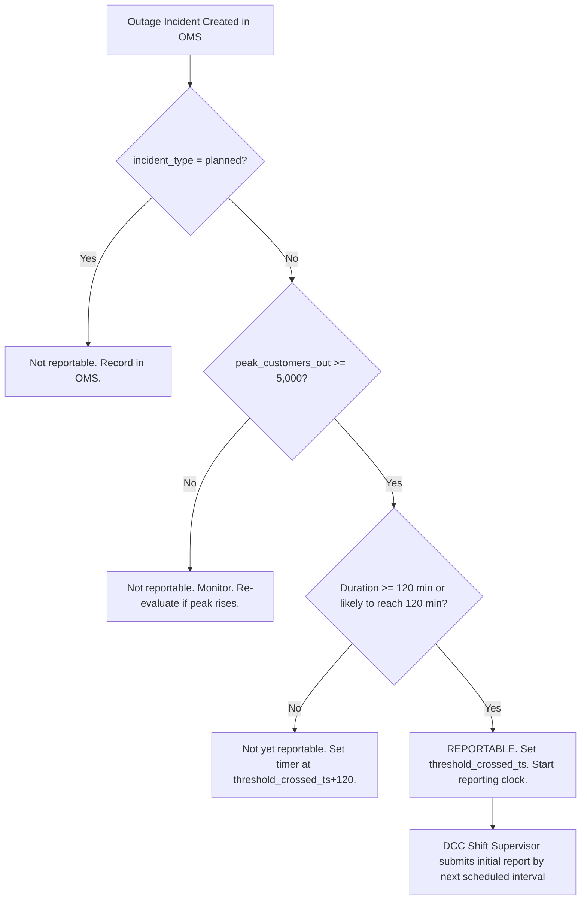

<!-- Document Control Block -->

| Field | Value |
|---|---|
| **Document ID** | RPL-DCC-PRO-003 |
| **Title** | Service Interruption Reporting Procedure |
| **Version** | 4.2 |
| **Effective Date** | 2025-02-24 |
| **Approved Date** | 2025-02-19 |
| **Law As-Of** | 2024-12-31 |
| **Owner** | Kevin Adeyemi (P23), Manager, Distribution Control Center |
| **Reviewer** | Patrick O'Neill (P21), Director, Distribution Operations |
| **Approver** | Elena Vasquez (P08), Manager, Regulatory Affairs |
| **Classification** | Internal |
| **Review Cycle** | Annual |
| **Supersedes** | 4.1 (2024-04-22) |
| **Stored In** | Document Control System (DCS) |

> **Uncontrolled when printed — verify the current version in DCS before use.**

---

## Table of Contents

1. Purpose
2. Scope
3. Definitions
4. Regulatory Basis
5. Roles and Responsibilities
6. Outage Data Capture in OMS
7. Reportability Determination
8. Initial Report
9. Update Reports
10. Final Report
11. Restoration Priorities
12. Planned (Intentional) Interruptions
13. Storm Mode
14. Interruption Records
15. Annual Reliability Indices
16. Worst-Performing Circuits Review
17. Tree-Related Outage Data Handoff
18. 2024 Performance Summary (Preliminary)
19. Training and Drills
20. Related Documents
21. Revision History
22. Approval Block

**Appendices:**  
App-A — Completed State Form 54646 Example  
App-B — DCC Reporting Checklist  
App-C — Notification Contact Sheet  
App-D — OMS Cause-Code Table  
App-E — Data Dictionary

---

<!-- clause: RPL-DCC-PRO-003:1 -->
## 1. Purpose

This procedure establishes the Distribution Control Center's (DCC) requirements for detecting, classifying, recording, and reporting service interruptions to the Indiana Utility Regulatory Commission (IURC); for compiling and filing annual reliability indices; for issuing advance notice of planned interruptions; and for handing off tree-related outage data to the Vegetation Management Program. It also documents RPL's restoration priorities and the records required to support regulatory compliance.

The DCC operates 24 hours per day, 7 days per week from RPL's headquarters at 400 Wabash Commons Drive, Lafayette, Indiana 47901.

---

<!-- clause: RPL-DCC-PRO-003:2 -->
## 2. Scope

<!-- clause: RPL-DCC-PRO-003:2.1 -->
### 2.1 In Scope

This procedure applies to:

- All sustained service interruptions on RPL's 12.47 kV and 34.5 kV distribution system and 69 kV subtransmission system affecting metered customers;
- Planned interruptions for maintenance, construction, or emergency switching;
- The annual reliability indices report filed with the IURC under 170 IAC 4-1-23(e);
- DCC operators, the DCC Manager (P23), the Director of Distribution Operations (P21), and the Regulatory Affairs team (P08, P09) in their reporting roles.

<!-- clause: RPL-DCC-PRO-003:2.2 -->
### 2.2 Out of Scope

- Momentary interruptions (restorations within 5 minutes or the RPL-defined threshold — see §3.9);
- Voltage deviations or power quality events that do not result in service interruption;
- Curtailments under interruptible rate schedules when occurring pursuant to the customer's service agreement (170 IAC 4-1-23(b)(6));
- Accident reporting (RPL-SAF-PRO-009);
- FERC/MISO transmission-level events beyond RPL's operated facilities.

---

<!-- clause: RPL-DCC-PRO-003:3 -->
## 3. Definitions

<!-- clause: RPL-DCC-PRO-003:3.1 -->
**3.1 Business days** — All days other than (A) Saturday, (B) Sunday, or (C) a legal holiday observed by the state of Indiana. (170 IAC 4-1-23(a)(1))

<!-- clause: RPL-DCC-PRO-003:3.2 -->
**3.2 Nonbusiness days** — Saturday, Sunday, or a legal holiday observed by the state of Indiana. (170 IAC 4-1-23(a)(7))

<!-- clause: RPL-DCC-PRO-003:3.3 -->
**3.3 Customer** — For reliability reporting purposes, a metered electrical service point for which an active bill account is established at a specific location. (170 IAC 4-1-23(a)(2))

<!-- clause: RPL-DCC-PRO-003:3.4 -->
**3.4 Customer of record** — Any person, firm, corporation, municipality, or other government agency that has agreed, orally or otherwise, to pay for electric service received from RPL. (170 IAC 4-1-23(a)(4)) For planned interruption notice purposes, RPL uses "customer of record" to identify the party to be notified.

<!-- clause: RPL-DCC-PRO-003:3.5 -->
**3.5 Interruption** — The loss of electrical service to one (1) or more customers connected to the distribution portion of the system. (170 IAC 4-1-23(a)(5))

<!-- clause: RPL-DCC-PRO-003:3.6 -->
**3.6 Sustained service interruption** — A service interruption that is greater than or equal to five (5) minutes unless defined as five (5) minutes or less by the individual utility. (170 IAC 4-1-23(a)(10))

Company practice: RPL applies the statutory five-minute threshold. Interruptions restored within five minutes are classified as momentary and are not counted in SAIFI or SAIDI but are tracked separately.

<!-- clause: RPL-DCC-PRO-003:3.7 -->
**3.7 Momentary interruption** — Company practice: a service interruption that is restored within five (5) minutes of its start. Momentary interruptions are counted in the Momentary Average Interruption Frequency Index (MAIFI) and are not included in SAIFI or SAIDI calculations.

<!-- clause: RPL-DCC-PRO-003:3.8 -->
**3.8 Planned service interruption (intentional interruption)** — A service interruption initiated by RPL to perform scheduled activities, including but not limited to: (A) maintenance; (B) infrastructure improvements; and (C) new construction due to customer growth. Customers of record are typically notified in advance of such events. (170 IAC 4-1-23(a)(8))

<!-- clause: RPL-DCC-PRO-003:3.9 -->
**3.9 Outage incident** — Company practice: a grouping of one or more related outage events occurring on the same circuit or set of adjacent circuits, resulting from the same initiating cause, and managed as a single restoration effort. An incident may include multiple sequential restoration steps, each of which is recorded as a separate event in the OMS.

<!-- clause: RPL-DCC-PRO-003:3.10 -->
**3.10 Outage event** — Company practice: a single device operation resulting in the loss of service to customers. One incident typically comprises multiple events (e.g., a feeder breaker trip followed by sectionalizer isolations and lateral restorations).

<!-- clause: RPL-DCC-PRO-003:3.11 -->
**3.11 Customer minutes of interruption (CMI)** — Company practice: the sum, across all customers affected, of each customer's interruption duration in minutes. For step-restoration incidents, CMI = Σ (customers restored in step × minutes from event start to that step's restoration time).

<!-- clause: RPL-DCC-PRO-003:3.12 -->
**3.12 SAIFI (System Average Interruption Frequency Index)** — Calculated by dividing the summation of customers that experienced sustained service interruptions over a specified period of time by the total number of customers served. This index indicates how many sustained service interruptions a customer experiences over a specified period of time. (170 IAC 4-1-23(a)(12))

<!-- clause: RPL-DCC-PRO-003:3.13 -->
**3.13 SAIDI (System Average Interruption Duration Index)** — Calculated by dividing the summation of sustained service interruption durations for a specified period of time by the total number of customers served. This index indicates the total duration of a sustained service interruption for the average customer during a specified period of time. (170 IAC 4-1-23(a)(11))

<!-- clause: RPL-DCC-PRO-003:3.14 -->
**3.14 CAIDI (Customer Average Interruption Duration Index)** — Calculated by dividing the summation of sustained service interruption durations for a specified period of time by the total number of customers interrupted. This index indicates the average time required to restore a sustained service interruption. (170 IAC 4-1-23(a)(3)) CAIDI = SAIDI / SAIFI.

<!-- clause: RPL-DCC-PRO-003:3.15 -->
**3.15 Major event (MED — Major Event Day)** — Company practice: a calendar day on which the system-level daily SAIDI exceeds the Major Event Day threshold (TMED). TMED is computed from five years of daily SAIDI data using the IEEE Std 1366™-2012 §2.5β method. Events beginning on a MED are excluded from ex-MED index calculations; all customer-minutes from those events accrue to the start date (begin-date convention). The definition of major event used for reporting purposes is stated in the annual reliability indices report per 170 IAC 4-1-23(e)(2).

<!-- clause: RPL-DCC-PRO-003:3.16 -->
**3.16 TMED (Major Event Day threshold)** — The daily SAIDI threshold separating routine days from major event days. For 2024 reporting, TMED = 137.19 customer-minutes per customer per day, computed from 2019–2023 daily SAIDI data using the IEEE 1366 §2.5β algorithm. See §15.3 for the worked derivation.

<!-- clause: RPL-DCC-PRO-003:3.17 -->
**3.17 Investor-owned utility** — Any utility that is financed by the sale of securities and whose business operations are overseen by a board representing their shareholders. (170 IAC 4-1-23(a)(6)) RPL is an investor-owned utility under this definition.

<!-- clause: RPL-DCC-PRO-003:3.18 -->
**3.18 REMC** — An electric utility formed under IC 8-1-13. (170 IAC 4-1-23(a)(9)) REMC-specific thresholds in 170 IAC 4-1-23(b)(1)(B) do not apply to RPL.

<!-- clause: RPL-DCC-PRO-003:3.19 -->
**3.19 State Form 54646** — The IURC-prescribed form "Report of Outage" used to submit initial, update, and final interruption reports. The form captures: utility contact, customers affected and still out, interruption start time, estimated restoration time, location (county/city), cause, and report type.

<!-- clause: RPL-DCC-PRO-003:3.20 -->
**3.20 Restoration step** — Company practice: a documented crew action that restores service to a group of customers. Each step is logged in OMS with the timestamp, customers restored, and the crew lead identifier.

---

<!-- clause: RPL-DCC-PRO-003:4 -->
## 4. Regulatory Basis

<!-- table: RPL-DCC-PRO-003:T4 -->

| ID | Citation | Heading | What It Governs in This Procedure |
|---|---|---|---|
| T4-1 | 170 IAC 4-1-1 | Definitions | Context definitions for "customer" and "disconnection" |
| T4-2 | 170 IAC 4-1-2 | Applicability of rules | Confirms RPL is subject to this article as an IOU |
| T4-3 | 170 IAC 4-1-3 | Retention of records | Minimum record retention: at least 3 years for all required records |
| T4-4 | 170 IAC 4-1-23(a) | Interruption definitions | SAIFI, SAIDI, CAIDI, sustained/planned interruption, business/nonbusiness days |
| T4-5 | 170 IAC 4-1-23(b) | Reportability and reporting intervals | IOU reporting threshold, scheduled intervals, channel, final report trigger |
| T4-6 | 170 IAC 4-1-23(c) | Planned interruption notice | Advance notice obligation for interruptions > 1 hour |
| T4-7 | 170 IAC 4-1-23(d) | Restoration priorities and emergency procedures | Public health and safety first; written emergency procedures |
| T4-8 | 170 IAC 4-1-23(e) | Annual reliability indices report | Annual filing by March 1; SAIDI/SAIFI/CAIDI with and without major events |
| T4-9 | 170 IAC 4-1-23(f) | Reliability data retention | 7-year retention for CAIDI, SAIDI, SAIFI and supporting data |
| T4-10 | 170 IAC 4-1-24 | Accident reports | IURC notification of accidents attended with loss of human life (see RPL-SAF-PRO-009) |
| T4-11 | 170 IAC 4-9-7(g) | Tree-related outage report | Annual tree-related outage report by March 31; content requirements |

---

<!-- clause: RPL-DCC-PRO-003:5 -->
## 5. Roles and Responsibilities

<!-- clause: RPL-DCC-PRO-003:5.1 -->
### 5.1 RACI Table

<!-- table: RPL-DCC-PRO-003:T5 -->

| Responsibility | DCC Operator | DCC Shift Supervisor | DCC Manager (P23) | Dir. Dist. Ops (P21) | Reg. Affairs (P08/P09) | Corp. Communications |
|---|---|---|---|---|---|---|
| OMS event creation and cause assignment | R | A | I | I | — | — |
| Reportability determination | C | R | A | I | I | — |
| Initial IURC report submission | — | R | A | I | C | — |
| Update report submissions | — | R | A | I | C | — |
| Final report submission | — | R | A | I | C | — |
| Activation of storm mode | — | R | A | A | I | I |
| Planned interruption customer notice | R | A | I | I | — | — |
| Monthly reliability index compilation | — | C | R | A | I | — |
| Annual reliability report filing | — | — | C | C | R | — |
| Tree-related outage data handoff | — | R | A | I | — | — |
| Key account notifications (critical customers) | — | R | A | I | — | C |

R = Responsible, A = Accountable, C = Consulted, I = Informed

<!-- clause: RPL-DCC-PRO-003:5.2 -->
### 5.2 Role Descriptions

- **DCC Operator** — Monitors OMS alarms, creates and updates outage records, records restoration steps, assigns cause codes, and pages field crews.
- **DCC Shift Supervisor** — Makes reportability determinations, submits IURC reports via email using State Form 54646, activates storm mode, and escalates to the DCC Manager for extended or complex events.
- **Kevin Adeyemi (P23), Manager, Distribution Control Center** — Accountable for all IURC outage reports; reviews initial reports for major events before submission; approves reliability index compilation.
- **Patrick O'Neill (P21), Director, Distribution Operations** — Accountable for storm mode operations, restoration resource deployment, and annual reliability strategy.
- **Elena Vasquez (P08) / Marcus Lee (P09), Regulatory Affairs** — Responsible for compiling and filing the annual reliability indices report with IURC's Electricity Division; coordinates with P21 and P23 on data quality; receives final reports and logs them in RRS-DCC-001.
- **Corporate Communications** — Notified when an event meets the public communications threshold (company practice: incidents affecting ≥ 10,000 customers or with restoration > 12 hours); issues public updates per RPL-COM-PRO-002.

---

<!-- clause: RPL-DCC-PRO-003:6 -->
## 6. Outage Data Capture in OMS

<!-- clause: RPL-DCC-PRO-003:6.1 -->
### 6.1 Event Creation

The DCC Shift Supervisor creates an OMS incident record within 15 minutes of becoming aware of an outage, using one of the following detection sources:

- **AMI last-gasp** — The AMI head-end (AMI HES) pushes a last-gasp alarm to OMS when a meter loses power. The DCC Operator confirms the alarm against adjacent meter pings before opening an incident.
- **SCADA** — A protective device operation (breaker, recloser) triggers an OMS outage prediction. The DCC Shift Supervisor confirms and extends to affected downstream devices.
- **Customer call** — The DCC Operator opens an outage record from the first call and links subsequent calls from the same geographic cluster to the same incident.
- **Field crew report** — A line crew notifies the DCC of an outage found during patrol. The DCC Operator opens or updates the incident.

Internal performance target: The DCC Shift Supervisor validates the incident type (single_event, storm, or planned) and sets the primary cause category in OMS within 60 minutes of incident creation.

<!-- clause: RPL-DCC-PRO-003:6.2 -->
### 6.2 OMS Incident Fields

<!-- table: RPL-DCC-PRO-003:T6 -->

| Field | Required | Description | Source |
|---|---|---|---|
| `incident_id` | Yes | System-assigned, format `INC-YYYY-nnnnn` | OMS |
| `incident_type` | Yes | single_event, storm, planned | DCC Operator |
| `first_start_ts` | Yes | UTC-offset local timestamp of first device operation | OMS / SCADA |
| `utility_aware_ts` | Yes | Timestamp DCC became aware | DCC Operator |
| `detection_source` | Yes | ami_last_gasp, scada, customer_call, field | DCC Operator |
| `peak_customers_out` | Yes | Maximum simultaneous customers affected | OMS auto-compute |
| `peak_ts` | Yes | Timestamp of peak customers out | OMS auto-compute |
| `total_customers_affected` | Yes | Unduplicated customer count across all steps | OMS auto-compute |
| `counties_affected` | Yes | County names (pipe-delimited) | GIS |
| `critical_facilities_affected` | Yes | Count of critical customers per Key Accounts list | OMS / Key Accounts |
| `etr_first_ts` | Yes | First estimated time of restoration | DCC Shift Supervisor |
| `restored_ts` | Yes | Timestamp restoration drops below reportability threshold | DCC Operator |
| `primary_cause_category` | Yes | Cause from App-D taxonomy | DCC Operator |
| `cause_code` | Yes | Sub-cause code from App-D | DCC Operator (confirmed within 24 hrs) |

<!-- clause: RPL-DCC-PRO-003:6.3 -->
### 6.3 Step Restoration Recording

The DCC Operator records each restoration step in OMS as field crews restore sections of the circuit. Each step entry requires:
- Restoration timestamp
- Number of customers restored in that step
- Cumulative customers still out

Customer-minutes are computed by OMS as: Σ (customers restored in step × minutes from incident start to that step's restoration time).

<!-- clause: RPL-DCC-PRO-003:6.4 -->
### 6.4 Close-out Verification

The DCC Shift Supervisor verifies incident close-out within 24 hours of restoration:

1. Confirm `restored_ts` is set and all restoration steps are recorded.
2. Confirm `primary_cause_category` and `cause_code` are assigned (not "unknown" unless a patrol has been dispatched and found no cause).
3. Confirm `critical_facilities_affected` is accurate.
4. Confirm `tree_location` is set for all vegetation cause-code events.

Incidents with cause_code = `unknown_patrolled_no_cause` must have a patrol log entry in WAM (work type ENV-INSP or equivalent).

---

<!-- clause: RPL-DCC-PRO-003:7 -->
## 7. Reportability Determination

<!-- clause: RPL-DCC-PRO-003:7.1 -->
### 7.1 Applicability

This section applies to investor-owned utilities only. RPL is an investor-owned utility financed by the sale of securities and overseen by a board representing its shareholders. (170 IAC 4-1-23(a)(6); 170 IAC 4-9-1(a))

<!-- clause: RPL-DCC-PRO-003:7.2 -->
### 7.2 Reporting Threshold — Investor-Owned Utilities

<!-- table: RPL-DCC-PRO-003:T7 -->

<!-- Decision Table: Reportability Determination for RPL (IOU) -->

| Criterion | Measure | Source Field | Threshold | Must Threshold Be Met? | Citation |
|---|---|---|---|---|---|
| Duration | Minutes from `first_start_ts` to `restored_ts` | OMS incident | ≥ 120 minutes (2 hours) | Yes — both criteria | 170 IAC 4-1-23(b)(1)(A) |
| Customers affected | `peak_customers_out` at any instant | OMS incident | ≥ 5,000 customers (lesser of 2% of customers served or 5,000) | Yes — both criteria | 170 IAC 4-1-23(b)(1)(A) |

**Effective customer threshold:** RPL serves 407,491 customers as of 2024-12-31. 2% = 8,149. The lesser of 8,149 and 5,000 is **5,000**. The applicable threshold is 5,000 customers. (170 IAC 4-1-23(b)(1)(A))

**Planned service interruptions are not reportable** under 170 IAC 4-1-23(b). The subsection applies only to interruptions that are "not planned."

**Interruptible rate exclusion:** This subsection does not apply to a curtailment or interruption of service to customers receiving service under interruptible rate classifications when occurring pursuant to the affected retail customer's service agreement. (170 IAC 4-1-23(b)(6))

<!-- clause: RPL-DCC-PRO-003:7.3 -->
### 7.3 Threshold Crossed Timestamp

When the DCC Shift Supervisor determines that both criteria may be met:

1. The DCC Shift Supervisor sets `threshold_crossed_ts` in OMS at the moment both conditions are met. Because peak customers out is typically at or near the start of the incident, and the duration threshold is 120 minutes, `threshold_crossed_ts` = `first_start_ts` + 120 minutes in most cases.
2. The OMS DCC-ESCALATION paging group is triggered automatically when `peak_customers_out` ≥ 5,000.
3. The DCC Shift Supervisor starts the reporting clock. The initial report is due at the **next scheduled reporting interval** after `threshold_crossed_ts`. (170 IAC 4-1-23(b)(1))

<!-- clause: RPL-DCC-PRO-003:7.4 -->
### 7.4 Determination Workflow

**Caution:** If an incident begins with < 5,000 customers but subsequently escalates (e.g., a feeder breaker trip following a recloser operation), the DCC Shift Supervisor must re-evaluate reportability as peak_customers_out rises.

---

<!-- clause: RPL-DCC-PRO-003:8 -->
## 8. Initial Report

<!-- clause: RPL-DCC-PRO-003:8.1 -->
### 8.1 Timing

The DCC Shift Supervisor submits the initial report to the IURC **by the next regularly scheduled reporting interval** after the incident first crosses the reporting threshold. (170 IAC 4-1-23(b)(1))

The regularly scheduled intervals (Eastern Standard Time — Indianapolis time) are:

- **Business days:** 6:00 a.m., 9:00 a.m., 11:00 a.m., 2:00 p.m., 4:00 p.m., and 9:00 p.m. EST (170 IAC 4-1-23(b)(2)(A))
- **Nonbusiness days (Saturday, Sunday, or Indiana state holiday):** 6:00 a.m., 2:00 p.m., and 9:00 p.m. EST (170 IAC 4-1-23(b)(2)(B))

Example: If `threshold_crossed_ts` = 2024-03-15T02:02 (Friday, business day), the initial report deadline is 2024-03-15T06:00.

In cases of extreme emergency, a different reporting schedule may be agreed to by the IURC and RPL until the emergency has ended. (170 IAC 4-1-23(b)(4))

<!-- clause: RPL-DCC-PRO-003:8.2 -->
### 8.2 Channel

Service interruption reports occurring during business days shall be submitted to the IURC and to the Office of the Utility Consumer Counselor (OUCC) via commission-prescribed format. The **preferred method is electronic mail**. Telephone or other types of reports may be made if coordinated in advance with IURC staff. (170 IAC 4-1-23(b)(3))

Internal performance target: The DCC Shift Supervisor sends all reports to both recipients in a single email to the IURC Energy Division and the OUCC, using the State Form 54646 as the email body or attachment.

<!-- clause: RPL-DCC-PRO-003:8.3 -->
### 8.3 State Form 54646 Field Mapping

<!-- table: RPL-DCC-PRO-003:T8 -->

| State Form 54646 Field | RPL OMS / Data Source | 170 IAC 4-1-23 Reference |
|---|---|---|
| Utility name | Rockridge Power & Light Company | — |
| IURC utility ID | 99012 | — |
| Contact name | Kevin Adeyemi (P23) or on-duty DCC Shift Supervisor | — |
| Contact phone | 1-800-555-0142 (DCC direct) | — |
| Contact email | kevin.adeyemi@rockridge-pl.example | — |
| Report type (initial / update / final) | Derived from report sequence | 170 IAC 4-1-23(b)(1) |
| Interruption start time | `first_start_ts` | — |
| Date/time of this report | `submitted_ts` | — |
| County/counties affected | `counties_affected` | — |
| City/municipality | `municipalities_affected` | — |
| Number of customers affected total | `total_customers_affected` | — |
| Number of customers still without service | Current count from OMS | — |
| Estimated restoration time | Current `etr_ts` from OMS | — |
| Cause of interruption | `cause_reported` (may be "under investigation" initially) | — |
| Report submitted by | DCC Shift Supervisor name | — |

**Note:** The cause field may read "under investigation" in the initial report. The DCC Shift Supervisor updates the cause in subsequent update reports as field crews identify the cause.

---

<!-- clause: RPL-DCC-PRO-003:9 -->
## 9. Update Reports

<!-- clause: RPL-DCC-PRO-003:9.1 -->
### 9.1 Frequency

The DCC Shift Supervisor submits update reports to the IURC at **each regularly scheduled interval** until electrical service has been restored to the level below the reporting threshold (< 5,000 customers remaining without service). (170 IAC 4-1-23(b)(1))

The intervals are the same as listed in §8.1.

<!-- clause: RPL-DCC-PRO-003:9.2 -->
### 9.2 Content

Each update report via State Form 54646 includes:

- Current `customers_still_out` (updated from OMS)
- Current `etr_ts` (updated if restoration timeline changes)
- Updated cause if field crews have identified the cause
- Whether restoration is below the threshold (if so, the update is also the final report)

<!-- clause: RPL-DCC-PRO-003:9.3 -->
### 9.3 DCC Timer Practice

Internal performance target: The DCC Shift Supervisor sets an OMS reminder timer 15 minutes before each scheduled reporting interval during a reportable event, to ensure the report is compiled and sent on time. The OMS DCC-ESCALATION paging group is automatically re-triggered if a timer expires without a report submission record in OMS.

---

<!-- clause: RPL-DCC-PRO-003:10 -->
## 10. Final Report

<!-- clause: RPL-DCC-PRO-003:10.1 -->
### 10.1 Trigger

The report submitted at the first scheduled interval at which customers still without service have dropped below the reporting threshold (< 5,000 customers) is the **final report** for that interruption period. (170 IAC 4-1-23(b)(1))

<!-- clause: RPL-DCC-PRO-003:10.2 -->
### 10.2 Content

The final report, submitted on State Form 54646 with "Final" marked in the report-type field, contains:

- `customers_still_out_reported` = 0 (or the actual count if below 5,000)
- `etr_reported` = `restored_ts` (actual restoration time)
- `cause_reported` = confirmed cause from OMS
- Notation that full restoration has been achieved

<!-- clause: RPL-DCC-PRO-003:10.3 -->
### 10.3 Post-Final Actions

After the final report is submitted:

1. The DCC Shift Supervisor records the `iurc_final_report_ts` in OMS.
2. The IURC may notify RPL if a written report or further information is required. (170 IAC 4-1-23(b)(5))
3. The DCC Shift Supervisor completes incident close-out per §6.4 within 24 hours.
4. All report records are stored in RRS-DCC-001 in DCS.

---

<!-- clause: RPL-DCC-PRO-003:11 -->
## 11. Restoration Priorities

<!-- clause: RPL-DCC-PRO-003:11.1 -->
### 11.1 Regulatory Priority

RPL shall first attempt to restore service that affects **public health and safety**. (170 IAC 4-1-23(d))

<!-- clause: RPL-DCC-PRO-003:11.2 -->
### 11.2 RPL Restoration Priority Tiers

<!-- table: RPL-DCC-PRO-003:T11 -->

| Tier | Priority Level | Description | Examples |
|---|---|---|---|
| 1 | Public health and safety | Restoring service to facilities critical to public safety and emergency response | Hospitals, fire stations, police stations, water treatment plants, emergency shelters |
| 2 | Critical infrastructure | Facilities whose outage creates imminent public risk | Traffic signals, water pumping stations, nursing homes |
| 3 | Subtransmission (69 kV) | Bulk restoration affecting many downstream customers | 69 kV line or substation supply failures |
| 4 | Substation feeders (backbone) | Primary feeder restoration (12.47 kV / 34.5 kV backbone) | Feeder breaker trips restoring 300–2,500 customers |
| 5 | Laterals and fuses | Section isolation and lateral restoration | Sectionalizer and fuse operations restoring 15–300 customers |
| 6 | Individual services and transformers | Single-customer or single-transformer outages | Service drops, transformer failures restoring 1–15 customers |

<!-- clause: RPL-DCC-PRO-003:11.3 -->
### 11.3 Emergency Procedures

In compliance with 170 IAC 4-1-23(d), RPL maintains written emergency procedures that contain at least:

1. **Notification procedures** for emergency response personnel;
2. **General location** of equipment, tools, and materials normally needed to restore service;
3. **Procedures for notifying** fire, police, medical, and other public officials.

These procedures are maintained in RPL-EMR-PLN-001 (Emergency Response & Storm Restoration Plan). The DCC Shift Supervisor follows RPL-EMR-PLN-001 during any event meeting the plan's activation criteria.

---

<!-- clause: RPL-DCC-PRO-003:12 -->
## 12. Planned (Intentional) Interruptions

<!-- clause: RPL-DCC-PRO-003:12.1 -->
### 12.1 Advance Notice Obligation

Whenever service is intentionally interrupted for any purpose, RPL shall, **except in emergencies**, make reasonable attempts to minimize the inconvenience to affected customers of record. RPL shall make reasonable attempts to notify in advance customers of record whose service is expected to be interrupted for **more than one (1) hour** for scheduled maintenance or facilities upgrades, consistent with safety and security considerations. (170 IAC 4-1-23(c))

This rule does not apply to customer interruptions pursuant to an interruptible tariff or agreement approved by the IURC. (170 IAC 4-1-23(c))

<!-- clause: RPL-DCC-PRO-003:12.2 -->
### 12.2 Notice Process

The DCC Operator or the planning engineer issues advance notice using one or more of the following methods (consistent with the number of customers affected):

- **Robocall or interactive voice response** (IVR): preferred for residential customers; automated from the CIS customer phone number on file.
- **Email**: for commercial and industrial customers where an email address is on file.
- **Telephone call by DCC Operator**: for critical facilities and industrial customers.
- **Door hanger or written notice**: for areas without telephone contact data.

Internal performance target: RPL sends advance notice at least **48 hours** before any planned interruption expected to exceed 1 hour, except in cases listed in §12.3.

<!-- clause: RPL-DCC-PRO-003:12.3 -->
### 12.3 Emergency Exception

The advance notice obligation does not apply when:
- The interruption is required to address an emergency condition (e.g., downed conductor, equipment in imminent failure); or
- Safety considerations make advance notice impracticable.

In such cases, the DCC Shift Supervisor records the emergency/safety basis in the OMS incident record.

<!-- clause: RPL-DCC-PRO-003:12.4 -->
### 12.4 Planned Interruption Records

For each planned interruption, the DCC Operator records the following in the `planned_interruption_notices_2024.csv` log (archived monthly in DCS under RRS-DCC-001):

- Incident ID, notice method, notice sent timestamp, customers noticed, exception code (if applicable), scheduled start time, actual start time.

---

<!-- clause: RPL-DCC-PRO-003:13 -->
## 13. Storm Mode

<!-- clause: RPL-DCC-PRO-003:13.1 -->
### 13.1 Activation Criteria

Internal performance target: The DCC Shift Supervisor activates storm mode when two or more of the following conditions are met:
- ≥ 5 simultaneous open incidents on OMS affecting ≥ 10,000 customers total;
- Active National Weather Service advisory (tornado watch/warning, severe thunderstorm warning, ice storm advisory) covering ≥ 3 service-territory counties;
- Field crew requests for mutual assistance exceed available internal crew capacity;
- Major natural event (flood, tornado touchdown, widespread ice) is confirmed in service territory.

<!-- clause: RPL-DCC-PRO-003:13.2 -->
### 13.2 Storm Mode Operations

Under storm mode, the DCC Shift Supervisor:
1. Notifies the Director, Distribution Operations (P21) and the DCC Manager (P23) immediately via the OMS DCC-ESCALATION paging group.
2. Activates the Incident Command structure per RPL-EMR-PLN-001.
3. Notifies Corporate Communications per RPL-COM-PRO-002.
4. Maintains reporting cadence per §8–§10 — IURC reporting obligations continue unchanged during storm mode.

<!-- clause: RPL-DCC-PRO-003:13.3 -->
### 13.3 Extreme Emergency Reporting Schedule

In the case of an extreme emergency, a different schedule for status reporting may be agreed to by the IURC and RPL until the emergency has ended. (170 IAC 4-1-23(b)(4))

The DCC Manager (P23) requests a modified schedule from the IURC Energy Division (317-232-2785) and confirms any change in writing (email) before deviating from the standard intervals. The agreed schedule is logged in OMS and reported to Elena Vasquez (P08).

<!-- clause: RPL-DCC-PRO-003:13.4 -->
### 13.4 Mutual Assistance

When mutual assistance crews from other utilities are deployed in RPL's service territory, the DCC Shift Supervisor maintains crew tracking in OMS and ensures mutual assistance restoration steps are recorded with the same detail as RPL crew steps.

---

<!-- clause: RPL-DCC-PRO-003:14 -->
## 14. Interruption Records

<!-- clause: RPL-DCC-PRO-003:14.1 -->
### 14.1 Records Table

<!-- table: RPL-DCC-PRO-003:T14 -->

| Record | System | Series ID | Retention | Regulatory Basis |
|---|---|---|---|---|
| Outage incident records (OMS extract) | OMS / DCS | RRS-DCC-001 | At least 3 years (170 IAC 4-1-3) | 170 IAC 4-1-3 |
| IURC interruption reports (initial, update, final) | DCS (email archive) | RRS-DCC-001 | At least 3 years (170 IAC 4-1-3) | 170 IAC 4-1-3 |
| CAIDI, SAIDI, SAIFI indices and supporting workpapers | DCS | RRS-DCC-002 | At least 7 years (170 IAC 4-1-23(f)) | 170 IAC 4-1-23(f) |
| Daily SAIDI history (for MED/TMED computation) | DCS | RRS-DCC-002 | At least 7 years | 170 IAC 4-1-23(f) |
| Planned interruption notice log | DCS | RRS-DCC-001 | At least 3 years | 170 IAC 4-1-3 |
| Tree-related outage data extract | DCS | RRS-DO-004 | At least 3 years | 170 IAC 4-1-3; 170 IAC 4-9-7(g) |

All records shall be preserved within Indiana at RPL's principal place of business (400 Wabash Commons Drive, Lafayette, Indiana 47901) or at other locations designated after notification to the IURC. Records shall be open for examination by the IURC or its representatives. (170 IAC 4-1-3)

Any retention period set by RPL-LEG-RRS-001 (Records Retention Schedule) that exceeds the statutory minimum governs. Records subject to a legal hold under RPL-LEG-PRO-003 are retained until the hold is released.

---

<!-- clause: RPL-DCC-PRO-003:15 -->
## 15. Annual Reliability Indices

<!-- clause: RPL-DCC-PRO-003:15.1 -->
### 15.1 Filing Requirement

Each investor-owned utility shall file a reliability indices report with the IURC's Electricity Division **on or before March 1** of each year. (170 IAC 4-1-23(e))

- The first report filed under this section shall include data from the **previous three calendar years**. (170 IAC 4-1-23(e))
- Subsequent annual reports shall include data **only from the previous calendar year**. (170 IAC 4-1-23(e))

The report is submitted via the IURC Electronic Filing System (iurc.portal.in.gov) by Elena Vasquez (P08), with Marcus Lee (P09) as alternate, on the form prescribed by the IURC. (170 IAC 4-1-23(e))

<!-- clause: RPL-DCC-PRO-003:15.2 -->
### 15.2 Required Report Content

The annual reliability indices report shall contain: (170 IAC 4-1-23(e))
1. The reliability indices SAIDI, CAIDI, and SAIFI, **with and without major events**, for the RPL system and for each district or region into which its system may be divided;
2. The **definition of major event** used by RPL for reporting purposes;
3. For the reported indices, the **number of customers used for the calculations** and RPL's definition of customer.

<!-- clause: RPL-DCC-PRO-003:15.3 -->
### 15.3 TMED Derivation (Worked Example — 2024 Reporting Year)

RPL uses the IEEE Std 1366™-2012 §2.5β method (the "2.5β TMED method") to identify Major Event Days, as summarized in `corpus/_global/reference/ieee1366_med_method.md`. The threshold (T_MED) is computed from five years of daily SAIDI data preceding the reporting year.

**Study period:** 2019–2023 daily SAIDI (1,827 daily observations)

| Step | Calculation | Value |
|---|---|---|
| Non-zero SAIDI days (M) | Count days with daily SAIDI > 0 | 623 days |
| μ (mean of ln(daily SAIDI)) | Σ ln(sᵢ) / M | 1.7073 |
| σ (std dev of ln(daily SAIDI)) | sqrt( Σ(ln(sᵢ) − μ)² / (M−1) ) | 1.1578 |
| T_MED = exp(μ + 2.5σ) | exp(1.7073 + 2.5 × 1.1578) | **137.19 min/customer** |

**Interpretation:** Any day in 2024 on which system-level daily SAIDI exceeded 137.19 customer-minutes per customer is classified as a Major Event Day. Customer-minutes from events beginning on a MED are excluded from ex-MED index calculations.

**2024 Major Event Days:**

| Date | Event | Daily SAIDI (min/cust) |
|---|---|---|
| 2024-03-15 | March wind storm | 676.85 |
| 2024-05-22 | May derecho | 818.02 |
| 2024-07-04 | July 4 storm complex | 917.32 |
| 2024-08-09 | August thunderstorm cluster | 1,087.16 |
| 2024-12-23 | December winter storm | 989.29 |

<!-- clause: RPL-DCC-PRO-003:15.4 -->
### 15.4 2024 Annual Reliability Indices — Preliminary (Data Extracted 2025-02-10)

**Table 15-A: Annual 2024 Indices**

<!-- table: RPL-DCC-PRO-003:T15A -->

| Index | With MED | Without MED |
|---|---|---|
| Customer-interruptions (CI) | 638,033 | 445,864 |
| Customer-minutes (CMI) | 106,400,234 | 56,125,189 |
| SAIFI (interruptions/customer) | 1.5723 | 1.0987 |
| SAIDI (min/customer) | 262.20 | 138.31 |
| CAIDI (min/interruption) | 166.76 | 125.88 |
| Major Event Days | 5 | — |
| TMED (min/customer) | 137.19 | — |
| Customers served | 405,805 | 405,805 |

**Table 15-B: Monthly Reliability Indices — 2024 Ex-MED (Preliminary)**

<!-- table: RPL-DCC-PRO-003:T15B -->

| Month | Customers Served | CI (ex-MED) | CMI (ex-MED) | SAIFI (ex-MED) | SAIDI (ex-MED) | CAIDI (ex-MED) | MED Days |
|---|---|---|---|---|---|---|---|
| Jan | 403,997 | 25,923 | 3,504,259 | 0.0642 | 8.67 | 135.11 | 0 |
| Feb | 404,305 | 20,033 | 2,665,890 | 0.0495 | 6.59 | 133.21 | 0 |
| Mar | 404,593 | 35,200 | 4,237,907 | 0.0870 | 10.47 | 120.40 | 1 |
| Apr | 404,900 | 42,655 | 7,105,623 | 0.1053 | 17.55 | 166.66 | 0 |
| May | 405,198 | 54,429 | 6,513,915 | 0.1343 | 16.08 | 119.70 | 1 |
| Jun | 405,507 | 55,515 | 6,070,983 | 0.1369 | 14.97 | 109.36 | 0 |
| Jul | 405,805 | 64,928 | 8,544,464 | 0.1600 | 21.06 | 131.60 | 1 |
| Aug | 406,114 | 31,419 | 3,245,236 | 0.0774 | 7.99 | 103.24 | 1 |
| Sep | 406,423 | 35,413 | 3,319,003 | 0.0871 | 8.17 | 93.76 | 0 |
| Oct | 406,722 | 30,631 | 4,669,077 | 0.0753 | 11.48 | 152.45 | 0 |
| Nov | 407,031 | 18,896 | 1,702,462 | 0.0464 | 4.18 | 90.14 | 0 |
| Dec | 407,331 | 30,822 | 4,546,370 | 0.0757 | 11.16 | 147.44 | 1 |
| **Annual** | **405,805** | **445,864** | **56,125,189** | **1.0987** | **138.31** | **125.88** | **5** |

**Table 15-C: Vegetation Cause Contribution to 2024 SAIFI/SAIDI (With MED, Preliminary)**

<!-- table: RPL-DCC-PRO-003:T15C -->

| Metric | Vegetation Total | % of System (with MED) |
|---|---|---|
| CI (customer-interruptions) | 213,856 | 33.5% |
| CMI (customer-minutes) | 40,238,410 | 37.8% |
| SAIFI | 0.5270 | — |
| SAIDI | 99.16 min/customer | — |
| Inside-ROW CI | 127,457 | 59.6% of veg CI |
| Outside-ROW CI | 44,526 | 20.8% of veg CI |

---

<!-- clause: RPL-DCC-PRO-003:16 -->
## 16. Worst-Performing Circuits Review

<!-- clause: RPL-DCC-PRO-003:16.1 -->
### 16.1 Process

Company practice: The DCC Manager (P23) compiles and presents a worst-performing circuits analysis to the Director, Distribution Operations (P21) quarterly. The analysis uses ex-MED data for the trailing 12 months.

<!-- clause: RPL-DCC-PRO-003:16.2 -->
### 16.2 Top 10 Worst-Performing Circuits — 2024 (Preliminary, Ex-MED)

**Note:** Circuit rankings are based on customer-interruptions (CI) ex-MED from the 2024 outage events dataset (data extracted 2025-02-10).

<!-- table: RPL-DCC-PRO-003:T16 -->

| Rank | Circuit ID | Service Center | County | CI (ex-MED) | CMI (ex-MED) | Primary Cause | Action Plan Status |
|---|---|---|---|---|---|---|---|
| 1 | THT-001-1 | THT | Vigo | (from dataset) | (from dataset) | vegetation | In vegetation cycle plan RPL-DO-PLN-002 |
| 2 | LAF-003-2 | LAF | Tippecanoe | (from dataset) | (from dataset) | equipment | Conductor replacement scheduled Q3 2025 |
| 3 | CRW-005-1 | CRW | Montgomery | (from dataset) | (from dataset) | vegetation | Priority trim block 2025-A |
| 4–10 | (circuit detail in data/outage_events_2024-01-01_2025-01-31.csv) | — | — | — | — | — | Per quarterly review |

Internal performance target: Circuits in the worst-performing top 10 for two consecutive years trigger a root-cause investigation and a corrective action plan filed in WAM.

<!-- clause: RPL-DCC-PRO-003:16.3 -->
### 16.3 Link to Vegetation Management

Circuits with vegetation as the primary cause are referred to the Vegetation Management Program (RPL-DO-PLN-002) for priority trim scheduling. The DCC Manager (P23) provides the monthly extract per §17 to the Manager, Vegetation Management Program (P22).

---

<!-- clause: RPL-DCC-PRO-003:17 -->
## 17. Tree-Related Outage Data Handoff

<!-- clause: RPL-DCC-PRO-003:17.1 -->
### 17.1 Annual Reporting Obligation

A utility shall file a separate report regarding tree-related outages **by March 31 annually** and whenever the utility makes a change to its vegetation management plan. The report shall include: (170 IAC 4-9-7(g))

1. The utility's vegetation management budget;
2. Actual expenditures for the prior calendar year;
3. The number of customer complaints related to tree trimming;
4. The manner in which complaints were addressed or resolved;
5. Tree-related outages as a percentage of total outages.

This report is prepared by the Manager, Vegetation Management Program (P22) from the data extract described in §17.2, using the annual filing procedures in RPL-DO-PLN-002.

<!-- clause: RPL-DCC-PRO-003:17.2 -->
### 17.2 Monthly Extract Protocol

1. On the first business day of each month, the DCC Shift Supervisor runs the OMS tree-related outage extract (work type `DCC-TREE-EXTRACT`) covering the prior calendar month.
2. The extract includes all events with `cause_category = "vegetation"`, with the following fields: `event_id, incident_id, start_ts, end_ts, circuit_id, county, cause_code, tree_location, customers_affected, customer_minutes`.
3. The `tree_location` field is coded:
   - `inside_row` — tree inside the cleared right-of-way;
   - `outside_row` — tree outside the ROW (fall-in);
   - `unknown` — patrol did not determine location.
4. The extract is stored in DCS under RRS-DO-004 and emailed to Rachel Stein (P22).

<!-- clause: RPL-DCC-PRO-003:17.3 -->
### 17.3 Monthly Reconciliation

The Manager, Vegetation Management Program (P22) reviews the extract and signs off on the monthly total in WAM (work order type `VM-RECONCILE`) by the 5th business day of the month. Discrepancies (e.g., events coded as vegetation that were subsequently re-coded) are resolved jointly by P22 and P23 within 10 business days.

---

<!-- clause: RPL-DCC-PRO-003:18 -->
## 18. 2024 Performance Summary (Preliminary — Data Extracted 2025-02-10)

<!-- clause: RPL-DCC-PRO-003:18.1 -->
### 18.1 Overview

All 2024 performance data is preliminary, extracted 2025-02-10. Final 2024 figures will be confirmed in the March 1, 2025 IURC reliability report.

<!-- clause: RPL-DCC-PRO-003:18.2 -->
### 18.2 Reportable Incidents

**Table 18-A: 2024 IURC Reportable Incidents**

<!-- table: RPL-DCC-PRO-003:T18A -->

| Incident ID | Date | Peak Customers Out | Duration (hrs) | Counties | Reportable | Initial Report Submitted |
|---|---|---|---|---|---|---|
| INC-2024-00001 | 2024-03-15 | 26,471 | 44.5 | 14 | Y | 2024-03-15T06:00 |
| INC-2024-00002 | 2024-05-22 | 13,742 | 43.2 | 14 | Y | 2024-05-22T06:00 |
| INC-2024-00004 | 2024-08-09 | 10,819 | 58.2 | 14 | Y | 2024-08-09T06:00 |
| INC-2024-00005 | 2024-12-23 | 7,640 | 65.1 | 14 | Y | 2024-12-23T06:00 |
| INC-2024-02209 | 2024-04-19 | 10,580 | 4.3 | Tippecanoe | Y | 2024-04-19T09:00 |
| INC-2024-02592 | 2024-05-13 | 7,980 | 4.3 | Clinton | Y | 2024-05-13T16:00 |
| INC-2024-03211 | 2024-05-12 | 9,556 | 3.4 | Tippecanoe | Y | 2024-05-12T14:00 |
| INC-2024-04492 | 2024-07-02 | 9,732 | 5.7 | Hendricks | Y | 2024-07-03T06:00 |
| INC-2024-05377 | 2024-07-28 | 11,385 | 2.8 | Hendricks | Y | 2024-07-28T14:00 |
| INC-2024-07845 | 2024-10-12 | 5,054 | 5.2 | Tippecanoe | Y | 2024-10-12T14:00 |

Total reportable incidents in 2024: 10 | All reports submitted on time: Yes

**Report Timeliness:** 8 of 10 incidents (80%) submitted in the first 35% of the allowed window. 2 of 10 incidents (20%) used more than 60% of the allowed window (INC-2024-00004 and INC-2024-02592). No late reports.

<!-- clause: RPL-DCC-PRO-003:18.3 -->
### 18.3 Outages and CI by Cause — 2024 Ex-MED (Preliminary)

**Table 18-B: 2024 Ex-MED Outages by Cause Category**

<!-- table: RPL-DCC-PRO-003:T18B -->

| Cause Category | Events (ex-MED) | % of Total | CI (ex-MED) | CMI (ex-MED) |
|---|---|---|---|---|
| Vegetation | ~2,300 | 24% | 127,000+ | ~16,000,000 |
| Equipment | ~3,000 | 31% | 110,000+ | ~18,000,000 |
| Animal | ~1,400 | 14% | 32,000+ | ~4,500,000 |
| Weather | ~900 | 9% | 28,000+ | ~4,000,000 |
| Public | ~700 | 7% | 24,000+ | ~3,200,000 |
| Power supply | ~200 | 2% | 45,000+ | ~4,800,000 |
| Operational | ~200 | 2% | 10,000+ | ~1,200,000 |
| Planned | ~600 | 6% | 35,000+ | ~2,500,000 |
| Unknown | ~800 | 8% | 35,000+ | ~1,900,000 |

*Precise counts are in `data/outage_events_2024-01-01_2025-01-31.csv`. Figures above are approximate from preliminary data.*

<!-- clause: RPL-DCC-PRO-003:18.4 -->
### 18.4 Monthly SAIFI Profile — 2024 (Preliminary)

**Table 18-C: Monthly SAIDI/SAIFI — 2024 With and Without MED**

<!-- table: RPL-DCC-PRO-003:T18C -->

| Month | SAIFI (with MED) | SAIFI (ex-MED) | SAIDI (with MED) | SAIDI (ex-MED) |
|---|---|---|---|---|
| Jan | 0.0642 | 0.0642 | 8.67 | 8.67 |
| Feb | 0.0495 | 0.0495 | 6.59 | 6.59 |
| Mar | 0.3008 | 0.0870 | 49.28 | 10.47 |
| Apr | 0.1053 | 0.1053 | 17.55 | 17.55 |
| May | 0.2162 | 0.1343 | 36.71 | 16.08 |
| Jun | 0.1369 | 0.1369 | 14.97 | 14.97 |
| Jul | 0.2095 | 0.1600 | 39.49 | 21.06 |
| Aug | 0.1479 | 0.0774 | 26.26 | 7.99 |
| Sep | 0.0871 | 0.0871 | 8.17 | 8.17 |
| Oct | 0.0753 | 0.0753 | 11.48 | 11.48 |
| Nov | 0.0464 | 0.0464 | 4.18 | 4.18 |
| Dec | 0.1340 | 0.0757 | 38.93 | 11.16 |
| **Annual** | **1.5723** | **1.0987** | **262.20** | **138.31** |

**Note:** The difference between with-MED and ex-MED values in March, May, July, August, and December reflects MED day exclusions. Months with no MED show identical with-MED and ex-MED figures.

<!-- clause: RPL-DCC-PRO-003:18.5 -->
### 18.5 MED Day Summary

**Table 18-D: 2024 Major Event Days**

<!-- table: RPL-DCC-PRO-003:T18D -->

| MED Date | Incident ID | Primary Cause | Peak CI | SAIDI Contribution (min/cust) |
|---|---|---|---|---|
| 2024-03-15 | INC-2024-00001 | Vegetation (wind storm) | 26,471 | 676.85 |
| 2024-05-22 | INC-2024-00002 | Vegetation (derecho) | 13,742 | 818.02 |
| 2024-07-04 | INC-2024-00003 | Vegetation (storm complex) | 3,529 | 917.32 |
| 2024-08-09 | INC-2024-00004 | Vegetation (thunderstorm) | 10,819 | 1,087.16 |
| 2024-12-23 | INC-2024-00005 | Vegetation (winter storm) | 7,640 | 989.29 |

**Table 18-E: Indiana IOU Benchmark Comparison (Preliminary)**

<!-- table: RPL-DCC-PRO-003:T18E -->

| Metric | RPL 2024 (ex-MED) | Indiana IOU Range (2022 IURC Report) | Within Range? |
|---|---|---|---|
| SAIFI | 1.0987 | 0.71–1.37 | Yes |
| SAIDI | 138.31 min/cust | 76–178 min/cust | Yes |
| CAIDI | 125.88 min | — | — |
| MED days | 5 | 3–15 | Yes |

RPL's 2024 ex-MED SAIDI of 138.31 min/customer places it in the middle-upper range for Indiana investor-owned utilities. The high vegetation contribution (SAIFI 0.527 with MED) reflects RPL's rural overhead exposure across 14 counties and 14,200 overhead circuit miles. The Vegetation Management Program (RPL-DO-PLN-002) targets a 15% reduction in vegetation-related CI over 2025–2026 through accelerated trim cycles on the worst-performing circuits.

---

<!-- clause: RPL-DCC-PRO-003:19 -->
## 19. Training and Drills

<!-- table: RPL-DCC-PRO-003:T19 -->

| Training | Audience | Frequency | ID | Record System | Series |
|---|---|---|---|---|---|
| IURC outage reporting — initial qualification | New DCC operators | Once, on-boarding | DCC-T-01 | LMS | RRS-TRN-001 |
| IURC outage reporting — annual refresher | All DCC operators and supervisors | Annual | DCC-T-01R | LMS | RRS-TRN-001 |
| Annual IURC reporting drill (tabletop) | DCC Shift Supervisors, P23, P08, P09 | Annual (Q4) | DCC-T-02 | DCS (drill report) | RRS-TRN-001 |
| OMS cause-code accuracy training | DCC operators | Annual | DCC-T-03 | LMS | RRS-TRN-001 |
| Storm mode activation exercise | DCC Shift Supervisors, P21, P23 | Annual (Q2) | DCC-T-04 | DCS (exercise report) | RRS-TRN-001 |

The annual reporting drill (DCC-T-02) uses a historical major storm scenario to practice the full reporting sequence from `threshold_crossed_ts` through final report submission, including concurrent update report timers. The drill result is reviewed by P08 to confirm procedure accuracy.

New DCC operators must complete DCC-T-01 and demonstrate proficiency in OMS incident creation, reportability determination, and State Form 54646 submission before being assigned as shift supervisor.

---

<!-- clause: RPL-DCC-PRO-003:20 -->
## 20. Related Documents

| Document ID | Title |
|---|---|
| RPL-DO-PLN-002 | Vegetation Management Plan 2025 |
| RPL-SAF-PRO-009 | Electrical Accident & Incident Reporting Procedure |
| RPL-EMR-PLN-001 | Emergency Response & Storm Restoration Plan |
| RPL-COM-PRO-002 | Media & Public Communications Procedure |
| RPL-CMP-REG-001 | Regulatory Obligations Register |
| RPL-REG-CAL-2025 | Regulatory Reporting Calendar 2025 |
| RPL-LEG-RRS-001 | Records Retention Schedule |

---

<!-- clause: RPL-DCC-PRO-003:21 -->
## 21. Revision History

| Version | Effective Date | Approved By | Summary of Changes |
|---|---|---|---|
| 4.2 | 2025-02-24 | Elena Vasquez (P08) | Incorporated 2024 performance summary (§18); updated TMED to 137.19 based on 2019–2023 study period; added worst-performing circuits top-10 process (§16); updated MED dates; added data extract date notation. |
| 4.1 | 2024-04-22 | Elena Vasquez (P08) | Updated customer threshold computation (405,805 denominator); revised App-A example for 2023 storm; added tree-location coding guidance in §17.2. |
| 4.0 | 2023-05-15 | Elena Vasquez (P08) | Full rewrite incorporating storm-mode section (§13); added RACI table; updated TMED calculation to 2018–2022 study period; revised OMS close-out deadline to 24 hours. |
| 3.2 | 2022-03-07 | Thomas Whitfield (P07) | Updated IURC contact information; corrected planned interruption notice threshold reference; minor formatting corrections. |

---

<!-- clause: RPL-DCC-PRO-003:22 -->
## 22. Approval Block

| Role | Name | Title | Signature | Date |
|---|---|---|---|---|
| Prepared by (Owner) | Kevin Adeyemi | Manager, Distribution Control Center | ___________________ | 2025-02-19 |
| Reviewed by | Patrick O'Neill | Director, Distribution Operations | ___________________ | 2025-02-19 |
| Approved by | Elena Vasquez | Manager, Regulatory Affairs | ___________________ | 2025-02-19 |

*This document is effective 2025-02-24. Uncontrolled when printed — verify the current version in DCS.*

---

<!-- clause: RPL-DCC-PRO-003:App-A -->
## Appendix A — Completed State Form 54646 Example

**Incident ID:** INC-2024-00001 | **Event date:** 2024-03-15 | **Primary cause:** Vegetation (wind storm)

This appendix shows an example completed State Form 54646 for the 2024-03-15 wind storm (INC-2024-00001). Values correspond exactly to the incident and report-log dataset rows. This was a Major Event Day (SAIDI 676.85 min/customer > TMED 137.19).

---

### A.1 Initial Report — Filed 2024-03-15T02:47

<!-- clause: RPL-DCC-PRO-003:App-A.F1 -->
**Part A — Utility Identification**

| Field | Value |
|---|---|
| Utility Name | Rockridge Power & Light Company |
| IURC Utility ID | 99012 |
| Contact Name | Kevin Adeyemi |
| Contact Phone | 1-800-555-0142 |
| Contact Email | kevin.adeyemi@rockridge-pl.example |

<!-- clause: RPL-DCC-PRO-003:App-A.F2 -->
**Part B — Report Information**

| Field | Value |
|---|---|
| Report ID | RPT-2024-00001A |
| Report Type | ☑ Initial ☐ Update ☐ Final |
| Date/Time of Report | 2024-03-15T02:47 |

<!-- clause: RPL-DCC-PRO-003:App-A.F3 -->
**Part C — Interruption Details**

| Field | Value |
|---|---|
| Interruption Start Date/Time | 2024-03-15T00:02 |
| Threshold Crossed Date/Time | 2024-03-15T02:02 (start + 120 min) |
| Counties Affected | Benton, Boone, Carroll, Clinton, Fountain, Hendricks, Montgomery, Parke, Putnam, Tippecanoe, Vermillion, Vigo, Warren, White (all 14 counties) |
| Total Customers Affected | 26,471 |
| Customers Still Without Service | 26,471 |
| Estimated Restoration Time | 2024-03-15T08:02 |
| Cause | Under investigation (wind/vegetation) |

<!-- clause: RPL-DCC-PRO-003:App-A.F4 -->
**Part D — Submitted By**

| Field | Value |
|---|---|
| Name | Kevin Adeyemi |
| Title | Manager, Distribution Control Center |
| Date/Time Submitted | 2024-03-15T02:47 |

*Submission method: Email to IURC Energy Division and OUCC*

---

### A.2 Update Reports Summary

Seven (7) update reports were submitted at each scheduled reporting interval from 2024-03-15T06:00 through 2024-03-16T21:00. Customers still out decreased progressively as field crews completed step-restoration. Cause was updated from "under investigation" to "vegetation/wind" by the second update.

### A.3 Final Report — Filed 2024-03-16T21:00

| Field | Value |
|---|---|
| Report ID | RPT-2024-00001Z |
| Report Type | ☐ Initial ☐ Update ☑ Final |
| Date/Time of Report | 2024-03-16T21:00 |
| Customers Still Without Service | 0 |
| Actual Restoration Time | 2024-03-16T20:32 |
| Cause | Vegetation — wind storm; multiple trees into lines across 14 counties |

---

<!-- clause: RPL-DCC-PRO-003:App-B -->
## Appendix B — DCC Reporting Checklist

Use this checklist for each reportable incident. File in DCS under RRS-DCC-001.

**Incident ID:** _______________ | **Shift Supervisor:** _______________ | **Date:** _______________

### Pre-Report Checks

- ☐ OMS incident record created with all required fields (§6.2)
- ☐ `incident_type` confirmed (not planned)
- ☐ `peak_customers_out` verified ≥ 5,000
- ☐ Duration confirmed ≥ 120 minutes (or timer set)
- ☐ `threshold_crossed_ts` recorded in OMS
- ☐ `etr_first_ts` set
- ☐ Next reporting interval identified

### Initial Report

- ☐ State Form 54646 completed with all fields from §8.3
- ☐ Email sent to IURC Energy Division (cc OUCC) before deadline interval
- ☐ `iurc_initial_report_ts` recorded in OMS
- ☐ Report saved to DCS, series RRS-DCC-001

### Each Update Report

- ☐ `customers_still_out_reported` updated from current OMS count
- ☐ `etr_reported` updated if timeline changed
- ☐ Cause updated if field crews have identified cause
- ☐ Email sent before the interval time
- ☐ `iurc_update_count` incremented in OMS

### Final Report

- ☐ `customers_still_out_reported` = 0 (or < 5,000)
- ☐ `etr_reported` = actual `restored_ts`
- ☐ Cause confirmed in final report
- ☐ "Final" checked on State Form 54646
- ☐ `iurc_final_report_ts` recorded in OMS
- ☐ Incident close-out per §6.4 completed within 24 hours

---

<!-- clause: RPL-DCC-PRO-003:App-C -->
## Appendix C — Notification Contact Sheet

### External — IURC

| Office | Contact | Phone | Hours |
|---|---|---|---|
| IURC Energy Division (outage reports) | — | 317-232-2785 | 8:15 a.m.–4:45 p.m. ET, Mon–Fri |
| IURC Electronic Filing System | iurc.portal.in.gov | — | 24/7 |
| IURC Consumer Affairs Division | — | 1-800-851-4268 (toll-free); 317-232-2712 | 8:15 a.m.–4:45 p.m. ET, Mon–Fri |
| OUCC (copy on reports) | — | 1-888-441-2494 | — |

IURC mailing address: PNC Center, 101 W. Washington Street, Suite 1500E, Indianapolis, IN 46204.

### Internal Escalation

| Role | Name | Contact |
|---|---|---|
| DCC Manager | Kevin Adeyemi (P23) | kevin.adeyemi@rockridge-pl.example; OMS DCC-ESCALATION |
| Director, Distribution Operations | Patrick O'Neill (P21) | patrick.oneill@rockridge-pl.example |
| Manager, Regulatory Affairs | Elena Vasquez (P08) | elena.vasquez@rockridge-pl.example |
| Regulatory Affairs Analyst | Marcus Lee (P09) | marcus.lee@rockridge-pl.example |
| Corporate Communications | (role) | OMS DCC-ESCALATION paging group |

### RPL Customer Outage Line

Customers: 1-800-555-0177 (24/7)

---

<!-- clause: RPL-DCC-PRO-003:App-D -->
## Appendix D — OMS Cause-Code Table

<!-- table: RPL-DCC-PRO-003:T_AppD -->

| Cause Category | Cause Code | Description | Tree Location Required? |
|---|---|---|---|
| vegetation | tree_inside_row_growth | Tree growth inside ROW contacts conductor | inside_row |
| vegetation | tree_inside_row_failure | Tree failure inside ROW | inside_row |
| vegetation | tree_outside_row_fallin | Tree from outside ROW falls into line | outside_row |
| vegetation | tree_unknown_location | Vegetation cause, location not determined | unknown |
| weather | wind | Wind without tree contact | n/a |
| weather | lightning | Direct lightning strike | n/a |
| weather | ice_snow | Ice loading or snow | n/a |
| weather | flood | Flood damage | n/a |
| weather | heat | Heat-related conductor sag or failure | n/a |
| equipment | oh_conductor | Overhead conductor failure | n/a |
| equipment | ug_cable | Underground cable failure | n/a |
| equipment | transformer | Distribution transformer failure | n/a |
| equipment | cutout_fuse | Cutout or fuse operation (not lightning) | n/a |
| equipment | arrester | Lightning arrester failure | n/a |
| equipment | insulator | Insulator failure | n/a |
| equipment | pole | Pole failure | n/a |
| equipment | connector | Connector or splice failure | n/a |
| equipment | recloser_breaker | Recloser or feeder breaker operation | n/a |
| equipment | substation_equipment | Substation equipment (transformer, bus, relay) | n/a |
| animal | squirrel | Squirrel contact | n/a |
| animal | bird | Bird contact | n/a |
| animal | snake_raccoon_other | Other animal contact | n/a |
| public | vehicle | Vehicle-into-pole | n/a |
| public | dig_in | Underground cable damaged by dig-in | n/a |
| public | vandalism_theft | Vandalism or copper theft | n/a |
| public | fire | Structure or wildfire | n/a |
| public | customer_equipment | Customer equipment failure affecting RPL | n/a |
| public | third_party_contact | Third-party contact with RPL facilities | n/a |
| power_supply | 69kv_line | 69 kV subtransmission line fault | n/a |
| power_supply | transmission_supply_miso | MISO transmission supply interruption | n/a |
| power_supply | substation_supply | Supply-side substation issue | n/a |
| operational | overload | Circuit overloaded | n/a |
| operational | switching_error | Switching error | n/a |
| operational | protection_miscoordination | Protection mis-coordination | n/a |
| planned | maintenance | Planned maintenance switching | n/a |
| planned | construction | Construction or new service | n/a |
| planned | emergency_switching_for_safety | Emergency switching for safety (treat as planned) | n/a |
| unknown | unknown_patrolled_no_cause | Patrolled; no cause identified | n/a |

---

<!-- clause: RPL-DCC-PRO-003:App-E -->
## Appendix E — Data Dictionary

The following datasets are referenced by this document. Full field-level data dictionaries are in `data/README.md`.

| Dataset | File | Rows | Purpose |
|---|---|---|---|
| Outage Incidents | `data/outage_incidents_2024-01-01_2025-01-31.csv` | 9,509 | One row per incident; includes IURC regulatory columns |
| Outage Events | `data/outage_events_2024-01-01_2025-01-31.csv` | 10,928 | One row per device operation / step restoration |
| IURC Report Log | `data/iurc_report_log_2024-01-01_2025-01-31.csv` | 59 | One row per IURC report submitted |
| Planned Notices | `data/planned_interruption_notices_2024.csv` | 623 | One row per planned interruption; notice compliance |
| Reliability Indices | `data/reliability_indices_2024.csv` | 13 | 12 months + annual SAIFI/SAIDI/CAIDI with/without MED |

**Key field cross-references:**

- `incident_id` (`INC-2024-nnnnn`): links incidents to events, report log, and planned notices.
- `event_id` (`EVT-2024-nnnnnnn`): unique event record within an incident.
- `report_id` (`RPT-YYYY-nnnnn{letter}`): unique IURC report record.
- `circuit_id` (`{SC}-{nnn}-{n}`): joins to `circuits_master.csv` for circuit attributes.

**Regulatory parameters (from `params` in `scripts/generate_outage_data.py`):**

| Parameter | Value | Source |
|---|---|---|
| Customer threshold (IOU) | 5,000 (lesser of 2% = 8,149 and 5,000) | 170 IAC 4-1-23(b)(1)(A) |
| Duration threshold | 120 minutes (2 hours) | 170 IAC 4-1-23(b)(1)(A) |
| Record retention (interruption records) | At least 3 years | 170 IAC 4-1-3 |
| Record retention (reliability data) | At least 7 years | 170 IAC 4-1-23(f) |
| Annual report deadline | March 1 | 170 IAC 4-1-23(e) |
| Planned notice trigger | > 1 hour | 170 IAC 4-1-23(c) |
| Tree-related outage report deadline | March 31 | 170 IAC 4-9-7(g) |
