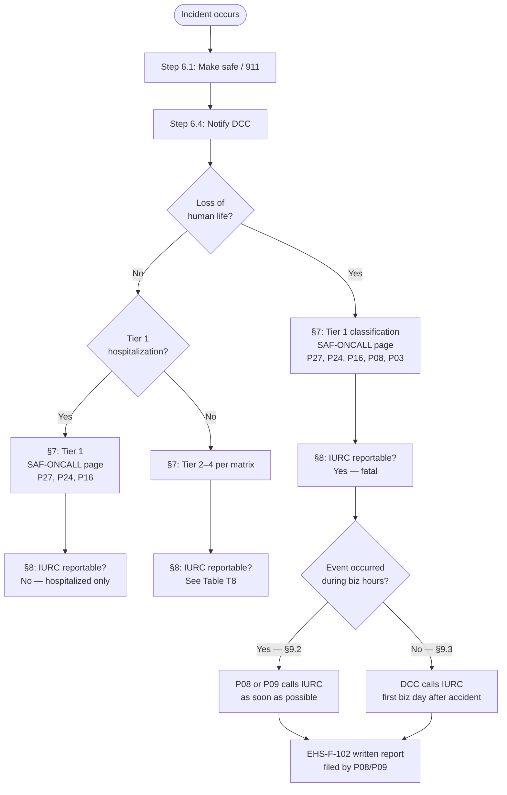

<!-- Document Control Block -->
| Field | Value |
|---|---|
| **Document ID** | RPL-SAF-PRO-009 |
| **Title** | Electrical Accident & Incident Reporting Procedure |
| **Version** | 2.0 |
| **Effective Date** | 2025-03-17 |
| **Approved Date** | 2025-03-12 |
| **Owner** | Tyrone Jackson, Manager, Safety (P27) |
| **Reviewer** | Sandra Kim, Director, Environmental Health & Safety (P24) |
| **Approver** | Elena Vasquez, Manager, Regulatory Affairs (P08) |
| **VP Operations Concurrence** | Michael Brennan, Vice President, Operations (P16) |
| **Law as-of** | 2024-12-31 |
| **Classification** | Internal |
| **Supersedes** | RPL-SAF-PRO-009 v1.2 (2023-10-02) |
| **Next Review** | 2026-03-17 |

> **Uncontrolled when printed — verify the current version in DCS before use.**

---

## Table of Contents

1. Purpose
2. Scope & Assessment Scope
3. Definitions
4. Regulatory Basis
5. Roles & Responsibilities
6. Immediate Actions
7. Severity Classification & Internal Notification Matrix
8. IURC Notification Decision
9. IURC Telephone Notice and Written Report
10. Other External Notifications
11. Incident Investigation
12. Corrective and Preventive Actions (CAPA)
13. OSHA/IOSHA Recordkeeping and Reporting
14. Records & Retention
15. Training
16. Related Documents
17. Revision History
18. Approval Block

Appendices:
- App-A: EHS-F-101 Incident Report (Rev. 03/2025)
- App-B: EHS-F-102 IURC Accident Notification Log & Written Report (Rev. 03/2025)
- App-C: Notification Contact Sheet
- App-D: Worked Examples — IURC Notification Branch
- App-E: Data Dictionary — incident_log_2024.csv

---

<!-- clause: RPL-SAF-PRO-009:1 -->
## 1. Purpose

This procedure establishes RPL's requirements for reporting, classifying, and investigating electrical accidents and incidents connected with the company's electric distribution facilities and field operations, including accidents and incidents involving employees, contractors, members of the public, vehicles, equipment, property damage, energized contacts, and near misses. It designates accountable roles, defines the process for notifying the Indiana Utility Regulatory Commission (IURC) of accidents attended with loss of human life, and ensures all required records are created and retained.

<!-- clause: RPL-SAF-PRO-009:2 -->
## 2. Scope & Assessment Scope

<!-- clause: RPL-SAF-PRO-009:2.1 -->
### 2.1 In Scope

This procedure covers all accidents and incidents:

- occurring on RPL premises or directly or indirectly arising from or connected with RPL's maintenance or operation of its electric distribution system;
- involving RPL employees, contractors working on RPL facilities, members of the public who contact RPL facilities, RPL fleet vehicles, and RPL equipment or property;
- occurring anywhere within RPL's service territory in the 14 west-central Indiana counties listed in §1.1.

This procedure covers IURC accident reporting (170 IAC 4-1-24) and the associated record retention (170 IAC 4-1-3) in full. It applies to RPL as an electrical public utility subject to IURC jurisdiction. (170 IAC 4-1-2)

<!-- clause: RPL-SAF-PRO-009:2.2 -->
### 2.2 Assessment Scope — Out-of-Scope References

The following laws and procedures are referenced by clause only; no values are stated here:

<!-- clause: RPL-SAF-PRO-009:2.2.1 -->
**Statutory duty:** IC 8-1-2-114 imposes the underlying legal requirement to notify the commission of every accident attended with loss of human life. RPL complies with IC 8-1-2-114 through the process in §9. This statutory provision is outside the v1 IURC knowledge layer; it is named here as context only.

<!-- clause: RPL-SAF-PRO-009:2.2.2 -->
**IOSHA/OSHA recordkeeping and severe-injury reporting:** See RPL-SAF-PRO-010. This procedure does not restate OSHA Form 300/301 obligations or severe-injury notification requirements.

<!-- clause: RPL-SAF-PRO-009:2.2.3 -->
**DOT post-accident drug and alcohol testing for CDL drivers:** See RPL-HR-PRO-015.

<!-- clause: RPL-SAF-PRO-009:2.2.4 -->
**Indiana 811 damage reporting for dig-ins:** See RPL-DO-PRO-020.

<!-- clause: RPL-SAF-PRO-009:2.2.5 -->
**Third-party claims:** See RPL-CLM-PRO-001.

<!-- clause: RPL-SAF-PRO-009:2.2.6 -->
**IC 8-1-2-40 (records preservation statute):** This statute governs certain records preservation requirements and is referenced in 170 IAC 4-1-3. It is outside the v1 knowledge layer; records retention in §14 is governed by 170 IAC 4-1-3 and RPL-LEG-RRS-001.

---

<!-- clause: RPL-SAF-PRO-009:3 -->
## 3. Definitions

<!-- clause: RPL-SAF-PRO-009:3.1 -->
**Commission** — The Indiana Utility Regulatory Commission (IURC). *(170 IAC 4-1-1(b))*

<!-- clause: RPL-SAF-PRO-009:3.2 -->
**Accident attended with loss of human life** — An accident in which a person dies, occurring on RPL premises or directly or indirectly arising from or connected with RPL's maintenance or operation of its electric distribution system. This is the trigger for IURC notification under 170 IAC 4-1-24. *(pack term; meaning taken from 170 IAC 4-1-24)*

<!-- clause: RPL-SAF-PRO-009:3.3 -->
**Regular business day** — A calendar day that is Monday through Friday, is not a State of Indiana public holiday, and falls within IURC office hours. **Company position:** RPL defines "regular business day" as a day on which the IURC is open for business, using the IURC's published hours of 8:15 a.m. to 4:45 p.m. ET. Weekends and the State of Indiana public holidays are outside regular business hours. See §8.2.

<!-- clause: RPL-SAF-PRO-009:3.4 -->
**Incident** — Any unplanned event arising from RPL's operations that results in, or could have resulted in, injury, illness, property damage, environmental release, or harm to a third party. Includes all categories in Table S-INC (§7.1).

<!-- clause: RPL-SAF-PRO-009:3.5 -->
**Near miss** — An unplanned event that did not result in injury, illness, or property damage but had the potential to do so. *Company definition — not defined in 170 IAC 4-1-24.*

<!-- clause: RPL-SAF-PRO-009:3.6 -->
**SIF potential (Serious Injury or Fatality potential)** — A near-miss event that, under slightly different circumstances, would likely have resulted in a fatality or permanent disability. *Company definition — not defined in 170 IAC 4-1-24.*

<!-- clause: RPL-SAF-PRO-009:3.7 -->
**Energized contact** — Direct or indirect physical contact, or establishment of an electric arc, between a person or conductive object and an energized electrical conductor or equipment, whether or not an injury results. *Company definition.*

<!-- clause: RPL-SAF-PRO-009:3.8 -->
**Tier** — RPL's four-level internal severity classification for incidents. See Table T7-1 (§7.1). *Company definition — not a regulatory threshold.*

<!-- clause: RPL-SAF-PRO-009:3.9 -->
**EHS-IMS** — RPL's EHS Incident Management System; the system of record for all incident reports and investigation files.

<!-- clause: RPL-SAF-PRO-009:3.10 -->
**DCC** — Distribution Control Center, Lafayette, staffed 24/7.

<!-- clause: RPL-SAF-PRO-009:3.11 -->
**CAPA** — Corrective and preventive action. Tracked in EHS-IMS under the identifier format `CAPA-2025-nnnn`.

---

<!-- clause: RPL-SAF-PRO-009:4 -->
## 4. Regulatory Basis

<!-- table: RPL-SAF-PRO-009:T4 -->
| ID | Citation | Heading | Disposition | Key Provision |
|---|---|---|---|---|
| T4-1 | 170 IAC 4-1-2 | Applicability of rules | Covered — §2.1 | These rules apply to any electrical public utility subject to IURC jurisdiction |
| T4-2 | 170 IAC 4-1-3 | Retention of records | Covered — §14 | Records preserved at least 3 years; kept within Indiana; open for commission examination |
| T4-3 | 170 IAC 4-1-24 | Accident reports | Covered — §8, §9, §14 | Telephone and written reports to IURC for every accident attended with loss of human life |
| T4-4 | 170 IAC 4-1-1 | Definitions | Covered — §3.1 | "Commission" means the Indiana Utility Regulatory Commission |

**Out-of-scope references** (see §2.2):
- IC 8-1-2-114 — statutory duty; no values
- IC 8-1-2-40 — records preservation statute; no values
- IOSHA/OSHA — RPL-SAF-PRO-010
- DOT post-accident testing — RPL-HR-PRO-015
- Indiana 811 — RPL-DO-PRO-020
- Third-party claims — RPL-CLM-PRO-001

---

<!-- clause: RPL-SAF-PRO-009:5 -->
## 5. Roles & Responsibilities

<!-- clause: RPL-SAF-PRO-009:5.1 -->
### 5.1 RACI Table

<!-- table: RPL-SAF-PRO-009:T5 -->
| Activity | Crew Lead / PIC | DCC Shift Supervisor | Kevin Adeyemi (P23) DCC Manager | Tyrone Jackson (P27) Safety Manager | Sandra Kim (P24) Dir. EHS | Elena Vasquez (P08) Mgr. Regulatory Affairs | Marcus Lee (P09) Reg. Analyst | Jonathan Pierce (P03) Sr. Counsel | Michael Brennan (P16) VP Operations | Corporate Communications | Claims |
|---|---|---|---|---|---|---|---|---|---|---|---|
| Immediate make-safe and EMS call | **R** | I | I | I | I | — | — | — | I | — | — |
| Open EHS-IMS incident report (EHS-F-101) | **R** | — | — | A | C | — | — | — | — | — | — |
| Notify DCC of incident | **R** | **R** | I | I | — | — | — | — | — | — | — |
| Determine tier and category (§7) | C | — | — | **R/A** | C | — | — | — | I | — | — |
| Execute internal notification matrix (§7) | — | **R** | **A** | **R** | C | — | — | — | I | — | — |
| IURC reportability determination (§8) | — | — | — | C | C | **R/A** | C | — | — | — | — |
| IURC telephone notice (§9) | — | **R** (after-hours) | — | C | C | **R/A** | C | — | — | — | — |
| IURC written report (§9) | — | — | — | C | C | **R/A** | **R** | I | — | — | — |
| Tier 1–2 investigation (§11) | C | — | — | **R/A** | C | — | — | **C** (privilege) | I | I | I |
| CAPA tracking (§12) | — | — | — | **R/A** | C | — | — | — | I | — | — |
| Records (§14) | — | — | — | **R** | **A** | — | — | — | — | — | — |

**R** = Responsible; **A** = Accountable; **C** = Consulted; **I** = Informed; — = No role

<!-- clause: RPL-SAF-PRO-009:5.2 -->
### 5.2 Role Descriptions

<!-- clause: RPL-SAF-PRO-009:5.2.1 -->
**Crew Lead / Person in Charge (PIC):** The RPL employee or contractor lead on site at the time of the incident. Responsible for implementing immediate actions (§6), calling 911, notifying DCC, and preserving the scene.

<!-- clause: RPL-SAF-PRO-009:5.2.2 -->
**DCC Shift Supervisor:** Receives initial notification from the field. Activates the notification matrix, pages SAF-ONCALL, and, when an incident occurs outside IURC business hours and involves loss of human life, places the IURC telephone call on the first business day following the accident (§9.3).

<!-- clause: RPL-SAF-PRO-009:5.2.3 -->
**Kevin Adeyemi (P23), Manager, Distribution Control Center:** Oversees DCC response; ensures SAF-ONCALL is paged and Tier 1 escalation reaches VP Operations.

<!-- clause: RPL-SAF-PRO-009:5.2.4 -->
**Tyrone Jackson (P27), Manager, Safety:** Incident classification authority; leads or assigns investigation for Tier 1–2; manages CAPA tracking; maintains records under RRS-SAF-001.

<!-- clause: RPL-SAF-PRO-009:5.2.5 -->
**Sandra Kim (P24), Director, Environmental Health & Safety:** Concurrence authority on tier classification for Tier 1; reviews investigation reports; approves CAPA closure.

<!-- clause: RPL-SAF-PRO-009:5.2.6 -->
**Elena Vasquez (P08), Manager, Regulatory Affairs:** Primary responsible party for IURC telephone notice and written report. Contactable via REG-ONCALL paging group.

<!-- clause: RPL-SAF-PRO-009:5.2.7 -->
**Marcus Lee (P09), Regulatory Affairs Analyst:** Alternate for P08; drafts EHS-F-102 written report sections; manages filing record.

<!-- clause: RPL-SAF-PRO-009:5.2.8 -->
**Jonathan Pierce (P03), Senior Counsel, Regulatory:** Reviewed under attorney-client privilege for Tier 1–2 investigations; notified before written IURC report is filed.

<!-- clause: RPL-SAF-PRO-009:5.2.9 -->
**Michael Brennan (P16), Vice President, Operations:** Receives Tier 1 notification; approves release of public statements with Corporate Communications.

<!-- clause: RPL-SAF-PRO-009:5.2.10 -->
**Corporate Communications (role):** Manages all media inquiries per RPL-COM-PRO-002. No statement may be made to the press before VP Operations (P16) approval.

<!-- clause: RPL-SAF-PRO-009:5.2.11 -->
**Claims (role):** RPL-CLM-PRO-001 governs third-party claims. Claims is notified for any Tier 1–2 incident involving a member of the public or property damage to third parties.

---

<!-- clause: RPL-SAF-PRO-009:6 -->
## 6. Immediate Actions

The following steps are company practice. They apply to every incident regardless of tier or category.

<!-- clause: RPL-SAF-PRO-009:6.1 -->
**Step 1 — Make safe.** The person in charge immediately de-energizes, grounds, and establishes a clear zone around any energized hazard in compliance with RPL-SAF-PRO-002 (Electrical Safety Rulebook). No one enters the hazard zone until the area is declared safe by a qualified employee.

> **Caution:** Do not attempt to de-energize a high-voltage conductor without proper switching authority from the DCC. Call the DCC at 1-800-555-0142 (internal: x4023) for switching instructions.

<!-- clause: RPL-SAF-PRO-009:6.2 -->
**Step 2 — Call 911 and provide emergency medical services.** If any person is injured, the PIC calls 911 without delay and provides first aid until emergency medical services arrive. The PIC identifies the location using the county, nearest cross street, and pole number or asset ID from GIS.

<!-- clause: RPL-SAF-PRO-009:6.3 -->
**Step 3 — Preserve the scene and evidence.** The PIC photographs the scene, tags all involved equipment "**Do not alter — EHS hold**," and instructs crew members not to move or alter evidence until the Safety Manager (P27) or a designated investigator releases the hold. Vehicle event data recorders and any electronic logs are preserved in-place.

> **Note:** Scene preservation also applies to RPL vehicles involved in incidents. The vehicle must not be moved except as directed by emergency services or law enforcement.

<!-- clause: RPL-SAF-PRO-009:6.4 -->
**Step 4 — Notify the DCC.** The PIC notifies the DCC shift supervisor by radio or phone (1-800-555-0142 after-hours; internal DCC direct line x4023) immediately after stabilizing the scene. The PIC provides: location, category, number of persons involved, injury status, and whether the hazard has been made safe.

<!-- clause: RPL-SAF-PRO-009:6.5 -->
**Step 5 — Open an EHS-IMS incident report.** The PIC or the DCC shift supervisor opens an incident report in EHS-IMS within 2 hours of initial notification, assigning a provisional `INC-2025-nnnnn` identifier and entering the event time, location, and category. The formal EHS-F-101 form (App-A) is completed within 24 hours.

> **Note:** A DCC shift supervisor who opens the EHS-IMS report on behalf of the field is not relieved of the notification matrix obligations in §7.

---

<!-- clause: RPL-SAF-PRO-009:7 -->
## 7. Severity Classification & Internal Notification Matrix

<!-- clause: RPL-SAF-PRO-009:7.1 -->
### 7.1 Incident Category Codes (Table S-INC)

<!-- table: RPL-SAF-PRO-009:T7a -->
| Code | Description |
|---|---|
| VEH | Vehicle incident (RPL fleet or contractor vehicle in the course of RPL work) |
| ENRG | Energized contact (direct or arc contact; no injury required) |
| FALL | Fall, slip, or trip |
| STRIK | Struck by object or equipment |
| FIRE | Fire or explosion |
| CUST | Public contact with RPL facility (member of the public contacts RPL equipment or infrastructure) |
| DIGN | Dig-in or underground contact (damage to RPL underground facilities) |
| EQP | Equipment or tool injury |
| PROP | Property damage (RPL or third-party; no injury) |
| NMSSSIF | Near miss with SIF potential |
| OTHER | Other incident not fitting the categories above |

<!-- clause: RPL-SAF-PRO-009:7.2 -->
### 7.2 Severity Tiers

> **Caution:** Severity tiers are RPL's internal classification. They do **not** define IURC reporting obligations; that determination is governed solely by 170 IAC 4-1-24 and is made in §8.

<!-- table: RPL-SAF-PRO-009:T7b -->
| Tier | Definition |
|---|---|
| Tier 1 | Fatality or hospitalization (including overnight observation) |
| Tier 2 | Lost-time injury or restricted work |
| Tier 3 | Medical treatment (no lost time) |
| Tier 4 | First aid, near miss, property damage only, or public contact with no injury |

**Company position:** A Tier 1 hospitalization that results in a subsequent death is reclassified to "fatal" and the IURC notification process in §8 is initiated immediately upon RPL being informed of the death, even if the original incident was classified as Tier 1 hospitalized.

<!-- clause: RPL-SAF-PRO-009:7.3 -->
### 7.3 Internal Notification Matrix

<!-- table: RPL-SAF-PRO-009:T7c -->
| Tier | Examples | Who is Notified | Internal Target | By Whom | Logged in |
|---|---|---|---|---|---|
| Tier 1 | Fatality; hospitalization; fatal public contact | P27 Safety Manager; P24 Dir. EHS; P16 VP Operations; P08 Mgr. Regulatory Affairs; P03 Sr. Counsel (for Tier 1 fatality); Corporate Communications; Claims (if public or third-party) | Internal performance target: within 1 hour of PIC notification to DCC | DCC Shift Supervisor via SAF-ONCALL page and direct call | EHS-IMS, EHS-F-101 Part G |
| Tier 2 | Lost-time injury; restricted work; energized contact with injury | P27 Safety Manager; P24 Dir. EHS; P16 VP Operations | Internal performance target: within 2 hours of PIC notification to DCC | DCC Shift Supervisor via SAF-ONCALL page | EHS-IMS, EHS-F-101 Part G |
| Tier 3 | Medical treatment; vehicle incident with injury | P27 Safety Manager | Internal performance target: within 4 hours of PIC notification to DCC | DCC Shift Supervisor via SAF-ONCALL page | EHS-IMS, EHS-F-101 Part G |
| Tier 4 | First aid; near miss; NMSSSIF; property damage; public contact (no injury) | P27 Safety Manager (next business day) | Internal performance target: next business day | DCC Shift Supervisor via EHS-IMS notification | EHS-IMS |

**Note:** All internal notification targets above are company-practice performance targets, not regulatory requirements. The DCC shift supervisor pages SAF-ONCALL for Tier 1–3 events. If P27 is unavailable, SAF-ONCALL routes to the on-call EHS supervisor.

---

---

<!-- clause: RPL-SAF-PRO-009:8 -->
## 8. IURC Notification Decision

<!-- clause: RPL-SAF-PRO-009:8.1 -->
### 8.1 Step 1 — Loss-of-Life Gate

Before consulting Table T8, the DCC shift supervisor and P27 (Safety Manager) determine: **Was there loss of human life?**

- **Yes** → The event is reportable to the IURC regardless of category (subject to the nexus condition in §8.1.1 below). Proceed to §8.2 (business-hours determination) and §9.
- **No** → Consult Table T8. For all categories where `Reportable to IURC? = No`, complete internal and other-agency reporting per §7, §10, and §13.

<!-- clause: RPL-SAF-PRO-009:8.1.1 -->
**Nexus condition.** IURC reporting is required when "an accident attended with loss of human life occurs within this state upon its premises, or directly or indirectly arising from or connected with its maintenance or operation." (170 IAC 4-1-24) All three elements must be present: (1) loss of human life; (2) in Indiana; (3) on RPL premises or arising from/connected with RPL's maintenance or operation.

> **Note:** Hospitalization alone — even overnight ICU care — does not trigger IURC notification under 170 IAC 4-1-24. **Company position:** A Tier 1 hospitalized event becomes IURC-reportable only if the person subsequently dies and RPL is informed of that death.

<!-- clause: RPL-SAF-PRO-009:8.2 -->
### 8.2 Step 2 — Business-Hours Determination

**Company position:** RPL uses the IURC's published office hours — 8:15 a.m. to 4:45 p.m. ET, Monday through Friday — as the definition of "regular business day" for the timing branches in 170 IAC 4-1-24. Weekends and the State of Indiana public holidays are outside regular business hours for this purpose.

**2025 Indiana state public holidays (Table X):** January 1, January 20, May 26, July 4, September 1, November 27, November 28, December 24, December 25.

The DCC shift supervisor determines whether the accident (not the time RPL was informed) occurred during a regular business day, as follows:

<!-- table: RPL-SAF-PRO-009:T8a -->
| Condition | Determination | Timing branch |
|---|---|---|
| Accident occurred Monday–Friday, not a state holiday, between 8:15 a.m. and 4:45 p.m. ET | During regular business hours | §9.2 — telephone notice as soon as possible after RPL is informed |
| Accident occurred Monday–Friday, not a state holiday, before 8:15 a.m. or after 4:45 p.m. ET | Outside regular business hours | §9.3 — telephone notice as early as practical, first business day following the accident |
| Accident occurred Saturday, Sunday, or state holiday | Outside regular business hours | §9.3 — telephone notice as early as practical, first business day following the accident |

**Holiday edge case example:** An accident occurring on Saturday, May 24, 2025 is outside regular business hours. Monday, May 26, 2025 is Memorial Day (Indiana state holiday) and therefore not a business day. The first business day following the accident is Tuesday, May 27, 2025. The DCC shift supervisor initiates the IURC telephone call on Tuesday, May 27, 2025 at or after 8:15 a.m. ET.

<!-- clause: RPL-SAF-PRO-009:8.3 -->
### 8.3 Step 3 — IURC Reportability Decision Table

<!-- table: RPL-SAF-PRO-009:T8b -->
| Row | Category | Code | Reportable to IURC? | Condition (exact pack text) | Citation | Clause ID |
|---|---|---|---|---|---|---|
| 1 | Vehicle incident | VEH | **Yes** — when attended with loss of human life arising from/connected with RPL maintenance or operation | "every public utility shall whenever an accident attended with loss of human life occurs within this state upon its premises, or directly or indirectly arising from or connected with its maintenance or operation, give immediate notice thereof to the commission" | 170 IAC 4-1-24 | RPL-SAF-PRO-009:8.3 |
| 2 | Energized contact | ENRG | **Yes** — when attended with loss of human life arising from/connected with RPL maintenance or operation | Same as Row 1 | 170 IAC 4-1-24 | RPL-SAF-PRO-009:8.3 |
| 3 | Fall/slip/trip | FALL | **Yes** — when attended with loss of human life arising from/connected with RPL maintenance or operation | Same as Row 1 | 170 IAC 4-1-24 | RPL-SAF-PRO-009:8.3 |
| 4 | Struck by | STRIK | **Yes** — when attended with loss of human life arising from/connected with RPL maintenance or operation | Same as Row 1 | 170 IAC 4-1-24 | RPL-SAF-PRO-009:8.3 |
| 5 | Fire/explosion | FIRE | **Yes** — when attended with loss of human life arising from/connected with RPL maintenance or operation | Same as Row 1 | 170 IAC 4-1-24 | RPL-SAF-PRO-009:8.3 |
| 6 | Public contact with RPL facility | CUST | **Yes** — when attended with loss of human life arising from/connected with RPL maintenance or operation | Same as Row 1 | 170 IAC 4-1-24 | RPL-SAF-PRO-009:8.3 |
| 7 | Dig-in/underground contact | DIGN | **Yes** — when attended with loss of human life arising from/connected with RPL maintenance or operation | Same as Row 1 | 170 IAC 4-1-24 | RPL-SAF-PRO-009:8.3 |
| 8 | Equipment/tool injury | EQP | **Yes** — when attended with loss of human life arising from/connected with RPL maintenance or operation | Same as Row 1 | 170 IAC 4-1-24 | RPL-SAF-PRO-009:8.3 |
| 9 | Property damage | PROP | **No** — not reportable to the IURC under 170 IAC 4-1-24; internal and other-agency reporting per §7, §10, §13 | Property damage without loss of human life does not trigger 170 IAC 4-1-24 | 170 IAC 4-1-24 | RPL-SAF-PRO-009:8.3 |
| 10 | Near miss SIF potential | NMSSSIF | **No** — not reportable to the IURC under 170 IAC 4-1-24; internal and other-agency reporting per §7, §10, §13 | A near miss does not constitute an accident attended with loss of human life | 170 IAC 4-1-24 | RPL-SAF-PRO-009:8.3 |
| 11 | Other | OTHER | **Yes** — when attended with loss of human life arising from/connected with RPL maintenance or operation | Same as Row 1 | 170 IAC 4-1-24 | RPL-SAF-PRO-009:8.3 |

---

<!-- clause: RPL-SAF-PRO-009:9 -->
## 9. IURC Telephone Notice and Written Report

<!-- clause: RPL-SAF-PRO-009:9.1 -->
### 9.1 Overview

When an accident is determined to be IURC-reportable per §8, the process in §9.2–§9.5 applies. The IURC contact for accident notification is the IURC Energy Division (see App-C). RPL's primary contact for IURC notification is Elena Vasquez (P08), Manager, Regulatory Affairs. Marcus Lee (P09), Regulatory Affairs Analyst, serves as alternate. Outside regular business hours, the DCC shift supervisor places the initial telephone call if the timing requirement falls before P08 or P09 can be reached.

<!-- clause: RPL-SAF-PRO-009:9.2 -->
### 9.2 Telephone Notice — Accident During Regular Business Hours

When an accident attended with loss of human life occurs during a regular business day, the utility shall "as soon as possible after being informed of such an accident . . . inform the commission by telephone of pertinent details of the accident including the name of the deceased." (170 IAC 4-1-24)

**Who calls:** P08 (Elena Vasquez, Manager, Regulatory Affairs), or P09 (Marcus Lee, Regulatory Affairs Analyst) as alternate. The DCC shift supervisor pages REG-ONCALL immediately upon receiving notification from the field.

**Telephone content — each of the following is a required element of the call:**

<!-- clause: RPL-SAF-PRO-009:9.2.1 -->
**Element 1 — Pertinent details of the accident.** P08 or P09 provides all pertinent details known at the time of the call, including: date, time, and location of the accident; category and brief description of what occurred; the RPL facility or operation involved; number of persons involved and their status.

<!-- clause: RPL-SAF-PRO-009:9.2.2 -->
**Element 2 — Name of the deceased.** P08 or P09 states the name of the deceased person. If the identity has not been confirmed by law enforcement at the time of the call, this fact is stated on the call and the name is provided as a follow-up call as soon as confirmed.

**EHS-F-102 Part B (App-B)** is the call log. P08 or P09 completes EHS-F-102 Part B immediately after the call, recording the time RPL was informed of the accident, the business-hours determination, the time of the IURC call, the IURC contact reached, and each required content element.

<!-- clause: RPL-SAF-PRO-009:9.3 -->
### 9.3 Telephone Notice — Accident Outside Regular Business Hours

When an accident attended with loss of human life occurs outside a regular business day (weekend, state holiday, or outside IURC hours), "the commission shall be so informed as early as practical the first business day following the accident." (170 IAC 4-1-24)

**Who calls:** The DCC shift supervisor places the call at or after 8:15 a.m. ET on the first business day following the accident, and pages REG-ONCALL to transfer the call to P08 or P09 as soon as they are available during that business day. The call must be placed before P08 or P09 arrive at the office if neither is reachable before the IURC opens.

The same content elements (§9.2.1 and §9.2.2) apply to the after-hours notification call.

**EHS-F-102 Part B** is completed by P09, recording the after-hours determination and all call details.

<!-- clause: RPL-SAF-PRO-009:9.4 -->
### 9.4 Written Report

"This telephone notification shall be augmented by a written report of the fatal accident as soon as all pertinent information has been accumulated, such report will be filed in the appropriate commission files and available upon proper request or order." (170 IAC 4-1-24)

P08 is responsible for the written report. P09 compiles the report content using EHS-F-102 Parts C and D (App-B), which includes one field per required element plus RPL's internal narrative sections. Jonathan Pierce (P03), Senior Counsel, Regulatory, reviews the draft before filing.

**Company practice:** the written report is filed via the IURC Electronic Filing System (iurc.portal.in.gov) under the applicable IURC cause or docket. The filing record is preserved in EHS-F-102 Part D and in EHS-IMS under the incident record.

<!-- clause: RPL-SAF-PRO-009:9.5 -->
### 9.5 Written Report Content (Company Practice)

EHS-F-102 Part C includes the following sections (company practice; each corresponds to a field in the form):

1. Date, time, and location of the accident
2. Name(s) of deceased
3. Description of the accident and RPL facility/operation involved
4. Immediate cause analysis
5. Contributing factors
6. Actions taken (emergency response, scene preservation)
7. CAPA reference numbers (`CAPA-2025-nnnn`)
8. Attachments (photographs, police report, EHS-F-101, investigation timeline)

---

<!-- clause: RPL-SAF-PRO-009:10 -->
## 10. Other External Notifications

The following external notifications may also be required depending on the nature of the incident. This section provides reference only; the referenced procedures govern:

- **911 / Police / Fire:** §6.2. Emergency services are notified immediately for any incident involving injury or imminent hazard.
- **IOSHA (Indiana Occupational Safety and Health Administration):** See RPL-SAF-PRO-010 for severe injury and fatality reporting requirements applicable to employees. No values are stated here.
- **DOT post-accident testing (CDL drivers):** See RPL-HR-PRO-015.
- **Indiana 811 (underground facility damage):** See RPL-DO-PRO-020 for DIGN incidents.
- **Insurers and third-party claims:** See RPL-CLM-PRO-001.
- **Corporate Communications (media):** See RPL-COM-PRO-002. No public statement is issued without VP Operations (P16) approval.

---

<!-- clause: RPL-SAF-PRO-009:11 -->
## 11. Incident Investigation

<!-- clause: RPL-SAF-PRO-009:11.1 -->
### 11.1 Investigation by Tier

<!-- table: RPL-SAF-PRO-009:T11 -->
| Tier | Investigation Lead | Team Members | Method | Internal target completion | Privileged review | Report format |
|---|---|---|---|---|---|---|
| Tier 1 | P27 (Safety Manager) | P24 (Dir. EHS), operations supervisor, field crew, Subject Matter Expert (SME) as needed | ICAM-style causal analysis; physical evidence; witness statements; timeline reconstruction | Internal performance target: root-cause report to P24 within 45 calendar days of incident | P03 (Sr. Counsel) reviews draft under attorney-client privilege before distribution | Full investigation report in EHS-IMS, attached to EHS-F-101 |
| Tier 2 | P27 (Safety Manager) | Operations supervisor, field crew | ICAM-style causal analysis; timeline reconstruction | Internal performance target: root-cause report to P24 within 30 calendar days of incident | P03 available for consultation at P27 discretion | Investigation report in EHS-IMS, attached to EHS-F-101 |
| Tier 3 | Operations supervisor (designated by P27) | Field crew | 5-Why analysis; written narrative | Internal performance target: closed in EHS-IMS within 14 calendar days of incident | Not required | Incident report plus investigation narrative in EHS-IMS |
| Tier 4 | Field crew lead or designated supervisor | — | Narrative description; contributing factor identification | Internal performance target: closed in EHS-IMS within 7 calendar days of incident | Not required | Incident report in EHS-IMS |

<!-- clause: RPL-SAF-PRO-009:11.2 -->
### 11.2 Investigation Checklist (Tier 1–2)

The Tier 1–2 investigation lead completes each of the following:

- [ ] Scene photographs documented and preserved (EHS-F-101 Part E)
- [ ] Equipment tagged "Do not alter — EHS hold" and preserved until P27 releases
- [ ] All witnesses identified and statements taken within 48 hours of incident
- [ ] Equipment inspection completed; test results attached
- [ ] Timeline reconstructed from EHS-IMS, DCC logs, and OMS event records
- [ ] Circuit and substation records pulled from GIS and WAM
- [ ] ICAM causal analysis completed (immediate causes, contributing factors, root causes, systemic factors)
- [ ] Draft report reviewed by P03 (P27 notifies P03 before distribution)
- [ ] CAPA items entered in EHS-IMS (§12) before report is finalized
- [ ] Report approved by P24 and filed in EHS-IMS

---

<!-- clause: RPL-SAF-PRO-009:12 -->
## 12. Corrective and Preventive Actions (CAPA)

<!-- clause: RPL-SAF-PRO-009:12.1 -->
**CAPA creation.** P27 creates a CAPA record in EHS-IMS for each corrective or preventive action identified in an investigation. Each CAPA receives an identifier in the format `CAPA-2025-nnnn`, an owner (by role or P-ID), and a due date.

<!-- clause: RPL-SAF-PRO-009:12.2 -->
**Due dates (company practice):** Tier 1 CAPAs — initial corrective actions within 30 calendar days of investigation close; systemic CAPAs within 90 calendar days. Tier 2 CAPAs — within 60 calendar days. Tier 3–4 CAPAs — within 30 calendar days. Extensions require P24 approval and are noted in EHS-IMS.

<!-- clause: RPL-SAF-PRO-009:12.3 -->
**Effectiveness review.** P27 reviews each CAPA at 90 days post-closure to confirm the corrective action is sustained. Results are recorded in EHS-IMS.

<!-- clause: RPL-SAF-PRO-009:12.4 -->
**Closure approval.** CAPA closure requires P24 sign-off in EHS-IMS.

<!-- clause: RPL-SAF-PRO-009:12.5 -->
**Lessons-learned bulletins.** For Tier 1–2 events with systemic root causes, P27 issues a safety lessons-learned bulletin (format: `SAF-LL-2025-nn`) distributed to all field supervisors and DCC. Bulletins are archived in EHS-IMS under series RRS-SAF-003.

> **Note:** CAPA records are company practice and are not submitted to the IURC. The IURC written report (§9.4) may reference CAPA numbers to document actions taken.

---

<!-- clause: RPL-SAF-PRO-009:13 -->
## 13. OSHA/IOSHA Recordkeeping and Reporting

OSHA Form 300, OSHA Form 301, and the IOSHA severe-injury notification process are governed by RPL-SAF-PRO-010 (OSHA/IOSHA Recordkeeping & Reporting Procedure). This section is an out-of-scope reference only; no values are stated here. P27 (Safety Manager) coordinates with RPL-SAF-PRO-010 process owners to ensure incidents classified Tier 1–3 under this procedure are evaluated for OSHA recordability.

---

<!-- clause: RPL-SAF-PRO-009:14 -->
## 14. Records & Retention

<!-- clause: RPL-SAF-PRO-009:14.1 -->
**Retention minimum.** "All records required by these rules shall be preserved for at least three years except as otherwise provided herein or by IC 8-1-2-40 (Burns 54-315)." (170 IAC 4-1-3)

<!-- clause: RPL-SAF-PRO-009:14.2 -->
**Records location.** Records "shall be kept within the State at the principal place of business of the public utility, or at such other places as the utility shall designate after notification to the commission, and shall be open for examination by the commission or its representatives." RPL's principal place of business is 400 Wabash Commons Drive, Lafayette, Indiana 47901. Electronic records are maintained in EHS-IMS (Lafayette server farm). Records maintained at other locations are designated only after RPL notifies the IURC as required by 170 IAC 4-1-3. (170 IAC 4-1-3)

<!-- clause: RPL-SAF-PRO-009:14.3 -->
**Commission notification.** "Each public utility shall notify the commission of the office at which such records are kept." RPL has notified the IURC of its records locations per the requirements of 170 IAC 4-1-3.

<!-- clause: RPL-SAF-PRO-009:14.4 -->
**IC 8-1-2-40.** IC 8-1-2-40 is referenced in 170 IAC 4-1-3 as a source of additional or alternative retention requirements. It is outside the v1 knowledge layer; RPL-LEG-RRS-001 governs final retention periods, which equal or exceed the regulatory minimum.

<!-- table: RPL-SAF-PRO-009:T14 -->
| Record Series | Series ID | System | Minimum Retention | Authority | Notes |
|---|---|---|---|---|---|
| Incident reports and investigation files | RRS-SAF-001 | EHS-IMS | 3 years | 170 IAC 4-1-3 | EHS-F-101 and all attachments |
| IURC accident notification logs and written reports | RRS-SAF-002 | EHS-IMS / DCS | 3 years | 170 IAC 4-1-3 | EHS-F-102 and IURC filing confirmation |
| CAPA records | RRS-SAF-003 | EHS-IMS | 3 years | 170 IAC 4-1-3 | All CAPA-2025-nnnn records |
| Training completion records | RRS-TRN-001 | EHS-IMS | Per RPL-LEG-RRS-001 | RPL-LEG-RRS-001 | SAF-T-05, SAF-T-06, DCC drill records |

Final retention periods, including any RPL-specific extensions, are set by RPL-LEG-RRS-001.

---

<!-- clause: RPL-SAF-PRO-009:15 -->
## 15. Training

<!-- table: RPL-SAF-PRO-009:T15 -->
| Training Code | Title | Audience | Frequency | Owner | Record Series |
|---|---|---|---|---|---|
| SAF-T-05 | Incident Reporting (this procedure) | All employees and contractors with field assignments | Annual | P27 (Safety Manager) | RRS-TRN-001 |
| SAF-T-06 | Incident Investigation for Supervisors | All supervisors and crew leads | New supervisor; refresher every 3 years | P27 (Safety Manager) | RRS-TRN-001 |
| DCC Drill — IURC Notification Branch | Tabletop drill: simulated Tier 1 fatal event; DCC shift supervisor places mock IURC call following §9.2 or §9.3 | DCC shift supervisors; P08; P09 | Twice per calendar year (schedule set by P27) | P27 with P08 | RRS-TRN-001 |

> **Note:** Completion of SAF-T-05 is a prerequisite for any employee performing field work on RPL facilities. Training records are maintained in EHS-IMS under RRS-TRN-001.

---

<!-- clause: RPL-SAF-PRO-009:16 -->
## 16. Related Documents

| Document ID | Title |
|---|---|
| RPL-SAF-PRO-002 | Electrical Safety Rulebook |
| RPL-SAF-PRO-010 | OSHA/IOSHA Recordkeeping & Reporting Procedure |
| RPL-HR-PRO-015 | Drug & Alcohol Testing Procedure (incl. DOT post-accident) |
| RPL-DO-PRO-020 | Damage Prevention & Indiana 811 Procedure |
| RPL-CLM-PRO-001 | Third-Party Claims Procedure |
| RPL-EMR-PLN-001 | Emergency Response & Storm Restoration Plan |
| RPL-COM-PRO-002 | Media & Public Communications Procedure |
| RPL-DCC-PRO-003 | Service Interruption Reporting Procedure |
| RPL-ENV-PRO-005 | Spill Response & Reporting Procedure |
| RPL-LEG-RRS-001 | Records Retention Schedule |
| RPL-LEG-PRO-003 | Legal Hold Procedure |

---

<!-- clause: RPL-SAF-PRO-009:17 -->
## 17. Revision History

<!-- table: RPL-SAF-PRO-009:T17 -->
| Version | Effective Date | Approved By | Change Summary |
|---|---|---|---|
| 1.0 | 2019-06-01 | P24 | Initial release; established IURC notification process and EHS-F-101 form |
| 1.1 | 2021-04-12 | P24 | Added energized contact category (ENRG); updated DCC notification steps following DCC system migration to new OMS |
| 1.2 | 2023-10-02 | P08 | Added NMSSSIF category per SafeStart program; revised investigation checklist; updated form EHS-F-101 (Rev. 10/2023); corrected contact information for IURC Energy Division following PNC Center relocation |
| 2.0 (current) | 2025-03-17 | P08 | Comprehensive revision: restructured to 18-section format; added §8 IURC decision table with full Table S-INC coverage; formalized business-hours interpretation (§8.2); added App-D worked examples; updated EHS-F-101 (Rev. 03/2025) and EHS-F-102 (Rev. 03/2025); added DCC drill requirement (§15); aligned with RPL-LEG-RRS-001 v7.2 retention series |

---

<!-- clause: RPL-SAF-PRO-009:18 -->
## 18. Approval Block

| Role | Name | Title | Signature | Date |
|---|---|---|---|---|
| Prepared by | Tyrone Jackson (P27) | Manager, Safety | _________________ | 2025-03-10 |
| Reviewed by | Sandra Kim (P24) | Director, Environmental Health & Safety | _________________ | 2025-03-11 |
| Approved by (IURC reporting) | Elena Vasquez (P08) | Manager, Regulatory Affairs | _________________ | 2025-03-12 |
| VP Operations Concurrence | Michael Brennan (P16) | Vice President, Operations | _________________ | 2025-03-12 |

---

## Appendix A — EHS-F-101 Incident Report (Rev. 03/2025)

<!-- clause: RPL-SAF-PRO-009:App-A -->
**Form ID:** EHS-F-101 (Rev. 03/2025) · **Maintained by:** P27 (Safety Manager) · **Filed in:** EHS-IMS

---

<!-- clause: RPL-SAF-PRO-009:App-A.1 -->
### Part A — Event

<!-- clause: RPL-SAF-PRO-009:App-A.F1 -->
**A.F1** EHS-IMS Incident ID: `INC-____-_____` *(auto-assigned upon creation; format INC-YYYY-nnnnn)*

<!-- clause: RPL-SAF-PRO-009:App-A.F2 -->
**A.F2** Date of event: `YYYY-MM-DD` ☐

<!-- clause: RPL-SAF-PRO-009:App-A.F3 -->
**A.F3** Time of event: `hh:mm` (local) · UTC offset: `__:__`

<!-- clause: RPL-SAF-PRO-009:App-A.F4 -->
**A.F4** Service center: ☐ LAF ☐ CRW ☐ THT ☐ FRK ☐ DAN

<!-- clause: RPL-SAF-PRO-009:App-A.F5 -->
**A.F5** Location — street address or nearest cross street: _______________________

<!-- clause: RPL-SAF-PRO-009:App-A.F6 -->
**A.F6** County: _______________________ · Pole/asset ID (from GIS): _______________________

<!-- clause: RPL-SAF-PRO-009:App-A.F7 -->
**A.F7** Latitude (decimal degrees): _____________ · Longitude (decimal degrees): _____________

<!-- clause: RPL-SAF-PRO-009:App-A.F8 -->
**A.F8** Tier (§7.2): ☐ Tier 1 ☐ Tier 2 ☐ Tier 3 ☐ Tier 4

<!-- clause: RPL-SAF-PRO-009:App-A.F9 -->
**A.F9** Category (§7.1, Table S-INC): ☐ VEH ☐ ENRG ☐ FALL ☐ STRIK ☐ FIRE ☐ CUST ☐ DIGN ☐ EQP ☐ PROP ☐ NMSSSIF ☐ OTHER

---

<!-- clause: RPL-SAF-PRO-009:App-A.2 -->
### Part B — Person(s) Involved

*(Complete one Part B section per person involved. For employees, complete all OSHA 301-style fields per RPL-SAF-PRO-010; no regulatory values are stated here.)*

<!-- clause: RPL-SAF-PRO-009:App-A.F10 -->
**A.F10** Person type: ☐ Employee ☐ Contractor ☐ Member of public ☐ None

<!-- clause: RPL-SAF-PRO-009:App-A.F11 -->
**A.F11** Name (or "member of the public — identified to law enforcement" if public): _______________________

<!-- clause: RPL-SAF-PRO-009:App-A.F12 -->
**A.F12** Employer / company: _______________________

<!-- clause: RPL-SAF-PRO-009:App-A.F13 -->
**A.F13** Injury severity (§7.2): ☐ None ☐ First aid ☐ Medical treatment ☐ Restricted work ☐ Lost time ☐ Hospitalized ☐ Fatal

<!-- clause: RPL-SAF-PRO-009:App-A.F14 -->
**A.F14** Body part affected (if injured): _______________________

<!-- clause: RPL-SAF-PRO-009:App-A.F15 -->
**A.F15** Medical treatment received (if any): _______________________

---

<!-- clause: RPL-SAF-PRO-009:App-A.3 -->
### Part C — Electrical Details

<!-- clause: RPL-SAF-PRO-009:App-A.F16 -->
**A.F16** Voltage class of equipment involved: ☐ 120/240V ☐ 12.47kV ☐ 34.5kV ☐ 69kV ☐ Unknown ☐ N/A

<!-- clause: RPL-SAF-PRO-009:App-A.F17 -->
**A.F17** Equipment type and RPL asset ID: _______________________

<!-- clause: RPL-SAF-PRO-009:App-A.F18 -->
**A.F18** Circuit ID (from GIS): _______________________

<!-- clause: RPL-SAF-PRO-009:App-A.F19 -->
**A.F19** Was the equipment energized at time of incident? ☐ Yes ☐ No ☐ Unknown

<!-- clause: RPL-SAF-PRO-009:App-A.F20 -->
**A.F20** Grounds installed prior to work? ☐ Yes ☐ No ☐ N/A

<!-- clause: RPL-SAF-PRO-009:App-A.F21 -->
**A.F21** PPE in use at time of incident: _______________________

<!-- clause: RPL-SAF-PRO-009:App-A.F22 -->
**A.F22** Minimum approach distance (MAD) per RPL-SAF-PRO-002 — was MAD maintained? ☐ Yes ☐ No ☐ N/A

---

<!-- clause: RPL-SAF-PRO-009:App-A.4 -->
### Part D — Narrative

<!-- clause: RPL-SAF-PRO-009:App-A.F23 -->
**A.F23** Activity being performed immediately before the incident: _______________________ *(text)*

<!-- clause: RPL-SAF-PRO-009:App-A.F24 -->
**A.F24** Description of what happened — sequence of events: _______________________ *(text)*

<!-- clause: RPL-SAF-PRO-009:App-A.F25 -->
**A.F25** Object or energy source that caused the injury/damage: _______________________

---

<!-- clause: RPL-SAF-PRO-009:App-A.5 -->
### Part E — Witnesses and Evidence

<!-- clause: RPL-SAF-PRO-009:App-A.F26 -->
**A.F26** Witness names and contact information (or "no witnesses"): _______________________ *(text)*

<!-- clause: RPL-SAF-PRO-009:App-A.F27 -->
**A.F27** Photographs taken? ☐ Yes (count: ___) ☐ No · Attached to EHS-IMS record? ☐ Yes ☐ No

<!-- clause: RPL-SAF-PRO-009:App-A.F28 -->
**A.F28** Equipment tagged "Do not alter — EHS hold"? ☐ Yes ☐ No · Tag applied by: _______ Date/time: `hh:mm YYYY-MM-DD`

---

<!-- clause: RPL-SAF-PRO-009:App-A.6 -->
### Part F — Outage Cross-Reference

<!-- clause: RPL-SAF-PRO-009:App-A.F29 -->
**A.F29** Did the incident cause an outage? ☐ Yes ☐ No

<!-- clause: RPL-SAF-PRO-009:App-A.F30 -->
**A.F30** OMS Event ID (from RPL-DCC-PRO-003): `EVT-____-_______` *(leave blank if no outage)*

---

<!-- clause: RPL-SAF-PRO-009:App-A.7 -->
### Part G — Notification Log

<!-- clause: RPL-SAF-PRO-009:App-A.F31 -->
**A.F31** DCC notified — date/time: `YYYY-MM-DD hh:mm`

<!-- clause: RPL-SAF-PRO-009:App-A.F32 -->
**A.F32** SAF-ONCALL paged — date/time: `YYYY-MM-DD hh:mm`

<!-- clause: RPL-SAF-PRO-009:App-A.F33 -->
**A.F33** Internal notifications per §7 matrix — completed? ☐ Yes *(attach log from EHS-IMS)*

<!-- clause: RPL-SAF-PRO-009:App-A.F34 -->
**A.F34** IURC reportable (§8 Table T8b)? ☐ Yes ☐ No · Category row: ___

<!-- clause: RPL-SAF-PRO-009:App-A.F35 -->
**A.F35** If IURC reportable — EHS-F-102 initiated? ☐ Yes ☐ No · EHS-IMS cross-reference: _______________________

<!-- clause: RPL-SAF-PRO-009:App-A.F36 -->
**A.F36** Police report number (if law enforcement responded): _______________________

---

<!-- clause: RPL-SAF-PRO-009:App-A.8 -->
### Part H — Sign-offs

<!-- clause: RPL-SAF-PRO-009:App-A.F37 -->
**A.F37** Completed by (PIC or DCC shift supervisor): _________________ Date: `YYYY-MM-DD`

<!-- clause: RPL-SAF-PRO-009:App-A.F38 -->
**A.F38** Reviewed by (Safety Manager P27): _________________ Date: `YYYY-MM-DD`

<!-- clause: RPL-SAF-PRO-009:App-A.F39 -->
**A.F39** *Office use only* — EHS-IMS record number confirmed: _______ · Classification confirmed: ☐ Yes ☐ Revised (explain in narrative)

---

## Appendix B — EHS-F-102 IURC Accident Notification Log & Written Report (Rev. 03/2025)

<!-- clause: RPL-SAF-PRO-009:App-B -->
**Form ID:** EHS-F-102 (Rev. 03/2025) · **Maintained by:** P08 (Manager, Regulatory Affairs) · **Filed in:** EHS-IMS and DCS (series RRS-SAF-002)

---

<!-- clause: RPL-SAF-PRO-009:App-B.1 -->
### Part A — Reportability Decision

<!-- clause: RPL-SAF-PRO-009:App-B.F1 -->
**B.F1** Incident ID (cross-reference to EHS-F-101): `INC-____-_____`

<!-- clause: RPL-SAF-PRO-009:App-B.F2 -->
**B.F2** Category (Table S-INC code): _______

<!-- clause: RPL-SAF-PRO-009:App-B.F3 -->
**B.F3** Decision table row (§8.3, Table T8b): Row ___

<!-- clause: RPL-SAF-PRO-009:App-B.F4 -->
**B.F4** Reportable to IURC? ☐ Yes ☐ No · If No — basis: _______________________

<!-- clause: RPL-SAF-PRO-009:App-B.F5 -->
**B.F5** Loss of human life confirmed? ☐ Yes ☐ No · Confirmed by (law enforcement / medical authority): _______________________

---

<!-- clause: RPL-SAF-PRO-009:App-B.2 -->
### Part B — Telephone Notice

*(Complete only when IURC-reportable)*

<!-- clause: RPL-SAF-PRO-009:App-B.F6 -->
**B.F6** Date/time RPL was informed of accident: `YYYY-MM-DD hh:mm`

<!-- clause: RPL-SAF-PRO-009:App-B.F7 -->
**B.F7** Accident occurred: ☐ During regular business hours (§9.2) ☐ Outside regular business hours (§9.3) · IURC hours: 8:15 a.m.–4:45 p.m. ET, Mon–Fri, excl. state holidays

<!-- clause: RPL-SAF-PRO-009:App-B.F8 -->
**B.F8** IURC telephone call placed — date/time: `YYYY-MM-DD hh:mm`

<!-- clause: RPL-SAF-PRO-009:App-B.F9 -->
**B.F9** Called by (name/title): _______________________

<!-- clause: RPL-SAF-PRO-009:App-B.F10 -->
**B.F10** IURC contact reached (name/title): _______________________

<!-- clause: RPL-SAF-PRO-009:App-B.F11 -->
**B.F11** Content element: Pertinent details of the accident provided on the call — describe: _______________________ *(text)*

<!-- clause: RPL-SAF-PRO-009:App-B.F12 -->
**B.F12** Content element: Name of the deceased stated on the call: _______________________ *(state name, or "identity not yet confirmed by law enforcement — follow-up call scheduled")*

<!-- clause: RPL-SAF-PRO-009:App-B.F13 -->
**B.F13** If identity not yet confirmed at time of call — follow-up call date/time: `YYYY-MM-DD hh:mm`

---

<!-- clause: RPL-SAF-PRO-009:App-B.3 -->
### Part C — Written Report

*(Each field is required by pack or company practice per §9.5)*

<!-- clause: RPL-SAF-PRO-009:App-B.F14 -->
**B.F14** Date of accident: `YYYY-MM-DD`

<!-- clause: RPL-SAF-PRO-009:App-B.F15 -->
**B.F15** Time of accident: `hh:mm` (local ET)

<!-- clause: RPL-SAF-PRO-009:App-B.F16 -->
**B.F16** Location (address, county, nearest cross street, pole/asset ID): _______________________

<!-- clause: RPL-SAF-PRO-009:App-B.F17 -->
**B.F17** Name(s) of deceased: _______________________ *(as confirmed by law enforcement)*

<!-- clause: RPL-SAF-PRO-009:App-B.F18 -->
**B.F18** Description of accident and RPL facility or operation involved: _______________________ *(text)*

<!-- clause: RPL-SAF-PRO-009:App-B.F19 -->
**B.F19** Immediate cause: _______________________ *(text)*

<!-- clause: RPL-SAF-PRO-009:App-B.F20 -->
**B.F20** Contributing factors: _______________________ *(text)*

<!-- clause: RPL-SAF-PRO-009:App-B.F21 -->
**B.F21** Actions taken (emergency response and scene preservation): _______________________ *(text)*

<!-- clause: RPL-SAF-PRO-009:App-B.F22 -->
**B.F22** CAPA reference numbers: `CAPA-____-____` *(list all; see §12)*

<!-- clause: RPL-SAF-PRO-009:App-B.F23 -->
**B.F23** Attachments: ☐ EHS-F-101 ☐ Photographs ☐ Police report ☐ Investigation timeline ☐ Other: _______

---

<!-- clause: RPL-SAF-PRO-009:App-B.4 -->
### Part D — Filing Record

<!-- clause: RPL-SAF-PRO-009:App-B.F24 -->
**B.F24** Date written report filed: `YYYY-MM-DD`

<!-- clause: RPL-SAF-PRO-009:App-B.F25 -->
**B.F25** Filing channel: ☐ IURC Electronic Filing System (iurc.portal.in.gov) ☐ Other (specify): _______

<!-- clause: RPL-SAF-PRO-009:App-B.F26 -->
**B.F26** Filed by (name/title): _______________________

<!-- clause: RPL-SAF-PRO-009:App-B.F27 -->
**B.F27** IURC filing confirmation / docket reference: _______________________

<!-- clause: RPL-SAF-PRO-009:App-B.F28 -->
**B.F28** P03 (Sr. Counsel) reviewed draft before filing? ☐ Yes · Date: `YYYY-MM-DD` ☐ Not required

<!-- clause: RPL-SAF-PRO-009:App-B.F29 -->
**B.F29** *Office use only* — Series RRS-SAF-002 record confirmed in EHS-IMS: ☐ Yes · Record number: _______

---

## Appendix C — Notification Contact Sheet

<!-- clause: RPL-SAF-PRO-009:App-C -->

### RPL Internal Contacts

| Role | Name | Phone / Ext | After-Hours |
|---|---|---|---|
| Safety Manager (P27) | Tyrone Jackson | x4027 | Page SAF-ONCALL |
| Director, EHS (P24) | Sandra Kim | x4024 | Page SAF-ONCALL |
| Manager, Regulatory Affairs (P08) | Elena Vasquez | x4008 | Page REG-ONCALL |
| Regulatory Affairs Analyst (P09) | Marcus Lee | x4009 | Page REG-ONCALL |
| Sr. Counsel, Regulatory (P03) | Jonathan Pierce | x4003 | Page REG-ONCALL |
| VP Operations (P16) | Michael Brennan | x4016 | Page DCC-ESCALATION |
| DCC Manager (P23) | Kevin Adeyemi | x4023 | DCC 24/7 |
| DCC Direct Line (24/7) | — | 1-800-555-0142 | 24/7 |
| SAF-ONCALL paging group | — | via OMS | 24/7 |
| REG-ONCALL paging group | — | via OMS | 24/7 |

### IURC External Contact

| | |
|---|---|
| **Agency** | Indiana Utility Regulatory Commission (IURC) |
| **Division** | Energy Division |
| **Address** | PNC Center, 101 W. Washington Street, Suite 1500E, Indianapolis, IN 46204 |
| **Phone (direct)** | 317-232-2785 (Energy Division) |
| **Phone (toll-free)** | 1-800-851-4268 |
| **Hours** | 8:15 a.m.–4:45 p.m. ET, Monday–Friday |
| **Filing portal** | iurc.portal.in.gov |
| **IURC utility ID** | 99012 |

### Emergency Services

| | |
|---|---|
| Emergency (all incidents with injury) | 911 |
| RPL 24/7 customer and field line | 1-800-555-0142 |

---

## Appendix D — Worked Examples: IURC Notification Branch

<!-- clause: RPL-SAF-PRO-009:App-D -->

### Example 1 — Accident During Regular Business Hours (from 2024 Dataset)

**Event:** On 2024-08-13 (Tuesday), at approximately 10:30 a.m. ET, a tree-service worker — not an RPL employee or RPL-contracted worker — contacts an energized RPL 12.47 kV overhead distribution conductor on circuit LAF-007-1 in Tippecanoe County while trimming a tree adjacent to the right-of-way. The tree-service worker suffers fatal injuries.

**Step 1 — Loss-of-life gate (§8.1):** Loss of human life → IURC reportable. Nexus confirmed: accident occurred in Indiana, arising from contact with RPL's distribution line in the course of its maintenance or operation.

**Step 2 — Business-hours determination (§8.2):** The accident occurred on Tuesday, 2024-08-13 at 10:30 a.m. ET — a regular business day (Monday–Friday, not a state holiday, within 8:15 a.m.–4:45 p.m. ET). Timing branch: §9.2 (telephone notice as soon as possible after RPL is informed).

**Step 3 — Category (§8.3):** CUST (public contact with RPL facility), Row 6. Reportable: Yes.

**Step 4 — Notification timeline (all times ET):**
- 10:30 a.m. — accident occurs
- 10:45 a.m. — RPL DCC informed by field crew via radio (EHS-F-102 Part B, Field B.F6)
- 10:45 a.m. — DCC shift supervisor pages SAF-ONCALL and REG-ONCALL
- 11:05 a.m. — P08 (Elena Vasquez) calls IURC Energy Division at 317-232-2785; provides pertinent details of the accident (EHS-F-102 Part B, Field B.F11) and, once identity is confirmed by law enforcement, the name of the deceased (Field B.F12); call logged in EHS-F-102 Part B
- 2024-08-21, 9:00 a.m. — Written report filed by P08 via iurc.portal.in.gov after all pertinent information has been accumulated; reviewed by P03 before filing (EHS-F-102 Part D)

**EHS-IMS record:** `INC-2024-00142` · **Category:** CUST · **Tier:** 1 · **iurc_reportable:** Y

**Name of the deceased:** The identity is confirmed by the Tippecanoe County Sheriff's Office and stated on the telephone call per 170 IAC 4-1-24. The name is recorded in EHS-F-102 Part B, Field B.F12 and is not reproduced in this procedure.

---

### Example 2 — Accident Outside Regular Business Hours (Holiday Edge Case)

**Hypothetical event:** On Saturday, 2025-05-24 at 2:15 a.m. ET, a contractor employee is fatally injured while performing emergency restoration work on an RPL circuit following a storm. The accident occurs on RPL premises (within an RPL substation yard).

**Step 1 — Loss-of-life gate:** Fatality → IURC reportable.

**Step 2 — Business-hours determination:** The accident occurred on a Saturday — outside regular business hours (§8.2, Table T8a, Row 3). The first business day following the accident would normally be Monday, 2025-05-26. However, May 26, 2025 is Memorial Day — an Indiana state public holiday. Therefore the first business day following the accident is **Tuesday, 2025-05-27**.

**Step 3 — Category:** ENRG (energized contact), Row 2. Reportable: Yes.

**Step 4 — Notification:** The DCC shift supervisor places the IURC telephone call on Tuesday, 2025-05-27 at or after 8:15 a.m. ET, "as early as practical" per 170 IAC 4-1-24. P08 or P09 takes over the call as soon as available. EHS-F-102 Part B records the after-hours determination (Field B.F7) and all call details.

---

## Appendix E — Data Dictionary: incident_log_2024.csv

<!-- clause: RPL-SAF-PRO-009:App-E -->

**File:** `data/incident_log_2024.csv` · **Rows:** 285 · **Seed:** 2024 · **Generator:** `scripts/generate_incident_data.py`

<!-- table: RPL-SAF-PRO-009:T_App-E -->
| Field | Type | Unit / Allowed Values | Nullable | Source / Derivation |
|---|---|---|---|---|
| incident_id | string | `INC-2024-#####` (5-digit sequence) | No | Company practice; EHS-IMS format |
| event_ts | string | `YYYY-MM-DDThh:mm` (local ET) | No | Generated; 2024-01-01 to 2024-12-31 |
| utc_offset | string | `-05:00` (EST) or `-04:00` (EDT) | No | Derived from event_ts (DST: 2024-03-10 to 2024-11-03) |
| service_center | string | LAF, CRW, THT, FRK, DAN | No | Company practice (§1.1 service centers) |
| county | string | Indiana county name | No | Derived from service_center; company practice |
| person_type | string | employee, contractor, public, none | No | Company practice; category-driven |
| category | string | VEH, ENRG, FALL, STRIK, FIRE, CUST, DIGN, EQP, PROP, NMSSSIF, OTHER | No | Company practice (§7.1 Table S-INC) |
| tier | string | 1, 2, 3, 4 | No | Company practice (§7.2) |
| energized_contact | string | Y, N | No | Y if ENRG category or energized hazard present |
| voltage_class | string | 120/240V, 12.47kV, 34.5kV, 69kV, unknown, "" | Yes (empty if not energized) | Company practice; RPL standard voltages |
| injury_severity | string | none, first_aid, medical_treatment, restricted, lost_time, hospitalized, fatal | No | Company practice; tier-consistent |
| property_damage_est_usd | integer | ≥ 0 | No | Company practice; 0 if no damage |
| outage_event_id | string | `EVT-2024-######` or "" | Yes | Cross-reference to outage_events_base.csv (RPL-DCC-PRO-003) |
| iurc_reportable | string | Y, N | No | Computed: Y if and only if injury_severity = "fatal" and nexus present (170 IAC 4-1-24) |
| informed_ts | string | `YYYY-MM-DDThh:mm` or "" | Yes | Populated only for iurc_reportable = Y |
| business_hours | string | Y, N, "" | Yes | Populated only for iurc_reportable = Y; derived from event_ts vs. IURC hours (§8.2) |
| iurc_phone_ts | string | `YYYY-MM-DDThh:mm` or "" | Yes | Populated only for iurc_reportable = Y |
| iurc_written_ts | string | `YYYY-MM-DDThh:mm` or "" | Yes | Populated only for iurc_reportable = Y |
| capa_count | integer | 0–6 | No | Company practice; tier-consistent |
| investigation_closed_date | string | `YYYY-MM-DD` or "" | Yes | Empty if investigation still open at 2024-12-31 |

**Margin rule (§3.6a):** All IURC-reportable rows comply with 170 IAC 4-1-24 timing. The dataset contains 1 reportable row; its `iurc_phone_ts` is within the same business day as `informed_ts`, and `iurc_written_ts` follows `iurc_phone_ts` after pertinent information was accumulated. No record tests a timing limit beyond compliance.

**Realistic imperfection:** 14 Tier 3 investigation_closed_date fields are blank, indicating investigations that were not closed before 2024-12-31. This is ordinary operational data with no regulatory effect.
