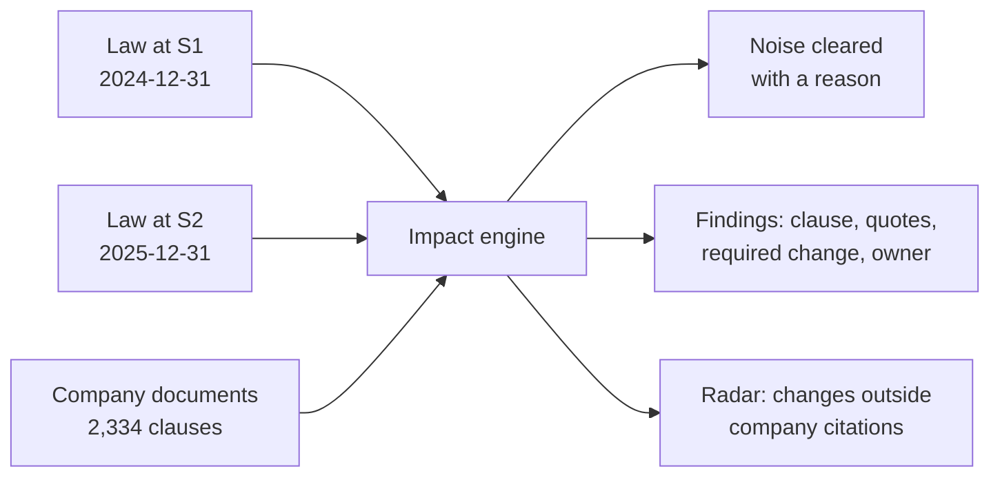

# Strata: Product Requirements

**Purpose:** define the problem Strata addresses, who it serves, what it must do, and how success is judged.

## TL;DR
- **Problem:** when a regulation changes, a company must find which of its own policy clauses now say the wrong thing. Today this is manual reading.
- **Approach:** compare two law snapshots (S1 to S2), keep substantive changes, and link each to the exact clauses affected, with verified quotes, the required change and an owner.
- **Principle:** flag, never edit. Humans decide; Strata shows evidence and explains what it ignored.
- **Demo:** synthetic Indiana utility (RPL), 12 documents, 2,334 clauses, real state and federal regulations.

## 1. Problem and the constraints that shaped the design
| Difficulty | Design response |
|---|---|
| About 91% of 1,114 raw changes are noise (1,004 purely cosmetic); a model silently skipping them is unsafe | Deterministic filtering before any model call, with a reason recorded |
| Documents cite law loosely; most substantive changes touch no cited section; federal citations do not resolve to section level | A radar screens uncited changes by company attributes instead of guessing |
| A missed obligation is a failure; a false alarm erodes trust | Every skip and clear is explained in a ledger |
| A fluent but wrong explanation is worse than none | Every claim must tie to quoted source text |
| Model API spend limit was hit during the build | Judgments are cached; demo runs are reproducible |
| The answer key is hidden | Engine reads only aggregate scores; never tuned to it |

## 2. Approach

Deterministic steps remove noise and pick candidates; a bounded model judgment runs only on survivors. Rationale: [TDD](TDD.md).

## 3. Target users
- **Compliance analyst:** triages a regulatory wave via a funnel from 1,114 changes to a short findings list.
- **Document owner, reviewer, approver:** learns what to fix and who signs; findings are routed via the document register.
- **Evaluator or domain expert:** needs to trust the result: verified quotes, cleared-with-reason ledger, scorecard, what-if.

## 4. Demo scenario assumptions
- All 12 documents comply with S1, so S1 vs S1 must give zero actionable findings (a control).
- State code 2024-12-31 to 2025-12-31; federal 2025-01-02 to 2026-10-02.
- S2 holds only changed or new sections; absence means unchanged, never repealed (prevents false repeal findings).
- Only S1-to-S2 changes are evaluated, and matching is generic: nothing is tied to RPL, a document or a citation (guards against overfitting).

## 5. Features
| ID | Feature | Priority |
|---|---|---|
| M1 | Impact engine and signal funnel: delta, characterize, candidates, judge, ledger ([Engine](supporting/ENGINE_SPEC.md)) | Must |
| M3 | Document board: flagged or cleared, verdict counts, owner, reason if cleared | Must |
| M4 | Evidence card: word-level diff, highlighted quote, verdict, required change, rationale, route | Must |
| M5 | Ledger: every change has a disposition; every cleared clause a reason | Must |
| M6 | Scorecard: precision, recall, routing vs a held-out answer key | Must |
| M7 | What-if: edit or repeal a cited section; output labelled simulated | Must |
| S1 | Radar: substantive changes with no company citation, screened by company attributes | Should |
| S2 | Review actions: accept or reject a finding with a note | Should |

## 6. Verdict vocabulary
| Verdict | Meaning |
|---|---|
| Action required | Clause conflicts with the rule or lacks a new requirement |
| Optional (rule relaxed) | Clause is stricter than the law now requires |
| Update citation | Text fine; reference renumbered or repealed |
| Review | Low confidence or unverified evidence; a human must look |
| Info / Cleared | Relevant with no action / checked with no impact, reason recorded |
Severity: high for customer- or regulator-facing obligations, medium for internal process, low for informational.

## 7. Success criteria and honest status
Method and numbers: [Evaluation and results](supporting/EVALUATION_AND_RESULTS.md).

| Criterion | Target | Status |
|---|---|---|
| Actionable findings on S1-vs-S1 control | 0 | Met, but a weak check (that run builds no inputs) |
| False positives on the do-not-flag set | 0 | Met |
| Document status correct | 12 of 12 | Met |
| Verified quotes on actionable findings; every change has a disposition | 100% | Enforced by an automatic ledger check |
| Reproducible reruns | Identical | Met: latest run needed no fresh model calls |
| Clause-level precision, recall, routing | 0.80, 0.83, 0.80 | **Not met.** 0 matches, suspected format mismatch with the answer key; unresolved, so no score is claimed |
| What-if presets | Load instantly | Met (pre-run); free-form what-if is gated |

## 8. Out of scope
| Not built | Rationale |
|---|---|
| Auto-editing documents | Product decision: humans own the text |
| Definition ripple | Defined terms are not linked to code sections in the data |
| Semantic or hybrid search | Citation and structure matching suffice at this scale |
| Dataset impact, compliance countdown | Dataset registry empty; state changes lack effective dates |
| Autonomous tool-using agents | Bounded, cached calls give guaranteed coverage and auditability |
Roadmap: [Limitations and roadmap](supporting/LIMITATIONS_AND_ROADMAP.md).
Terms: S1/S2 are old/new law snapshots; a candidate is a (change, clause) pair; a finding is a candidate judged affected. Next: [TDD](TDD.md)
