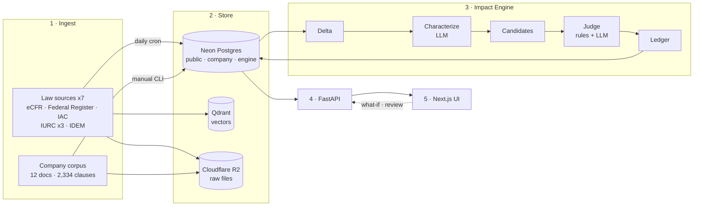
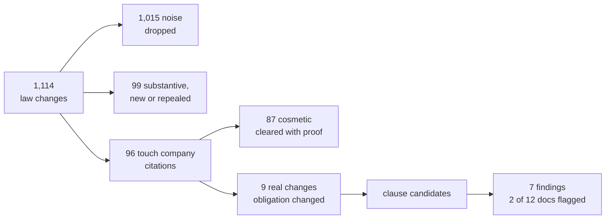

# Strata — Regulatory Impact Intelligence

**When a government rule changes, Strata shows a company exactly which clauses in which of its documents are affected, why, what must change, and who must act. It flags; it never edits.**

## TL;DR
- **Problem:** after a rule changes, finding which company clauses are now wrong is slow manual reading, and most law changes are cosmetic noise.
- **Approach:** compare two law snapshots, filter noise with deterministic code, match changes to clauses by citation, and let a bounded LLM judge only what remains, with every finding backed by verified quotes.
- **Demo:** a synthetic Indiana utility (Rockridge Power & Light, 12 documents) against real federal and Indiana rules.
- **Evidence:** 1,114 changes reduce to 7 findings and 2 of 12 documents flagged; the clause-level scorecard is still being reconciled ([results](supporting/EVALUATION_AND_RESULTS.md)).

## The whole system in one picture

## The result in one picture

*(latest run, as of 2026-10-08; details in [Evaluation & results](supporting/EVALUATION_AND_RESULTS.md))*

## Document map

| Doc | Answers |
|---|---|
| **[PRD](PRD.md)** | What problem, for whom, what success means |
| **[TDD](TDD.md)** | How it is designed and why: principles, layers, decisions |
| [Data model](supporting/DATA_MODEL.md) | The three data domains and their relationships |
| [Data pipelines](supporting/DATA_PIPELINES.md) | How law and company data become linked, queryable knowledge |
| [Engine spec](supporting/ENGINE_SPEC.md) | The 5-stage impact engine and its guardrails |
| [Interface design](supporting/API_AND_UI.md) | The analyst workflow and screens |
| [Evaluation & results](supporting/EVALUATION_AND_RESULTS.md) | How quality is measured; what the results show |
| [Limitations & future work](supporting/LIMITATIONS_AND_ROADMAP.md) | Where each workflow is limited and how it can improve |

**Suggested order:** PRD → TDD → Engine spec → Evaluation & results.

## Key ideas

| Idea | One line |
|---|---|
| Two law snapshots | S1 (2024-12-31) is the baseline all company docs comply with; S2 holds only what changed |
| Footprint | Only law sections that company clauses cite can create findings; the rest go to Radar |
| Code first, LLM last | Code classifies, matches and routes; the LLM only reads changed text and judges clause fit |
| Proof or no finding | Every real finding carries quotes verified as exact substrings of S1, S2 and the clause |
| Stitching | Rulemakings are linked to the code sections they amend, including via Indiana DIN identifiers |
| What-if | Edit or repeal a cited section and watch impact propagate through the same engine (labelled SIMULATED) |

## Glossary

| Term | Meaning |
|---|---|
| **S1 / S2** | Old / new law snapshots |
| **IAC / CFR** | Indiana Administrative Code / US Code of Federal Regulations |
| **FR** | Federal Register (daily rulemaking journal) |
| **IURC / IDEM** | Indiana Utility Regulatory Commission / Dept. of Environmental Management |
| **Clause** | Atomic unit of a company document (section, table row, form field…) |
| **Change record** | One S1→S2 change to one code section |
| **Footprint** | Law sections that company clauses cite |
| **Candidate** | A (change, clause) pair to evaluate |
| **Finding** | A candidate judged affected, with evidence |
| **DIN** | Indiana Register document ID embedded in IAC text, used for stitching |
| **Radar** | Screen for changes outside the footprint against company attributes |
