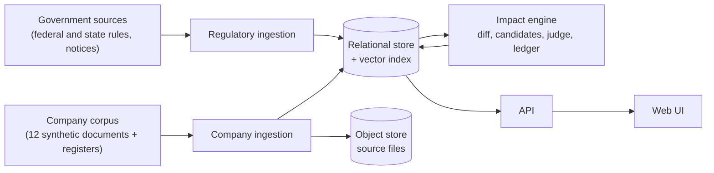
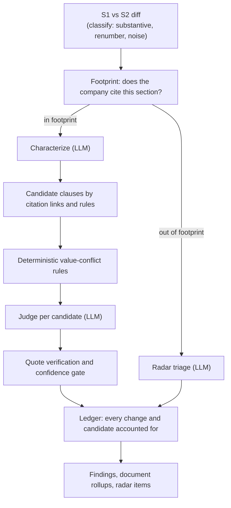

# Strata: Technical Design Document

**Purpose:** explain how Strata is designed, why, and what was rejected. Companion to the [PRD](PRD.md), which frames the problem.

## Design deep-dives

| Layer | Document |
|---|---|
| Data: tables, collections, relationships | [Data model](supporting/DATA_MODEL.md) |
| Data in: law and company ingestion, stitching, synthetic corpus | [Data pipelines](supporting/DATA_PIPELINES.md) |
| Core: the 5-stage impact engine | [Engine spec](supporting/ENGINE_SPEC.md) |
| Surface: API and screens | [API & UI](supporting/API_AND_UI.md) |
| Quality evaluation and measured results | [Evaluation & results](supporting/EVALUATION_AND_RESULTS.md) |
| Current limitations and future improvements | [Limitations & future work](supporting/LIMITATIONS_AND_ROADMAP.md) |

## TL;DR
- Strata finds which clauses in a company's documents are affected when regulations change between two dated snapshots of the law.
- It is a **deterministic pipeline with bounded LLM calls**. Code decides what is compared and what is routed; the LLM only characterizes, judges and triages.
- It is **precision-first and flag-only**. Every real finding carries verified quotes. Company documents are never edited.
- Results are reproducible: LLM calls are cached, and the system is blind to the answer key used for evaluation.

## 1. System picture

- **Two snapshots.** S1 is the law at end of 2024; S2 is the law roughly a year later. S2 is stored write-on-change, so a section missing from S2 means unchanged, never repealed.
- **Demo company.** A synthetic Rockridge Power & Light, so ground truth is known and no real data is exposed.
- **Stores by role.** A relational store is the system of record, with separate areas for law, company data and engine output. A vector index and an object store are derived or blob storage.

## 2. Design principles
| Principle | Rationale | Alternative rejected |
|---|---|---|
| Deterministic code first | Diffing, change classes, candidate selection, value conflicts, dates, routing and rollups are auditable and repeatable | Letting an LLM read all law against all clauses: costly, unrepeatable, hard to audit |
| LLM bounded | Each call has a fixed output schema, temperature 0, one call per item, and a per-run cap | Agents with tool loops and free retries: unbounded cost, unpredictable paths |
| Precision over recall | A compliance reviewer loses trust after a few false alarms. Noise is filtered before the LLM, and low-confidence results are demoted to informational | Maximizing recall and letting users sift |
| Evidence or no finding | A real finding needs quotes that appear verbatim in the old law, the new law and the clause; otherwise it is downgraded | Free-text rationales without checkable support |
| Flag only | The tool surfaces risk. People decide and edit. Reviews are annotations on a finding | Auto-redlining company documents |
| Reproducibility by caching | A cache key over stage, model and prompt makes reruns free and identical | Uncached calls: run-to-run drift, repeated cost |
| Information barrier | The system never reads the answer key. No tuning to specific clause ids or titles. A separate offline tool does all scoring | Tuning prompts and rules against the key, which would inflate results |
| Honest absence | Unchanged is the default for missing S2 sections. Changes the company cannot cite at section level go to a separate radar rather than being forced into findings | Treating absence as repeal; dropping uncitable changes silently |

## 3. Layers
| Layer | Role | Key design choice |
|---|---|---|
| Sources | Federal and Indiana regulations, agency notices, a synthetic company corpus | Synthetic company data gives known ground truth |
| Regulatory ingestion | Seven source adapters normalize, hash, detect change, and chain versions; a stitcher links notices to the sections they amend; sections are embedded for search | Content hashing makes change detection exact, not textual guesswork. Adapter failures are isolated |
| Company ingestion | Collect, parse, link clauses to citations, validate, store | Parse into clauses with structured citations so matching to law is by reference first, similarity second |
| Stores | Relational system of record, vector index, object store | Engine writes only its own area; law and company data are read-only to it |
| Engine | Five stages: diff, characterize, candidate selection, judge, ledger | See section 4 |
| API and UI | Thin read layer over engine output; what-if runs and reviews | Slow work runs in the background and the UI polls |

Detail: [Data pipelines](supporting/DATA_PIPELINES.md), [Data model](supporting/DATA_MODEL.md), [Engine spec](supporting/ENGINE_SPEC.md), [API & UI](supporting/API_AND_UI.md).

## 4. End-to-end flow

1. **Diff.** Compare snapshots; discard renumbering and noise before any model sees them.
2. **Footprint.** Split changes into those the company cites and those it does not.
3. **Characterize.** An LLM reads the legal text and states whether the obligation changed, in what direction, and which values changed.
4. **Candidates and rules.** Code selects affected clauses and applies value-conflict rules, so clear-cut cases need no judgement.
5. **Judge.** An LLM assesses each remaining clause. Output must quote its evidence.
6. **Ledger.** The run fails if any change lacks a disposition or any candidate is neither judged nor skipped. Nothing is lost silently.

Run types:
| Run | Purpose |
|---|---|
| Knowledge-base run (S1 vs S2) | The main analysis |
| Baseline run (S1 vs S1) | False-positive control: must return zero real findings |
| What-if | Edit or repeal one S1 section and see the clauses affected; never exported |

Scale (latest data): 4,603 code sections, 1,206 regulatory actions, 2,334 company clauses across 12 documents, 9,105 vectors. A cold knowledge-base run averages about 137 s; a cached rerun about 33 s; a baseline about 4 s.

## 5. Where the LLM is used and why
| Stage | Model class | Calls | Purpose |
|---|---|---|---|
| Characterize | Strong general model | One per in-footprint substantive change (few) | Reading legal text is a language task: did the obligation change, which way, which values |
| Judge | Strong general model | One per candidate surviving rules (hundreds per run) | Clause-level reasoning where precision matters most |
| Radar | Small, cheap model | One per out-of-footprint change | Coarse yes / unclear / no applicability triage; errors are cheap because output is advisory |
| Company enrichment | Strong general model | Optional | Not used in the evaluated runs |

Per-run call caps fail the run if exceeded. Cached calls are free and do not count. Token and cost totals are not recorded; only call counts, latency and cache hits.

## 6. Key design decisions
| Decision | Why | Alternative rejected |
|---|---|---|
| Pipeline, not agent | Auditable, bounded cost, repeatable | Tool-using agent loop |
| Match by citation links first | Legal references are exact; a clause that cites a section is the strongest signal | Embedding similarity as the primary matcher |
| Rules before judge | Numeric and date conflicts are decidable without a model, cheaper and more reliable | Judge handles everything |
| Confidence gate (0.6) and quote check | Converts uncertain results to informational instead of false alarms | Report everything the judge says |
| Ledger completeness check | Guarantees coverage claims are true | Best-effort processing |
| Separate radar for uncitable changes | Keeps findings precise while still surfacing possible exposure | Merge into findings or drop |
| S1-vs-S1 baseline | Measures false positives directly | Rely on spot checks |
| Synthetic company with hidden answer key | Known ground truth without exposing real data | Real company documents with ad hoc labels |
| Snapshot-based design | Reproducible, comparable runs | Live streaming of law changes |

## 7. Technology
| Concern | Choice |
|---|---|
| Backend | Python, FastAPI, async SQLAlchemy |
| Relational store | Postgres (law, company and engine areas) |
| Vector index | Qdrant, 384-dimension MiniLM embeddings |
| Object store | Cloudflare R2 |
| LLMs | Anthropic Claude (strong model for characterize and judge, small model for radar) |
| Frontend | Next.js, React, Tailwind |

## 8. Known limits
Scope is one synthetic company. The company-enrichment stage has not been run live, and no vector index exists for company clauses. See [Evaluation & results](supporting/EVALUATION_AND_RESULTS.md) and [Limitations & future work](supporting/LIMITATIONS_AND_ROADMAP.md).
