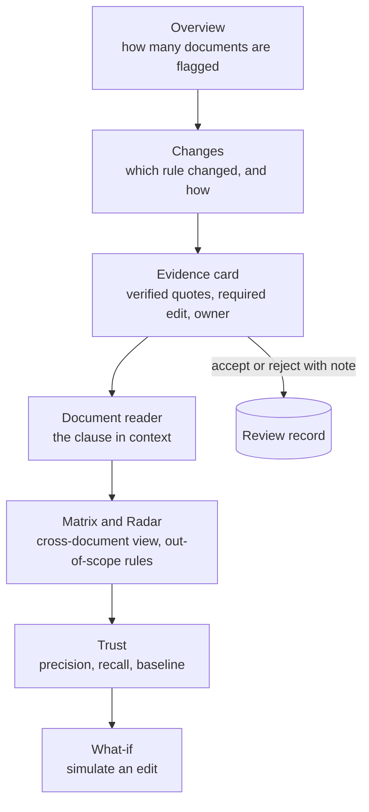

# Interface design

Purpose: how an analyst uses Strata to go from "a rule changed" to "this clause needs this edit, here is the proof". Engine logic is in [Engine spec](ENGINE_SPEC.md); stored objects are in [Data model](DATA_MODEL.md).

## TL;DR
- The interface follows the analyst's question order: how many documents are affected, which rule changed, what is the evidence, what is the fix.
- Every claim is shown with verified quotes. Every non-finding is shown with a reason.
- Everything is scoped to one engine run, so any screen can be reproduced later.
- Hypothetical (what-if) results are always labelled simulated and never mixed with real results.

## 1. Analyst journey

## 2. Screens
| Screen | Question it answers | What it shows |
|---|---|---|
| Overview | How big is the problem? | The funnel (raw changes, noise removed, real changes, findings); flagged vs cleared documents; an attention list |
| Changes | What changed, and how? | Changes grouped by class; for each, a text diff, a characterisation (tightened, relaxed, new, removed) and the company clauses that reach it |
| Evidence card | Why is this clause flagged, and what do I do? | Verdict, severity, confidence, who decided (rule or model); old and new rule text; verified quotes; required edit; owner, reviewer, approver |
| Documents | Where do I stand per document? | A status board by business area; a reader with a verdict marker beside each clause |
| Matrix | Which documents does each change touch? | Documents by changes, one verdict per cell |
| Radar | What about rules outside our known footprint? | Changes screened as possibly applicable, unclear or out of scope, each with a quote and a basis |
| Trust | Can I believe this? | Precision, recall, false-positive rate and routing accuracy against targets, beside a no-filter baseline |
| What-if | What if this rule were edited or repealed? | A simulated edit to a rule section, run through the same engine and compared with the real wave |
| Regulations | What does the source say? | Agencies, sections, version history with diffs, agency actions |
| Company | What is being monitored? | Profile attributes, org chart, document inventory |

Global search finds a document, change, clause or section from any screen.

## 3. Design principles
| Principle | Rationale | Alternative rejected |
|---|---|---|
| Evidence first | A reviewer acts only on what they can verify. Each finding leads with verified quotes from both rule versions and the company clause. | A bare verdict or score |
| Show the funnel | Compliance work is trusted when the reduction is visible: raw changes, minus noise, minus cleared, equals findings. | A single "N alerts" count |
| Cleared with reason | Silence is not assurance. A cleared clause records why it was cleared, so a reviewer can audit the negatives as well as the positives. | Showing only flagged items |
| Small verdict vocabulary | Action required, needs review, update citation, relaxed (optional), info, cleared. Fixed labels and a restrained palette (red, amber, green, grey) make a screen scannable in seconds. | Free-form severity text, ad hoc colours |
| Simulated is visibly simulated | A persistent banner and an explicit "back to real wave" control prevent a hypothetical being mistaken for a real regulatory change. | A normal-looking what-if run in the same list |
| Run selector | Every screen is tied to one run, held in the link. Sharing a link reproduces exactly what the sender saw. | Always showing "latest" |
| Review is recorded, not applied | Accept or reject (rejection requires a note) is stored beside the finding. The finding itself never changes, so the engine's output stays auditable. | Overwriting the verdict on review |
| Unbuilt features look unbuilt | Planned features appear as disabled cues, not live-looking links. | Hiding them, or leaving dead links |

## 4. How the interface talks to the engine
- **Read-mostly service.** The interface reads precomputed run results. The only writes are review decisions and what-if runs.
- **Long runs are asynchronous.** Starting a what-if returns immediately. The interface polls the run's progress and refreshes the result views when it finishes.
- **Results appear only when a run is complete.** A run in progress reports progress, not partial results. The interface treats this as "nothing yet", not as an error.
- **Contracts are checked.** Each response is validated against a schema on arrival, so drift between engine and interface fails visibly rather than showing wrong numbers.
- **Cost guard.** Custom what-if runs spend model budget, so they are off by default in live mode. Pre-computed presets remain available.

## 5. Tech note
| Layer | Choice |
|---|---|
| Frontend | Next.js (React, TypeScript), URL-held state, schema-validated data layer |
| Service | FastAPI over a Postgres store |
| Testing | Unit tests on labels and data adapters; a read-only end-to-end walk of the demo path against a live service |

## 6. Limits
- The review path is tested but has no real review history yet.
