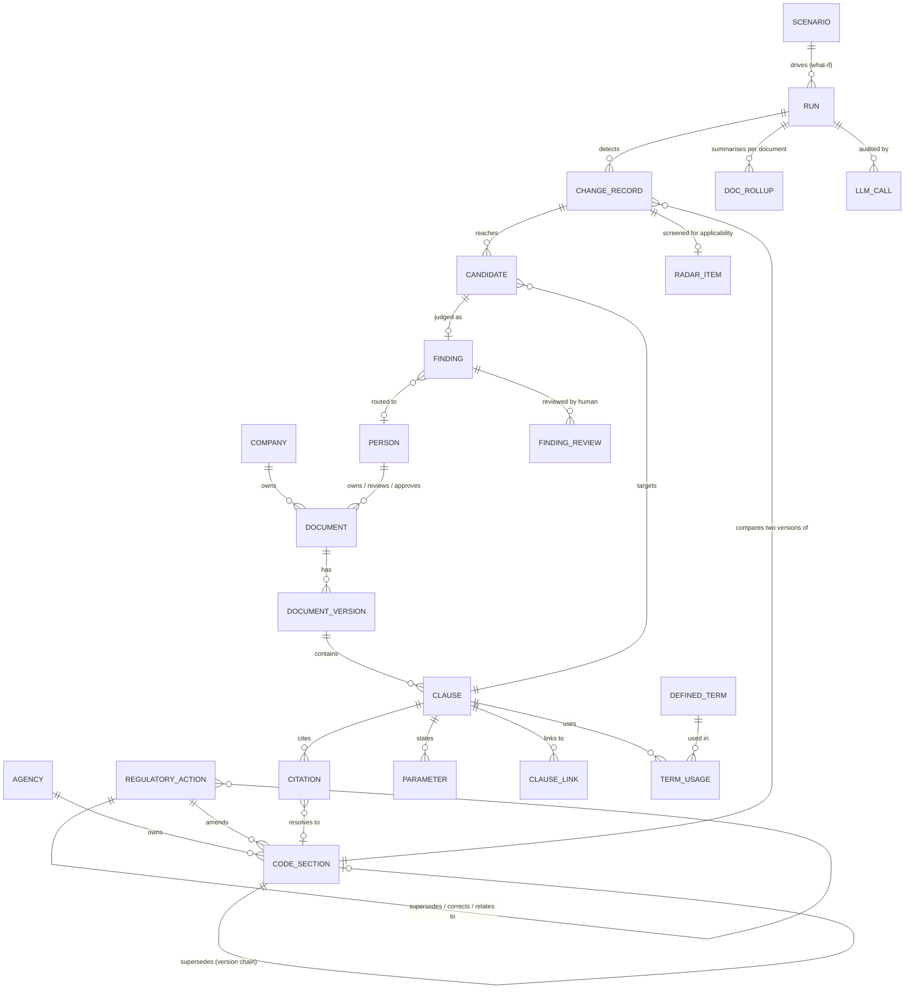
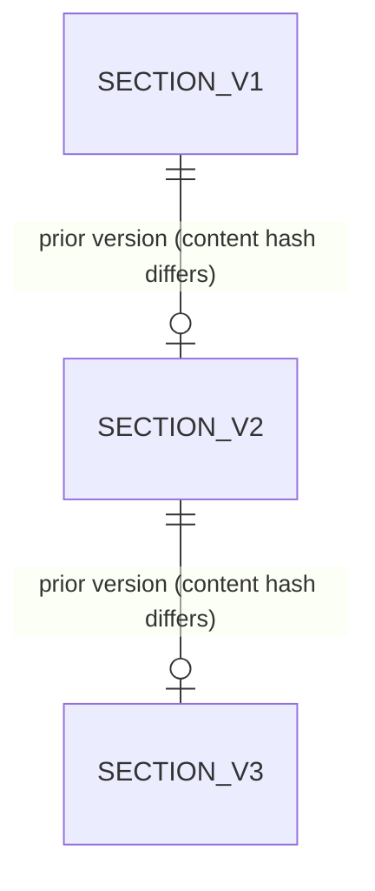

# Data Model (Conceptual)

Strata stores three kinds of data: the law, the company's documents as a graph of clauses, and the engine's findings about how the first affects the second. This document gives the entities, how they relate, and why the model looks the way it does. Production steps are in [DATA_PIPELINES.md](DATA_PIPELINES.md); engine behaviour is in [ENGINE_SPEC.md](ENGINE_SPEC.md).

## TL;DR
- Three domains: a **law knowledge base** (versioned), a **company knowledge graph** (documents broken into clauses), and **engine results** (changes, candidates, findings).
- The law is stored as **snapshots linked in a hash-chained version chain**. Diffing two snapshots gives the changes the engine reasons about.
- The unit of meaning is the **atomic clause**. Clauses carry typed citations to law and typed links to each other.
- Every LLM call is stored, and every verdict is a **ledger entry with a disposition**. Nothing is silently dropped.

## 1. The three domains

| Domain | Holds | Written by | Mutability |
|---|---|---|---|
| Law knowledge base | Code sections (one row per version), regulatory actions (rulemakings, orders), relationships between actions, agencies | Law ingestion | Append-only versions |
| Company knowledge graph | Documents, document versions, clauses, citations, parameters, defined terms, clause links, people | Company ingestion | Rebuilt deterministically from source |
| Engine results | Runs, change records, candidates, findings, reviews, roll-ups, radar items, what-if scenarios, LLM call log | Impact engine | Immutable per run |

Links between domains are by identifier, not enforced foreign keys. This keeps the domains independently rebuildable (see decision 5).

## 2. Master conceptual ER
Entities and relationship labels only.

One small view of the law's version mechanism:

## 3. Key modelling decisions

| # | Decision | Why | Alternative rejected |
|---|---|---|---|
| 1 | **Versioned snapshots in a hash chain.** Each section version carries a content hash and points to its predecessor. | A change is then a fact of the data (two linked rows), not something inferred at query time. Two dated snapshots (S1, S2) define any comparison window. | Overwrite in place with an edit log: loses the ability to reconstruct the law as of a date. |
| 2 | **Write-on-change second snapshot.** A new version row is written only if the content hash differs. | Cheap and unambiguous change detection. Consequence: absence from S2 means *unchanged*, never *repealed*; repeal is an explicit, dated fact. | Full copy per snapshot: large, and every diff needs a full comparison. |
| 3 | **Atomic clause as the unit of meaning.** Documents are split into the smallest passage that states one obligation, position, definition, or form field. | Impact is judged per obligation. A whole-document unit dilutes the signal; a sentence unit loses context. Each clause keeps its heading path and role. | Fixed-size text chunks: they cut obligations in half and mix topics. |
| 4 | **Typed clause links and citations.** Links record how clauses relate (restates, references clause, references form, references record series, ...). Citations record how well they resolve to a law section. | The engine follows typed edges deliberately (for example, from a register row to the procedure that uses it). Resolution quality is explicit, so unresolved law is visible, not hidden. | Untyped "related" edges: cannot be traversed with meaning or audited. |
| 5 | **Deterministic identifiers shared across stores.** Company IDs are derived from their natural keys. The same ID names a row in the relational store and a point in the vector index. | Re-running ingestion gives identical IDs, so writes are idempotent and the stores cannot drift. The relational store is the source of truth; the index mirrors it. | Random IDs plus a mapping table: re-ingestion would orphan every downstream reference. |
| 6 | **Immutable audit trail of every LLM call.** Each call is stored with its stage, model, input hash, request, response, validity, and latency. | Reproducibility and review. An input-hash cache means identical prompts are not re-paid for, and any verdict can be traced to its exact prompt. | Logging only final verdicts: the reasoning behind a verdict cannot be re-examined. |
| 7 | **Ledger of dispositions.** Every change record and every candidate ends in an explicit disposition: judged (by rule or by LLM) or skipped with a reason. | Coverage is auditable: for any run we can show that nothing was dropped without a recorded reason. This is the basis for the evaluation in [EVALUATION_AND_RESULTS.md](EVALUATION_AND_RESULTS.md). | Emit only positive findings: "no finding" would be indistinguishable from "not examined". |
| 8 | **Findings are immutable; human review is a separate record.** A review accepts or rejects a finding without altering it. | Preserves the engine's original output so engine quality and reviewer behaviour can be measured separately. | Editing findings in place: destroys the evaluation baseline. |
| 9 | **Soft links between domains.** Law, company, and results reference each other by identifier with no enforced foreign key. | Each domain can be rebuilt on its own schedule. Cost: orphan risk if the company graph is rebuilt under a new version, which is managed by deterministic IDs and per-run immutability. | Hard cross-domain keys: would force rebuilds to cascade through results. |

## 4. Role of each store

| Store | Technology | Role | Source of truth? |
|---|---|---|---|
| Relational | PostgreSQL (three schemas, one per domain) | Law versions, company graph, run results, LLM call log. Supports the joins, constraints, and uniqueness the model depends on. | Yes |
| Vector index | Qdrant | Semantic search over law text chunks. Each point carries the ID of its relational row. The engine's candidate retrieval currently uses citations, not the index (see [LIMITATIONS_AND_ROADMAP.md](LIMITATIONS_AND_ROADMAP.md)). | No, a mirror |
| Object store | Cloudflare R2 | Raw fetched sources, original company documents, bulk clause extracts, run reports. Re-parsing and audit read from here. | Source artefacts only |

## 5. Scale (snapshot, October 2026)

| Item | Count |
|---|---|
| Law: code sections (all versions) | 4,603 |
| Law: regulatory actions / relationships | 1,206 / 843 |
| Law: sections with a prior version / repealed | 1,081 / 1,109 |
| Company: documents / clauses | 12 / 2,334 |
| Company: clause citations / clause links | 1,550 / 4,675 |
| Company: extracted parameters / defined terms | 2,948 / 67 |
| Engine: runs | 24 |
| Engine: change records / candidates / findings | 5,587 / 6,991 / 1,240 |
| Engine: logged LLM calls | 1,606 |
| Vector index: law chunks | 9,105 |
| Object store | 2,769 objects, about 222 MB |

Company data is a synthetic tenant (a fictional power utility), used so results can be inspected without confidentiality concerns.
