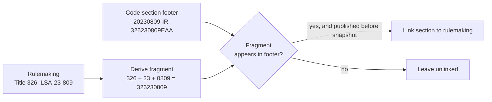

# Data Pipelines
Strata needs two kinds of data: a versioned, linked knowledge base of public regulation, and a company's internal documents broken into checkable units. This document explains how each is built and why. Table structures are in [Data model](DATA_MODEL.md); how the engine uses the data is in [Engine spec](ENGINE_SPEC.md).

## TL;DR
- Law: seven public sources are normalised to one shape, hashed, and stored only when new or changed. Each section is then linked to the rulemaking that amended it.
- The most distinctive step is "DIN stitching": it links state environmental rulemakings to code sections using an identifier, not topic inference.
- Company documents become 2,334 atomic clauses with citations, numbers, defined terms and typed links, behind 12 validation gates.
- The test company is synthetic, generated from the real law, quality-looped by independent reviewers, and walled off from its own answer key.
# 1. Law pipeline
## 1.1 Sources
Two record kinds, because law has two natures: codified text changes in place and needs versions; rulemaking events happen once and are immutable.

| Source | Record kind |
|---|---|
| eCFR (FERC Title 18, EPA Title 40); Indiana Administrative Code (Titles 170, 326, 327, 610, 675) | Versioned code section |
| Federal Register (FERC, EPA); Indiana utility regulator (rulemakings, orders, investigations); Indiana environmental regulator (rulemaking packets) | Immutable action |

## 1.2 One adapter contract
Every source implements the same steps (fetch since a cursor, normalise, report health), so new sources plug in without touching change detection or stitching. Rejected: per-source pipelines (duplicated logic, divergent semantics). Failures are isolated per adapter and per record, because public sites are unreliable and partial freshness beats none.
## 1.3 Change detection and version chain
- The change key is a content hash of heading plus body. Code sections are never edited in place.
- No prior row: new. Same hash: nothing written. Different hash: a new row pointing to its predecessor, forming a version chain.
- Why hashing: some sources (the Indiana code) give no reliable "last changed" signal. Hashing is the one filter that works for all sources, and it makes re-runs idempotent.
## 1.4 Two snapshots and the write-on-change rule
- S1: full baseline (Indiana code edition dated 2024-12-31; federal code 2025-01-02), the law the company was written against.
- S2: the law to evaluate against (2025-12-31; 2026-10-02).
- S2 stores only sections that are new or whose hash changed. This keeps S2 small (1,081 sections have a prior version) and makes the S1-to-S2 difference the ground truth for "what changed".
- Consequence: absence from S2 means "unchanged", never "repealed". A repeal is an explicit status row, so the two cases cannot be confused.
- Size: 4,603 code sections (1,109 repealed), 1,206 actions, 843 action relationships.
# 2. Stitching
## 2.1 Why it is needed
Codified text says what the rule is; rulemakings say why and when it changed. Compliance reasoning needs both: "which section did this order amend, and what did the order say?" No source supplies that join, so Strata builds it. A section is linked to the action that last amended it; links are never overwritten, so every pass is idempotent.
## 2.2 Link types
| Link | Match signal | Guard |
|---|---|---|
| Federal Register to federal code | Action lists the CFR sections it amends; exact, then part-level match; amending action types only | Effective dates must align (about a year after, a week before) |
| Federal code to Register (reverse) | Same references, searched from the unlinked section | Same date guard; newest action first |
| Utility regulator to state code (Title 170) | Action cites an Indiana code section | Action published on or before the snapshot |
| Environmental regulator to state code (326/327) | DIN fragment (below) | Published on or before the snapshot |
| Action to action | Shared docket, shared rule identifier, or explicit relation | Type inferred: supersedes, corrects, withdraws, related |

Audit coverage: 83% of Title 170 sections linked; 63% (326) and 79% (327) via DINs; 48.5% of federal sections.
## 2.3 The DIN technique
Problem: environmental rulemakings carry no code citations, so citation matching gives 0% for Titles 326 and 327. Topic similarity would be guesswork.

Insight: every section's footer lists the document identification numbers (DINs) of every rulemaking that touched it. A DIN embeds the title, year and rulemaking number, so a fragment derived from the rulemaking's own identifier appears verbatim in the sections it amended.

Why it works: the fragment is unique per rulemaking, so this is identifier matching, not inference. Impact: Titles 326 and 327 went from 0% to 63.1% and 79.0% linked (1,408 new links). The date guard rejects rulemakings newer than the snapshot.
# 3. Company pipeline
The engine never reads raw documents. Each is decomposed into typed, cross-linked clauses, the atomic unit of checking, which gives precise citations and traceable findings.

## 3.1 Stages
| Stage | What and why |
|---|---|
| Segment | Four document profiles (prose, register, dataset, reference), each split so every row or section is one clause |
| Enrich (deterministic) | Regex and grammar extract citations, numeric parameters (deadlines, thresholds, frequencies, amounts), defined terms and their usages, and a clause role |
| Enrich (LLM, optional) | Normalised statements, topic terms, assessability. Not run for the current data, so output does not depend on a model |
| Link | Typed edges: references (clause, tariff, form, record), "restates" (same obligation in different places, so one law change traces to every document repeating it), and document-to-law scope |

Deterministic extraction first, LLM second: citations and numbers are exact strings, so regex is verifiable and repeatable; a model is reserved for judgements regex cannot make.
## 3.2 What is produced
| Object | Count |
|---|---|
| Clauses | 2,334 (internal procedure 1,233; regulatory restatement 640; definition 221; template field 204; boilerplate 36) |
| Citations | 1,550 (1,357 resolved to the law KB; the rest external, unmonitored or out of scope) |
| Parameters | 2,948 |
| Defined terms / usages | 67 / 693 (12 documents, 27 people) |
| Clause links | 4,675 (3,048 "restates" edges; the rest references to clauses, records, tariffs, forms, obligations) |
## 3.3 Validation gates
Unclaimed text at most 5% (measured 3.0%); text coverage at least 95% per document; no duplicate clause ids; every restatement carries a citation; at least 80% of references resolve; extracted numbers verified against source text; the deny list was enforced. The last run passed 12/12. 
# 4. Synthetic corpus
## 4.1 Why synthetic
Real utility compliance documents are confidential, and a real corpus has no known answer. A fictional company, Rockridge Power & Light (an Indiana electric utility), lets us author documents that are compliant with S1, then know exactly which S1-to-S2 changes should matter. That makes recall and false-positive rate measurable. See [Evaluation](EVALUATION_AND_RESULTS.md).
## 4.2 Grounded generation
Writers receive a grounding pack built from the real S1 code text for each document's topic, so quoted values, deadlines and citations come from actual law. A shared foundation (company profile, people, organisation chart, operational data) is built first, so no document invents its own facts.
## 4.3 Waves
- Foundation: profile, 27 people, org chart, document register, operations data. One source of company facts.
- Wave 2: nine policy, operations, environmental and safety documents, in parallel (independent given the foundation).
- Wave 3: compliance register, regulatory calendar, records schedule. They index Wave 2's 1,164 frozen clause ids, so they run last.

The spill-response document cites a rule absent from the knowledge base and is written without regulatory values, testing out-of-scope handling.
## 4.4 QA loop
Every document: automated checks (id grammar, every value traced to its source, phantom-citation scan, banned phrases, date ordering) then a fidelity review against the law, then a realism review, each by a fresh independent agent that did not write it. Any failure goes to a fix agent, up to three cycles, and automated checks re-run after each fix. Independence matters: a model reviewing its own output tends to approve it.
## 4.5 Information barriers and answer key
- Restricted: per-value source ledgers, grounding packs, QA and validation reports, the answer key.
- Visible to the engine: documents, datasets, rendered Word/PDF/Excel copies, shared company data.
- The answer key was written by an isolated agent: 13 expected findings (6 medium, 7 informational); 2 documents should be flagged, 10 cleared.
- Ingestion enforces the barrier with allow and deny lists (a gate asserts the deny list fired). Writers saw only their own grounding pack.
- Scale: 407,491 customers, 409,950 meters, 112 substations, realistic 2024 reliability figures, so documents carry realistic thresholds and calculations.
# Caveats
- State-rule stitching (utility and environmental regulators to Indiana code) is a bulk step run manually, not part of the daily job; new state rulemakings are not linked automatically.
- Company LLM enrichment and dataset checks have not been run; the current clause graph is deterministic only.
- The Qdrant round-trip gate is a stub, and two dataset gates pass trivially when datasets are off.
- Counts are a snapshot (2026-10-08). See [Limitations and roadmap](LIMITATIONS_AND_ROADMAP.md).
