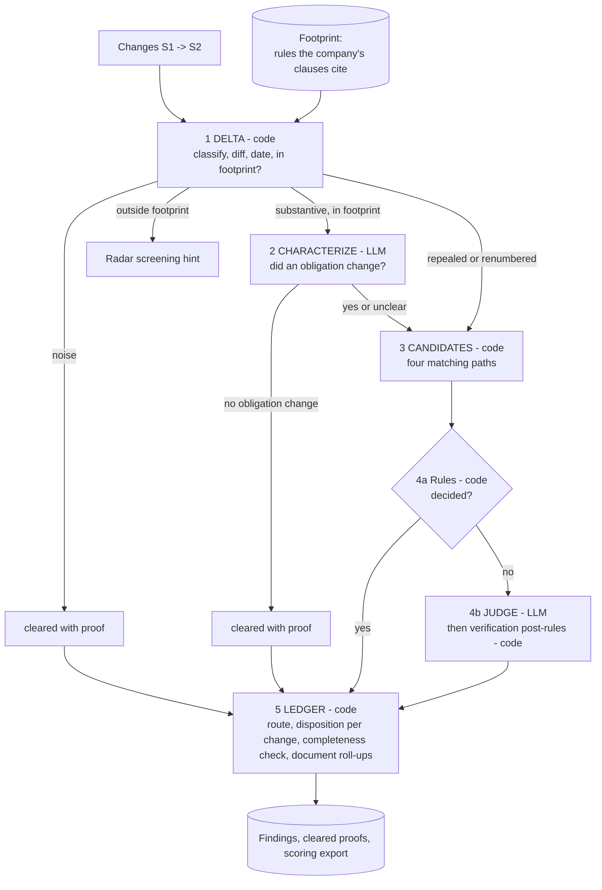
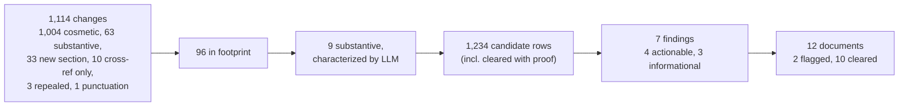

# Engine Spec: the Impact Engine
Purpose: turn "these rules changed between snapshot S1 and snapshot S2" into "these clauses in these company documents are affected, here is the quoted proof", while showing that everything else was checked and cleared. Figures are from the latest knowledge-base run (2026-10-08).
**TL;DR**
- Most legal text changes are noise. The design question is not "what changed?" but "which changes matter to this company, and can we prove it?"
- Code does the certain work (classify, diff, match, apply rules, route, audit). An LLM is used only to read meaning: what a change did in legal effect, and whether a clause is affected.
- Every finding carries verbatim quotes from S1, S2 and the clause. Unverifiable findings are downgraded, never shown as actionable.
- Funnel: 1,114 changes -> 96 touch the company -> 9 change an obligation -> 7 findings (4 actionable) -> 2 of 12 documents flagged. Flag-only: the engine never edits company documents.
Related: [TDD](../TDD.md), [Data model](DATA_MODEL.md), [Data pipelines](DATA_PIPELINES.md), [API & UI](API_AND_UI.md), [Evaluation & results](EVALUATION_AND_RESULTS.md), [Limitations](LIMITATIONS_AND_ROADMAP.md).
## 1. Core insight
Of 1,114 changed sections, 1,004 (90%) are cosmetic: re-adoption, a new filing-history line, punctuation, an updated cross-reference. A naive "diff then ask an LLM" approach would spend a model call on each, and would drown real changes in false alarms. Two ideas fix this:

1. **Noise is decided by code, with proof.** A change is cosmetic if the text is identical after stripping metadata. This is deterministic, free and auditable.
2. **Impact needs evidence, not similarity.** A clause is affected only if (a) it is linked to the changed rule by a citation, a link or a shared parameter, and (b) the judge can quote the old rule, the new rule and the clause. Topical similarity alone never creates a finding.

| Decision | Why | Alternative rejected |
|---|---|---|
| Classify noise with deterministic rules | Free, reproducible, explainable per change | LLM triage of every change: costly, non-reproducible, hides why something was dropped |
| Restrict to the company's footprint first | Cuts 1,114 changes to 96 before any LLM call | Embed-and-search all clauses against all changes: high recall, poor precision, no proof |
| Rules before the LLM judge | Unambiguous cases (repeal, renumber, exact value match) need no judgement | Judge everything: slower, and the model can disagree with arithmetic |
## 2. Pipeline

Stages 1, 3, 4a and 5 are code; Stages 2 and 4b call an LLM, followed by code verification. The LLM sees only what rules could not decide.
## 3. Stage 1: Delta, taxonomy and footprint
Change classes, first match wins:

| Class | Test | Noise? |
|---|---|---|
| `repealed` | S2 status repealed or expired | no |
| `renumbered` | No S1 pair, but a different S1 section in the same rule family shares >= 0.80 five-word-shingle similarity | no |
| `new_section` | No S1 pair and no renumber match | no |
| `cosmetic` | Identical after whitespace and Unicode normalization | yes |
| `metadata_only` | Identical after stripping authority lines, filing history, statute lists, source notes | yes |
| `punctuation_only`, `cross_ref_only` | Only punctuation differs, or every changed word lies inside a citation | yes |
| `substantive` | Anything else | no |
Why 0.80: renumbers are near-verbatim moves; a high bar avoids pairing unrelated sections, and a miss falls safely to `new_section`.

**Footprint.** The footprint is the set of S1 sections and rules cited by the company's assessable, non-boilerplate clauses. A change outside it cannot affect any document by citation, so it is recorded as not in footprint (Radar may still screen it, section 8). Only in-footprint changes cost LLM calls. Dates are taken from the source's own publication data and left empty rather than guessed.
## 4. Stage 2: Characterize
One LLM call per substantive, in-footprint change. Input: S1 text, S2 text, word diff, and code-extracted hints (numbers present in only one version). The prompt forbids speculating about any company. Output: whether an obligation changed, its direction (tightened, relaxed, new, removed, clarified, style-only, mixed), structured value changes (for example 30 calendar days -> 45), and one quote from each side.
Code then verifies: a value change is kept only if the old text occurs in S1 and the new text in S2. If the model says no obligation changed, the change is cleared with its reason recorded. If it says yes but nothing verifies, or output is invalid, the change continues to matching flagged for review. Why this stage exists: the model reads the rule once per change, not once per clause, which is cheaper and gives the judge a verified, shared description of the change.
## 5. Stage 3: Candidate matching
Four paths, in priority order. A clause matched by several paths becomes one candidate that records all of them.

| Path | Rule | Rationale |
|---|---|---|
| Direct section | Clause cites the changed section | Strongest evidence: the author tied the clause to this text |
| Direct rule | Clause cites the rule, not the section | Catches rule-level references to a section that changed |
| Register hop | Clause is linked to a direct clause (obligation, record series, tariff, form links) | Obligations restated elsewhere inherit the change |
| Value echo | Clause states a parameter equal to the old value (same unit) and sits in a document that already has a direct match or cites the same rule | Catches restated numbers without a citation, with two guards to avoid coincidental numbers |
Repeals and renumbers use direct section only. A semantic-similarity path was rejected: it adds false positives without proof.
## 6. Stage 4: Rules, then judge, then verification
**4a Deterministic rules.** Repeal of a cited section -> `stale_citation` (cited text -> "(repealed)"). Renumber -> `stale_citation` (old citation -> new). A verified value change whose old value equals a clause's parameter (same unit) -> `parameter_change`, severity high, with quotes from S1, S2 and the clause. Why: these are string and arithmetic facts; a model adds only variance.

**4b LLM judge.** One call per remaining candidate. Input: change description, quotes, diff (long sections windowed around the edits) and the clause with its parameters and match path. Decision rule: affected only if the clause as written would now be non-compliant, misleading or incomplete; merely citing the rule is not enough. Output: affected, type, severity, suggested edit, three quotes, rationale, confidence. LLM failure degrades to an `informational` "judgement unavailable" item needing review, never silence.

| Check | Behaviour | Why |
|---|---|---|
| Quotes verify | S1 quote in S1, S2 quote in S2, clause quote in clause (case- and whitespace-insensitive; very short quotes never verify). One retry with a correction message; still failing -> downgrade to `informational`, needs review | Detects fabricated evidence mechanically |
| Confidence gate | Confidence below 0.6 -> `informational`, needs review | Low-confidence calls reach a human, not a work queue |
| Stale-at-approval | If the change was already published when the document was last approved, and the finding is a substantive type, label it `stale_at_approval` (assigned by code, never the LLM) | The document may have been approved with the change already in force; this is a different remedy and a different conversation than "a new rule broke it" |
## 7. Stage 5: Ledger and completeness guarantee
The ledger refuses to finish the run if the books do not balance. Each change ends in one disposition: findings emitted, needs review (only informational findings, or a new section in footprint), no affected clauses, excluded as noise, or not in footprint.

The run fails if: a change has no disposition; a candidate was neither judged nor cleared with a reason; or a non-informational finding lacks verified quotes. The ledger also routes findings to the document's owner, reviewer and approver and rolls each document up as `flagged` or `cleared` with a reason. Why: a reviewer's real question is "did you check everything?", and "cleared with proof" answers it.
## 8. Radar, what-if, human review
- **Radar** screens changes outside the footprint, which have no citation link. A cheap model sees the change plus company attributes (for example sector, activities) and answers: obligation changed? applicable yes/no/unclear, on which attributes, with a verified quote. Code downgrades "yes" without a valid attribute basis to "unclear". Radar results are hints for a human; they never create candidates or flag documents. Why separate: it widens recall without contaminating the evidence-grade findings.
- **What-if** is an ordinary run on a user-supplied edit or repeal of an S1 section the company cites. Same stages, smaller call budget, results labelled SIMULATED, never exported or scored. Presets scale a cited parameter by about 1.5x or repeal the most-cited section. Stale-at-approval never applies (no real publication date).
- **Human review.** A reviewer can accept or reject a finding (rejection requires a note). Reviews are appended and never alter the finding, so the machine's judgement stays auditable. Zero reviews exist so far.
## 9. Guardrails
| Guardrail | Why |
|---|---|
| Verbatim-quote check on every finding | Detects hallucinated evidence |
| No actionable finding without verified quotes (enforced three times: judge, rules, ledger) | A single bypass would defeat the guarantee |
| Engine, prompts and caches never read the answer key; no hardcoded document or citation names; flag-only on company documents | Prevents leakage; generalizes; humans edit |
| Response cache keyed by stage, model and prompt hash; every call logged; per-run call budget | Reruns are free and reproducible; cost bounded, overflow degrades to needs review |
## 10. Worked example
| | Change A: cosmetic readoption | Change B: real value change |
|---|---|---|
| What happened | Rule re-adopted; only the filing-history line and a statute-reference line differ | A section now says "within 45 days" where S1 said "within 30 days" |
| Stage 1 | Identical after metadata stripping -> `metadata_only` (noise) | `substantive`, cited by 2 company clauses -> in footprint |
| Stage 2 | Not reached | `obligation_changed`, tightened, 30 -> 45 days, quotes verified in S1 and S2 |
| Stage 4 | Never judged | Clause parameter equals old value 30 -> rule: `parameter_change`, high, action required, three quotes. Others go to the judge |
| Result | Document shows "cleared" with reason and proof | Document flagged; evidence card shows quotes; routed to owner, reviewer, approver |
## 11. Results funnel (latest KB run)

- Of 1,234 candidate rows, 411 were judged by the LLM and the rest cleared by rule or proof. All 7 findings have verified quotes; the 4 actionable ones are the scored set. Radar produced 90 screening items (20 yes, 17 unclear, 53 no). Cost and token counts are not recorded.
## 12. Evaluation approach
Detail in [Evaluation & results](EVALUATION_AND_RESULTS.md). Design:
- **Hidden answer key.** The expected affected clauses are held out. The engine, prompts and caches cannot read it, and agents building the system cannot open it.
- **Aggregate-only scoring.** The scorer returns recall, precision, false-positive rate on known-negative documents, routing accuracy and a baseline check, not which items were missed. This prevents tuning to the key.
- **S1 baseline.** Comparing S1 with itself must yield zero findings. This checks the plumbing, but it is vacuous by construction (empty input) and says nothing about judgement.

**Honest status: recall and precision currently score 0** (6 expected, 4 produced, 0 matched), while false positives on negatives, routing, baseline and all 12 document statuses pass. The cause is unresolved. Judge strictness was ruled out: 304 re-answered prompts reproduced the same 4 clauses. Leading hypotheses, unverified: (a) clause identifiers are exported in a different form than the key expects (document-prefixed vs bare); (b) citation granularity for rule-level events differs (we export a rule and a sub-rule; the calendar names several). Because the key is hidden, a human must check the format; the fix is a small export change not yet made. Until then the 0 should be read as "unmatched under this format", not as proof the findings are wrong.
Provenance: after the API spend limit was hit, some judge answers were produced offline by agents and loaded into the response cache (flagged), so demo runs are cache-only.
Known engine limits (for example, new sections in the footprint are review-only) are in [Limitations](LIMITATIONS_AND_ROADMAP.md).
