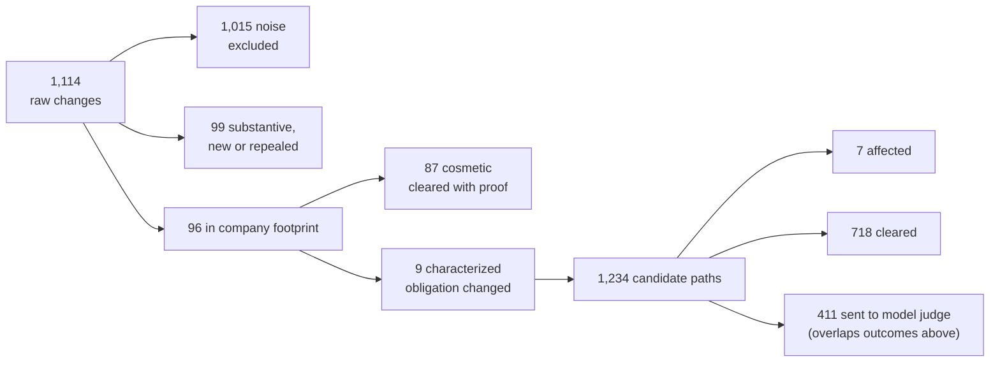

# Strata: Evaluation and Results

**Purpose:** how Strata's output is judged, the scale of the data it ran on, what the latest real run produced, and what those results do and do not show. Figures are as of 2026-10-08, measured on the live stores.

## TL;DR
- Evaluation rests on structural guarantees (verified quotes, a complete ledger, reproducible runs) plus a blind scorecard against a hidden answer key.
- The latest real-wave run filtered 1,114 raw changes down to 7 findings; 12 of 12 documents received the correct flagged or cleared status.
- The clause-level scorecard currently shows 0 matches. We suspect an export-format mismatch with the answer key and are investigating. We do not claim clause-level accuracy.
- The results show the pipeline completes and gets document-level status right. They do not yet show clause-level precision or recall.
## How the system is evaluated
| Mechanism | What it checks | Why this design |
|---|---|---|
| S1 baseline (no-change control) | Runs the engine on a snapshot pair with no inputs built. Expect 0 findings. | Cheap control that the pipeline completes and does not invent findings. See the caveat below. |
| Hidden answer key, aggregate-only scoring | Expected affected clauses are held out of the engine. Scoring reports aggregate counts only, never per-item hints. | Prevents tuning to the answer. Per-item feedback would invite overfitting. |
| Verified-quote rule | Every finding must quote text that exists verbatim in the source clause and the changed law. Unverifiable quotes are dropped. | A reviewer can check any finding in seconds. It rules out fabricated evidence by construction. |
| Ledger completeness | Every candidate path ends with a recorded outcome and reason: affected, cleared, or sent onward. | Silence is never an outcome. A cleared item is auditable, not just missing. |
| Reproducibility via cache | Model judgments are cached on their inputs. Re-running the same inputs gives the same outputs. | Results can be re-derived and diffed. Cost and latency fall on re-runs (see Speed). |
| Document-level correctness | Each company document is labeled flagged or cleared. The label is compared with the expected status. | Coarse but robust check that survives clause-level boundary and format differences. |

**Baseline caveat.** The S1 baseline builds no inputs. Its 0 findings therefore validate only that the pipeline completes end to end. They are not evidence of correct discrimination. Discrimination is tested by the real-wave run and the document-level check.
## Scale of the data
**Law knowledge base**
| Item | Value |
|---|---|
| Code sections | 4,603 (federal 330, Indiana 4,273); 1,109 repealed; 1,081 with a prior version |
| Regulatory actions | 1,206 (Federal Register 990, utility-commission investigations 138, general orders 42, rulemakings 19, environmental agency 17) |
| Searchable text chunks | 9,105 |
| Snapshots | 2 per code, about a year apart |
**Company corpus (12 documents)**
| Item | Value |
|---|---|
| Clauses | 2,334 (internal procedure 1,233, regulatory restatement 640, definition 221, template field 204, boilerplate 36) |
| Parameters / defined terms | 2,948 / 67 |
| Ingest quality gates | 12 of 12 passed (unclaimed text 3.0% against a 5% limit; 0 duplicate clause IDs) |
## Results: latest real-wave run

| Metric | Value |
|---|---|
| Change classes | cosmetic 1,004; substantive 63; new section 33; cross-reference only 10; repealed 3; punctuation 1 |
| Findings | 7: stale at approval 3, required content change 1, informational 3 (all quotes verified) |
| Documents | 2 flagged, 10 cleared (12 of 12 match the expected status) |
| Speed | Full run 136.6 s average, 33.4 s with a warm cache; what-if 15.5 s; baseline 3.6 s |

Noise filtering is the main effect: 91% of raw changes (1,015 of 1,114) never reach a model.
## What-if and radar
| Feature | Result |
|---|---|
| What-if | Runs a hypothetical change through the same engine in about 15.5 s. Used to test sensitivity without touching real findings. |
| Radar | 90 items screened for changes outside the company footprint: 20 yes, 17 unclear, 53 no. Unclear items are surfaced rather than forced to a verdict. |
## Scorecard status
- Clause-level matches against the answer key: **0**.
- Suspected cause: the export format does not line up with the key. Under investigation; not yet confirmed.
- Until resolved, a 0 means "unmeasured", not "all findings wrong" and not "none expected".
- Document-level status: **12 of 12 correct**.
## What the results do and do not show
| Show | Do not show |
|---|---|
| Pipeline completes on real data, repeatably | Clause-level precision or recall |
| Noise is removed aggressively (91%) with proof for cosmetic clears | That the 7 findings are the complete expected set |
| Every finding carries a verified quote | That the model judge is calibrated; its confidence is unmeasured |
| Document-level labels match on all 12 documents | Generalization beyond one company and one year of changes |
| The baseline completes without inventing findings | Discrimination from the baseline (it builds no inputs) |

Twelve documents is a small sample and the test is coarse. Known limits and next steps are in [Limitations and roadmap](LIMITATIONS_AND_ROADMAP.md). Design context is in [Engine spec](ENGINE_SPEC.md).
**Back to:** [README](../README.md)
