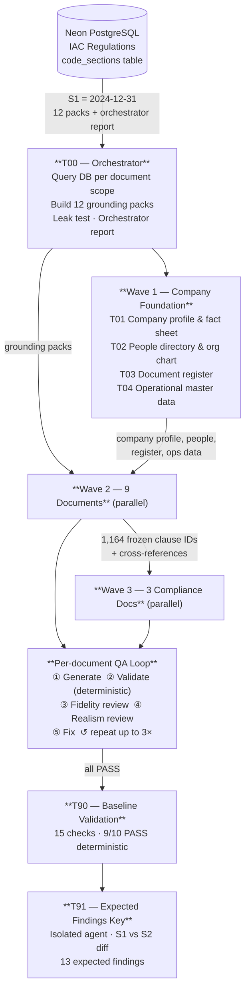
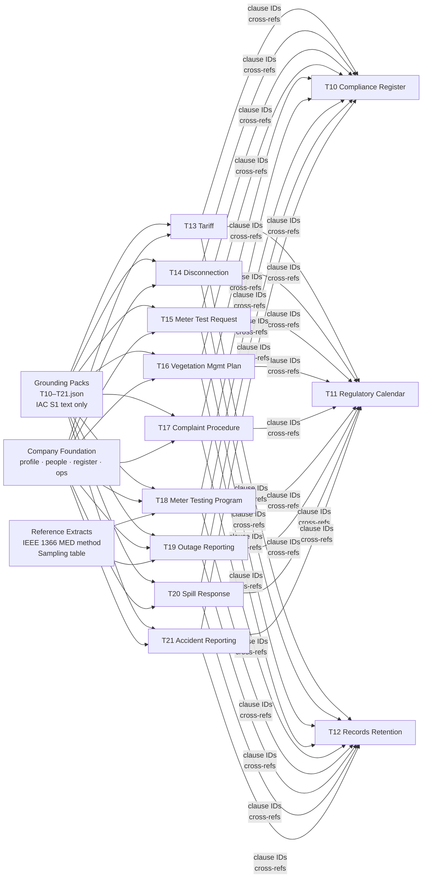
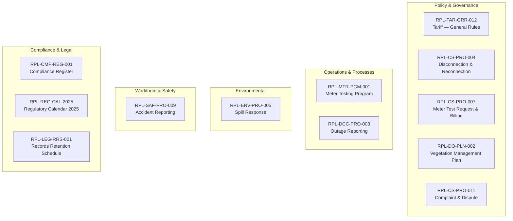
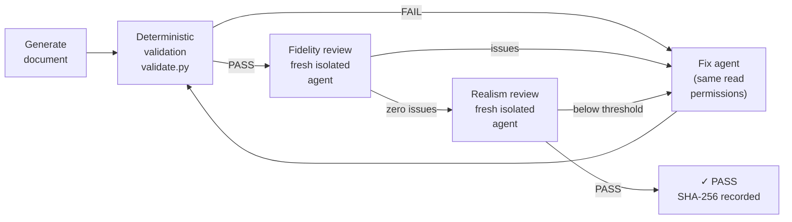
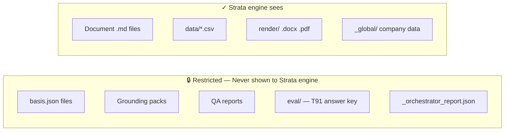

# RPL Synthetic Corpus — How It Was Generated

**Entity:** Rockridge Power & Light Company (RPL) · IURC ID 99012 · Indiana IOU  
**Law as-of:** 2024-12-31 (Snapshot 1) · Evaluated against: 2025-12-31 (Snapshot 2)

---

## Generation Pipeline



---

## Foundation Layer (Wave 1)

> Everything in Wave 2 is grounded in these four files — no document invents its own facts.

| Task | Output | Key Content |
|---|---|---|
| **T01** | `company_profile.yaml` · `company_fact_sheet.md` | Legal name, service territory, 14 counties, 5 service centers, financials |
| **T02** | `people_directory.csv` · `org_chart.md` | 27 named employees P01–P27 across 9 departments |
| **T03** | `document_register.csv` | 12 doc IDs, versions, owners, reviewers, approval dates |
| **T04** | 10 CSV/YAML files + scripts | 112 substations · 528 circuits · 10,928 outage events · 5-yr SAIDI history · TMED |

---

## Data Dependency — What Feeds What



> **T20 special case:** 327 IAC 2-6.1 absent from DB → entire document written as company practice (§2.7 fallback). No regulatory values cited.

---

## The 12 Documents — 5 Verticals



---

## Per-Document Output Structure

Every document produces **4 artifact types**, none of which overlap in purpose:

```
corpus/docs/<DOC_ID>/
├── <DOC_ID>_v<n>.md          ← canonical doc (clause IDs embedded as HTML comments)
├── <DOC_ID>.basis.json       ← hidden ground-truth: every value linked to its pack source
├── data/*.csv                ← machine-readable datasets (T16, T18, T19, T20, T21)
└── render/                   ← .docx + .pdf (+.xlsx for T16, T18)
```

> `basis.json` is **never** shown to the Strata engine. It is the answer key for QA validation.

---

## QA Loop (applied to every document)



**Validation checks include:** clause-ID grammar · value-ledger completeness · phantom-citation scan · banned-phrase scan · render parity · date ordering · §1 constants verbatim

---

## Corpus Metrics at a Glance

### Company (RPL)
| | |
|---|---|
| Customers | 407,491 (Residential 361,480 · Commercial 44,215 · Industrial 1,184) |
| Meters | 409,950 (AMI 371,200 · AMR 31,400 · Electromechanical 7,350) |
| Employees | ~1,450 · 27 named (P01–P27) |
| Service territory | 14 west-central Indiana counties · 5 service centers |
| Infrastructure | 112 substations · 528 circuits · 14,200 OH mi · 4,900 UG mi |

### Regulatory & Compliance
| | |
|---|---|
| Governing regulation | 170 IAC 4-1 · 4-9 · 16-1 · 1-6 (tariff filings) |
| Compliance obligations | 70 (RPL-CMP-REG-001) |
| Regulatory calendar events | 48 (RPL-REG-CAL-2025) |
| Record series | 86 (RPL-LEG-RRS-001) |
| S1→S2 changed citations | 5 (170 IAC 1-6-3/4/5 · 1-7-3 · 4-1-16) |

### Operational Data (T04)
| | |
|---|---|
| Outage events (2024) | 10,928 events · 2019–2023 daily SAIDI history |
| TMED (2.5β method) | 137.19 min/customer |
| ex-MED SAIFI / SAIDI / CAIDI | 1.099 / 138.3 / 125.9 min |
| MED days 2024 | 5 (Mar 15 · May 22 · Jul 4 · Aug 9 · Dec 23) |
| Vegetation mgmt budget | $41,600,000 |

### Corpus Structure
| | |
|---|---|
| Total documents | 12 (9 Wave 2 + 3 Wave 3) |
| Clause IDs (frozen) | 1,164 across all Wave 2 documents |
| Basis value ledger entries | ~443 total (every number in every doc traced to source) |
| Grounding packs | 12 (T10–T21.json; T20 empty — 327 IAC 2-6.1 absent) |
| Expected findings (T91) | 13 (6 medium · 7 informational · 2 docs flagged · 10 cleared) |

---

## Information Barriers



> Worker agents also operate under barriers: each sees only its own grounding pack, never another task's pack, the orchestrator report, or the eval folder.
