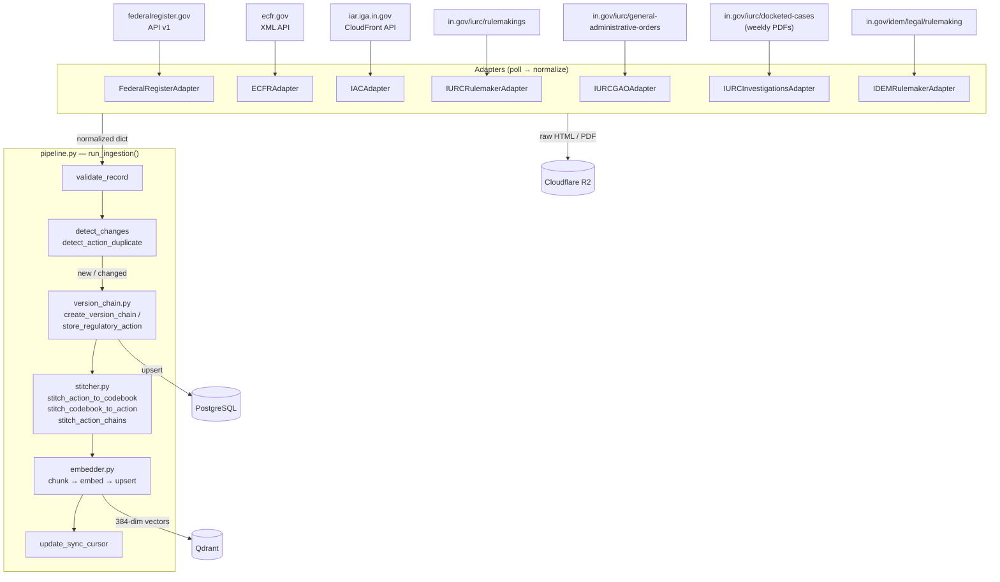
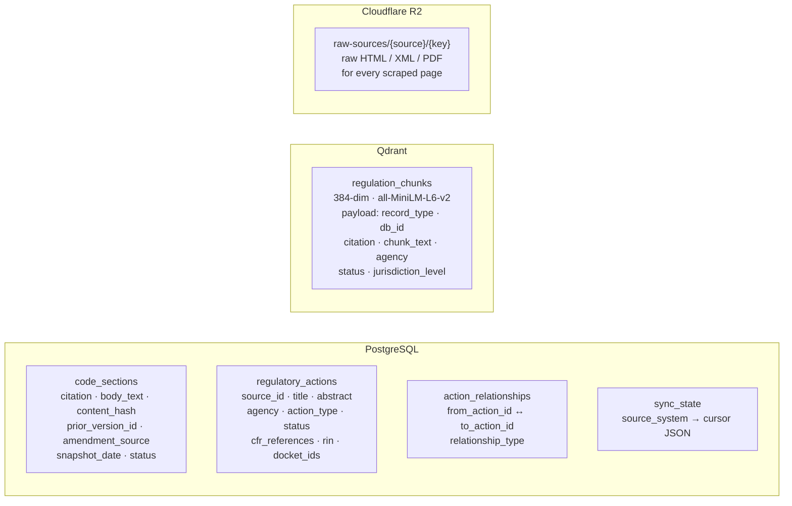
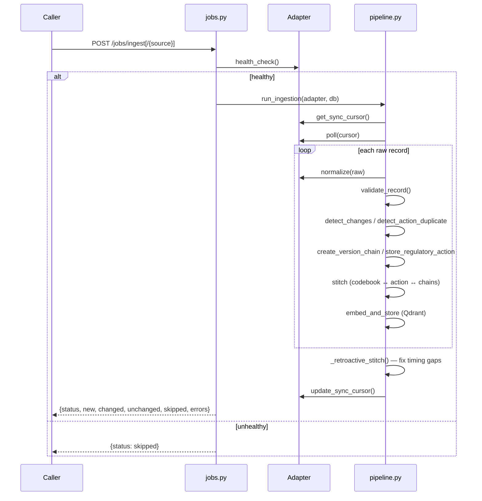
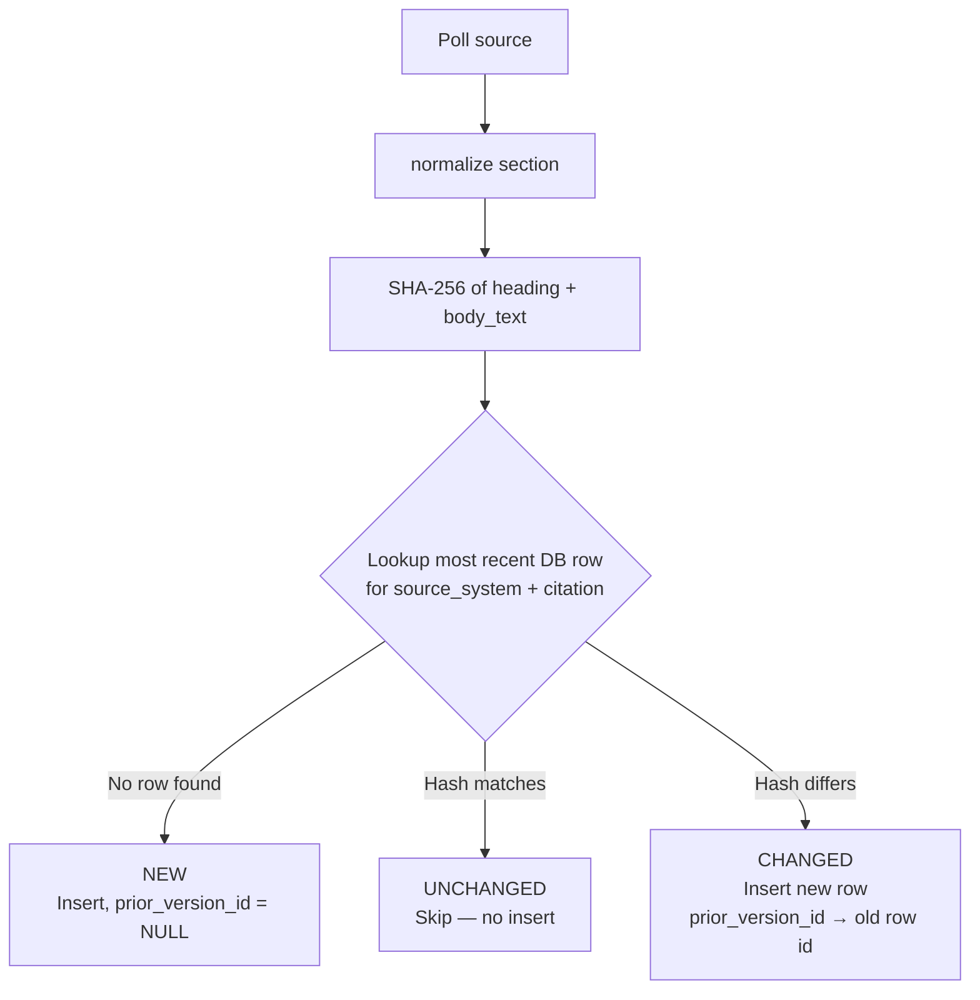

# Strata Regulatory Intelligence — Architecture

## Pipeline Overview



> **Trigger:** HTTP POST to `/jobs/ingest` (all sources) or `/jobs/ingest/{source_system}` (one source). Each adapter is health-checked before running; failures are skipped and logged.

---

## Data Sources

| Source Key | Agency | Type | URL | Adapter |
|---|---|---|---|---|
| `federal_register` | FERC, EPA | Rulemakings & Proposed Rules (JSON API) | `federalregister.gov/api/v1` | `FederalRegisterAdapter` |
| `ecfr` | FERC (Title 18), EPA (Title 40) | Codified CFR text (XML) | `ecfr.gov` | `ECFRAdapter` |
| `iac` | IURC (170), IDEM (326/327), Labor (610/675) | Indiana Admin Code (HTML/API) | `iar.iga.in.gov` | `IACAdapter` |
| `iurc_rulemakings` | IURC | Pending & effective rulemakings (HTML/PDF) | `in.gov/iurc/rulemakings/` | `IURCRulemakerAdapter` |
| `iurc_gaos` | IURC | General Administrative Orders (HTML/PDF) | `in.gov/iurc/general-administrative-orders/` | `IURCGAOAdapter` |
| `iurc_investigations` | IURC | Docket investigations (weekly PDF filings) | `in.gov/iurc/docketed-cases/` | `IURCInvestigationsAdapter` |
| `idem_rulemakings` | IDEM | Environmental Rules Board packets (HTML/PDF) | `in.gov/idem/legal/rulemaking/` | `IDEMRulemakerAdapter` |

---

## Storage Layers



| Store | What it holds | Why |
|---|---|---|
| **PostgreSQL `code_sections`** | Versioned snapshots of CFR / IAC text sections | Structured queries, version history, stitching lookups |
| **PostgreSQL `regulatory_actions`** | Federal Register rules, IURC/IDEM orders/investigations | Immutable action records, relationship graph |
| **PostgreSQL `action_relationships`** | Links between related actions (same RIN, docket chain) | Navigate rulemaking chains |
| **PostgreSQL `sync_state`** | Per-source cursor (last publication date, amendment date, etc.) | Incremental polling — only fetch what changed |
| **Qdrant `regulation_chunks`** | 384-dim vectors of chunked section/action text | Semantic search across all regulatory content |
| **Cloudflare R2** | Raw bytes of every fetched HTML/XML/PDF | Audit trail, re-parsing without re-scraping |

---

## Adapter Contract

Every adapter extends `SourceAdapter` and must implement:

```python
class SourceAdapter(ABC):
    source_system: str

    async def get_sync_cursor(self, db) -> dict:
        """Load last-pulled state from sync_state table."""

    async def poll(self, cursor: dict) -> list[dict]:
        """Fetch raw records from source since cursor. Returns raw dicts."""

    def normalize(self, raw: dict) -> dict | None:
        """Map raw record → CodeSection or RegulatoryAction dict. None = skip."""

    async def update_sync_cursor(self, db, new_cursor: dict) -> None:
        """Persist new cursor to sync_state after successful batch."""

    async def health_check(self) -> bool:
        """Return False to skip this source this run (default: True)."""
```

---

## Ingestion Trigger



---

## Versioning & Change Detection

Code sections (`cfr`, `iac`) are **versioned by snapshot**, not mutated in place.



Implementation: `app/regulatory/ingestion/change_detector.py → detect_changes()`

**Version chain** — singly-linked list, newest at head:

```
Phase 1 (2024-12-31)                     Phase 2 (2025-12-31)
┌─────────────────────────────┐          ┌─────────────────────────────┐
│ id=100  "170 IAC 4-1-6"     │ ◄─────── │ id=200  "170 IAC 4-1-6"     │
│ prior_version_id = NULL      │          │ prior_version_id = 100       │
│ content_hash = abc123        │          │ content_hash = def456        │
└─────────────────────────────┘          └─────────────────────────────┘
        (historical)                              (current)
```

| Change Type | Result |
|---|---|
| Body text changed | New row, `prior_version_id` linked |
| Heading changed | New row (heading included in hash) |
| Status → repealed | New row, `status='repealed'` |
| No change | Skipped — UNCHANGED |

**Current snapshots:** Phase 1 = 2024-12-31, Phase 2 = 2025-12-31 (~4,600 sections each)

---

## Diff API

Diffs are computed on-demand from the version chain. Base prefix: `/diff`  
Implementation: `app/api/regulatory/diff.py`

| Endpoint | Description |
|---|---|
| `GET /diff/{source}/{citation}/compare?date_a=…&date_b=…` | Unified diff between two snapshot dates |
| `GET /diff/{source}/{citation}` | Full version history with `diff_from_previous` per version |

Diff format: `+` = added in newer snapshot, `-` = removed. Empty string = no text change.

---

## eCFR vs IAC Change Detection

| Source | Signal | Behaviour |
|---|---|---|
| **eCFR** (federal) | `GET /api/versioner/v1/titles` → `latest_amended_on` | Skip title entirely if date hasn't advanced — no section-level requests |
| **IAC** (Indiana) | None | Every sync scrapes all sections, hashes, and compares — no shortcut |
