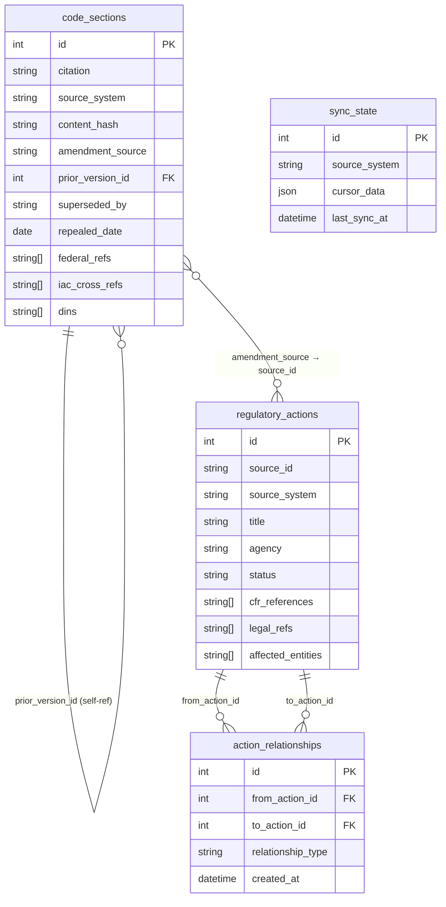

# Strata — Data Schemas Reference

Four tables store all regulatory intelligence. This document shows their fields and relationships.

---

## 1. Entity Relationship Diagram

---

## 2. `code_sections`

Stores individual regulatory code sections (e.g. IAC sections). Each row is one version of one section.

### Identity

| Field | Type | Nullable | Description |
|---|---|---|---|
| id | integer | No | Primary key |
| ★ citation | varchar | No | Human-readable unique identifier, e.g. `170 IAC 4-1-6` |
| source_system | varchar | No | Ingestion source, e.g. `cfr` |
| jurisdiction_level | varchar | No | `federal`, `state`, `local`, `international` |
| jurisdiction_geo | varchar | Yes | State or region code |

### Content

| Field | Type | Nullable | Description |
|---|---|---|---|
| heading | varchar | No | Section title |
| body_text | text | No | Full section text |
| ★ content_hash | varchar(64) | No | SHA-256 of body text; used to detect changes between snapshots |
| owning_agency | varchar | No | Agency responsible for the section |
| status | varchar | No | `in_progress`, `approved`, `blocked_suspended` |

### Versioning

| Field | Type | Nullable | Description |
|---|---|---|---|
| snapshot_date | date | No | Date this version was captured |
| effective_date | date | Yes | Date the rule took effect |
| ★ prior_version_id | integer (FK → code_sections.id) | Yes | Points to the previous version of this section; forms a version chain |
| superseded_by | varchar | Yes | Citation of the section that replaced this one |
| repealed_date | date | Yes | Date of repeal, if applicable |

### Cross-references

| Field | Type | Nullable | Description |
|---|---|---|---|
| ★ amendment_source | varchar | Yes | Links to `regulatory_actions.source_id`; the action that created/amended this section |
| ★ federal_refs | varchar[] | Yes | CFR citations extracted from body text |
| ★ iac_cross_refs | varchar[] | Yes | Other IAC section citations extracted from body text |
| ★ dins | varchar[] | Yes | Document Identification Numbers found in body text |

### Metadata

| Field | Type | Nullable | Description |
|---|---|---|---|
| title_number | varchar | Yes | Regulatory title number |
| part | varchar | Yes | Part within the title |
| section_number | varchar | Yes | Section number within the part |
| subpart | varchar | Yes | Subpart designation |
| source_url | varchar | Yes | URL to the original source document |
| ingested_at | datetime | No | Timestamp when the row was inserted |

**Unique constraint:** `(source_system, citation, snapshot_date)`

---

## 3. `regulatory_actions`

Stores regulatory actions from sources like the Federal Register (proposed rules, final rules, notices, etc.).

### Identity

| Field | Type | Nullable | Description |
|---|---|---|---|
| id | integer | No | Primary key |
| ★ source_id | varchar | No | ID from the originating source, e.g. Federal Register document number |
| ★ source_system | varchar | No | Source name, e.g. `federal_register` |
| action_type | varchar | No | Type of action: `rule`, `proposed_rule`, `notice`, etc. |
| source_type | varchar | Yes | Sub-classification from the source |

### Content

| Field | Type | Nullable | Description |
|---|---|---|---|
| title | varchar | No | Action title |
| abstract | text | Yes | Summary text |
| action_text | varchar | Yes | Short action description |
| agency | varchar | No | Issuing agency |
| status | varchar | No | Processing/publication status |

### Dates

| Field | Type | Nullable | Description |
|---|---|---|---|
| date_published | date | Yes | Publication date |
| date_effective | date | Yes | Effective date of the rule |
| date_comment_close | date | Yes | Comment period close date |
| date_filed | date | Yes | Date filed with the Federal Register |

### References

| Field | Type | Nullable | Description |
|---|---|---|---|
| ★ cfr_references | varchar[] | Yes | CFR sections this action affects; used by the stitcher to link actions to code sections |
| ★ legal_refs | varchar[] | Yes | Statutory authority citations; used by the stitcher |
| ★ affected_entities | varchar[] | Yes | Organizations or entity types affected |
| docket_ids | varchar[] | Yes | Associated docket identifiers |
| rin | varchar | Yes | Regulatory Information Number |
| related_actions | json | Yes | Freeform map of related action references from the source |

### Status / Audit

| Field | Type | Nullable | Description |
|---|---|---|---|
| source_url | varchar | No | Link to the action on the source site |
| full_text_url | varchar | Yes | Direct link to full text PDF or HTML |
| ingested_at | datetime | No | Timestamp when the row was inserted |
| adapter_version | varchar | No | Version of the ingestion adapter that created this row (default `1.0`) |

**Unique constraint:** `(source_system, source_id)`

---

## 4. `action_relationships`

Junction table linking pairs of regulatory actions to describe how one action relates to another.

| Field | Type | Nullable | Description |
|---|---|---|---|
| id | integer | No | Primary key |
| ★ from_action_id | integer (FK → regulatory_actions.id) | No | The acting/source action |
| ★ to_action_id | integer (FK → regulatory_actions.id) | No | The acted-upon/target action |
| ★ relationship_type | varchar | No | See values below |
| created_at | datetime | No | Row creation timestamp |

**`relationship_type` values:** `amends`, `corrects`, `supersedes`, `withdraws`, `extends`, `responds_to`, `implements`, `related_to`, `redesignated_as`, `split_from`, `merged_into`

**Unique constraint:** `(from_action_id, to_action_id, relationship_type)`

---

## 5. `sync_state`

One row per source system. Persists the cursor so incremental ingestion jobs can resume where they left off.

| Field | Type | Nullable | Description |
|---|---|---|---|
| id | integer | No | Primary key |
| ★ source_system | varchar | No | Source identifier, e.g. `federal_register`; unique per system |
| cursor_data | json | Yes | Opaque cursor blob (page token, date offset, etc.) set by each adapter |
| last_sync_at | datetime | Yes | Timestamp of the most recent successful sync |

---

## 6. Key Linking Fields

| From | Field | To | Purpose |
|---|---|---|---|
| `code_sections` | `amendment_source` | `regulatory_actions.source_id` | Ties a code section to the action that created or last amended it |
| `code_sections` | `prior_version_id` | `code_sections.id` | Version chain: follow this FK to walk back through history |
| `code_sections` | `federal_refs[]` | `regulatory_actions.cfr_references[]` | Array overlap used by the stitcher to associate actions with sections |
| `action_relationships` | `from_action_id` | `regulatory_actions.id` | Source side of an inter-action relationship |
| `action_relationships` | `to_action_id` | `regulatory_actions.id` | Target side of an inter-action relationship |
| `sync_state` | `source_system` | *(adapter config)* | Resume key for incremental ingestion cursors |
