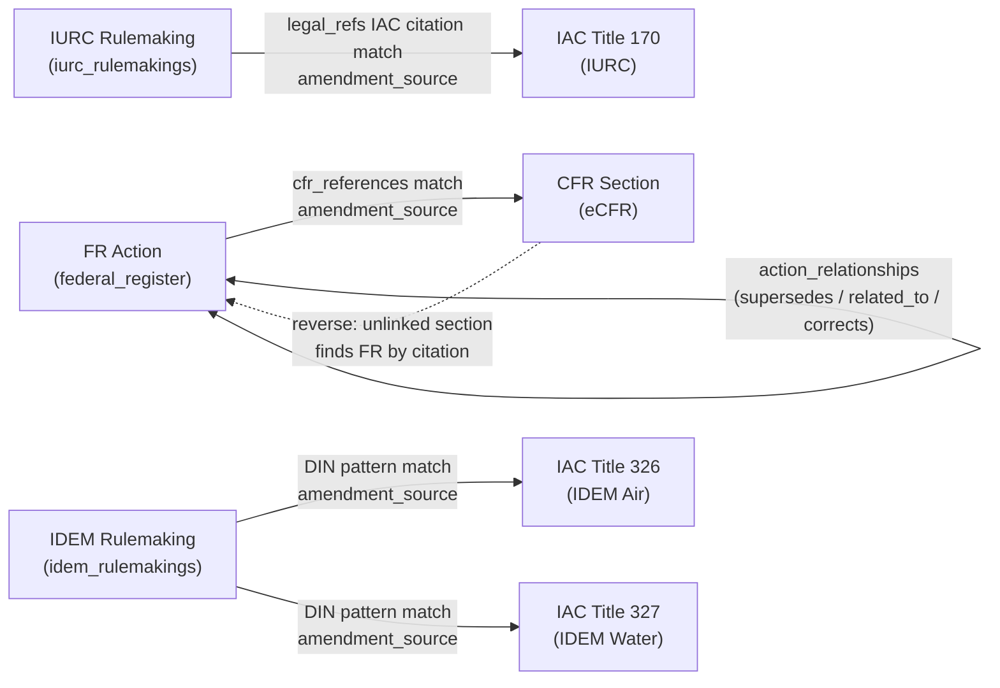

# Strata Stitching Reference

**What is stitching?**
Stitching creates persistent links between regulatory actions (rulemakings, final rules) and the code sections they amend. Once stitched, Strata can answer: "What FR rulemaking last amended this CFR section?" or "Which IDEM rulemakings touch this IAC section?" Links are stored in two places:

- `code_sections.amendment_source` — the `source_id` of the action that most recently amended the section
- `action_relationships` table — action-to-action links (supersedes, related_to, corrects)

---

## Overview: All Stitch Types



---

## Stitch Types Reference

| # | Name | From | To | Match Field | Date Guard | Coverage |
|---|------|------|----|-------------|------------|----------|
| 1 | FR → CFR | FR action (`final_rule` etc.) | CFR section | `cfr_references[]` vs `citation` | action ≤ snapshot + 365 days | 160/330 (48.5%) |
| 2 | CFR → FR (reverse) | Unlinked CFR section | FR action | `citation` vs `cfr_references[]` (exact then part-prefix) | Either date None, or within 30 days | Fills gaps from pass 1 |
| 3 | IAC ← IURC | IURC rulemaking | IAC Title 170 section | `legal_refs[]` IAC citation vs `citation` | `date_published` ≤ `snapshot_date` | 539/647 (83%) |
| 4 | IAC ← IDEM (DIN) | IDEM rulemaking | IAC Title 326/327 section | LSA-derived DIN fragment vs `dins[]` | `date_published` ≤ `snapshot_date` | 909/1440 T326 (63%), 499/632 T327 (79%) |
| 5 | FR ↔ FR | FR action | FR action | RIN, docket_ids, `related_actions[]` | None | 257 supersedes, 579 related_to, 7 corrects |

---

## Stitch Type 1 & 2: FR ↔ CFR

**Forward (Pass 1):** When a final rule is ingested, its `cfr_references` list (e.g. `["40 CFR 60.5580a"]`) is matched against CFR code sections by exact citation, then by part-level prefix if no exact match. Sections already linked are skipped.

**Reverse (Pass 2):** For CFR sections still unlinked after Pass 1, the stitcher queries FR actions whose `cfr_references` contain the section's citation (exact, then part-prefix fallback). The most recent date-aligned action wins.

**Date guard logic (`_dates_align`):**
- Both dates None → skip (no information)
- One date None → link (eCFR publication lag is common)
- Otherwise: `action_date` must be at most 365 days before `section.effective_date` (with a 7-day forward tolerance for eCFR capture lag)

---

## Stitch Type 3: IURC → IAC Title 170

IURC rulemakings carry `legal_refs` listing explicit IAC citations like `"170 IAC 4-1-6"`. The stitcher matches these against IAC code sections using a dash-prefix strategy:

```
legal_refs: ["170 IAC 4-1-6"]
  → CodeSection citation LIKE "170 IAC 4-1-6-%"
  → or citation == "170 IAC 4-1-6"
```

All matched sections with no existing `amendment_source` and a snapshot date on or after the rulemaking publish date are linked.

---

## Stitch Type 4: IDEM → IAC via DIN (Deep Dive)

This is Strata's most distinctive stitching method. IDEM rulemakings do **not** carry explicit IAC section citations. Instead, each IAC section's `body_text` footer records the DINs (Document Identification Numbers) of every rulemaking that has ever touched it.

**DIN Format:**
```
YYYYMMDD-IR-{TITLE3D}{YEAR2D}{LSA4D}{TYPE}
e.g.  20230809-IR-326230809EAA
       │        │  ├──┤├┤├──┤
       date     │  326 23 0809 = Title 326, LSA-23-809
                IR = Indiana Register
```

**Extraction and matching process:**

```mermaid
sequenceDiagram
    participant LSA as IDEM Rulemaking<br/>source_id: LSA-23-809
    participant EX as Extractor
    participant DB as IAC code_sections
    participant LINK as amendment_source

    LSA->>EX: abstract: "Title 326 ..."<br/>source_id: "LSA-23-809"
    EX->>EX: extract title=326 from abstract
    EX->>EX: extract year=23, lsa_num=809 from source_id
    EX->>EX: build din_fragment = "326230809"
    EX->>DB: SELECT where title_number='326'<br/>AND dins[] LIKE '%-IR-326230809%'<br/>AND amendment_source IS NULL
    DB-->>EX: sections: [326 IAC 2-3-5, 326 IAC 7-1-2, ...]
    EX->>EX: date guard: date_published ≤ snapshot_date
    EX->>LINK: set amendment_source = "LSA-23-809"
```

**Why this works:** Indiana embeds the originating LSA number directly inside every DIN stored on the code section. The 9-character fragment (`326230809`) is unique per rulemaking, so matches are precise — no topic inference required.

**DIN stitching impact:**

| Title | Before | After | New links |
|-------|--------|-------|-----------|
| 326 (IDEM Air) | 0% | 63.1% (909/1,440) | +909 |
| 327 (IDEM Water) | 0% | 79.0% (499/632) | +499 |
| **Total** | | | **+1,408** |

---

## Stitch Type 5: FR ↔ FR Action Relationships

The stitcher creates `action_relationships` rows linking FR actions to each other. Three discovery methods:

1. **RIN-based** — actions sharing a Regulatory Identification Number are related (e.g. a proposed rule and its final rule share a RIN)
2. **Docket-based** — actions sharing a docket ID get `related_to` links
3. **Explicit** — FR adapter provides a `related_actions[]` list with typed links

Relationship types inferred from action_type pairs:

| From type | To type | Inferred relationship |
|-----------|---------|----------------------|
| proposed_rule | final_rule | supersedes |
| final_rule | correction | corrects |
| final_rule | withdrawal | withdraws |
| order | responds_to | responds_to |
| any other | any other | related_to |

Current counts: 257 supersedes, 579 related_to, 7 corrects (all FR↔FR).

---

## What Stitching Enables

- **Amendment tracing:** Given any CFR or IAC section, immediately retrieve the rulemaking that created it — including its preamble, legal basis, and comment period history.
- **Impact analysis:** Given a pending rulemaking, find all code sections it will amend and surface the last action to touch each one, enabling side-by-side comparison.
- **Regulatory genealogy:** Follow the `supersedes` chain backwards from a final rule through its proposed rule to the original docket, or forwards to any corrections filed after publication.

---

## Current Limitations

| Gap | Affected data | Root cause |
|-----|---------------|------------|
| CFR sections unlinked (51.5%) | ~170 sections across 40 CFR 72/73 and others | FR actions for those parts not yet ingested; or FR action post-dates the eCFR snapshot |
| IAC Titles 610 and 675 at 0% | ~N sections | No IURC or IDEM rulemakings for those titles in the DB — adapter coverage gap, not a stitcher bug |
| No FR↔state cross-links | All IURC/IDEM ↔ FR pairs | IURC refs are 170 IAC only; IDEM has no CFR refs; FR Indiana SIP approvals reference IAC by article only (no LSA numbers). Cross-links would require topic-similarity heuristics |
| action_relationships state-only | IURC/IDEM rulemakings | No RIN or docket overlap between state and federal systems |

---

*Source: `app/regulatory/ingestion/stitcher.py`*
