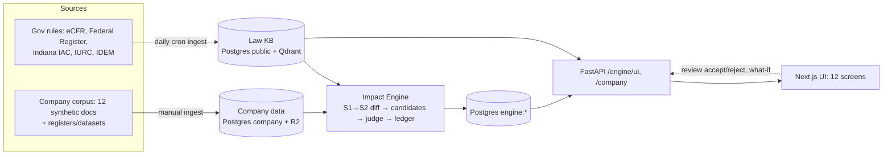
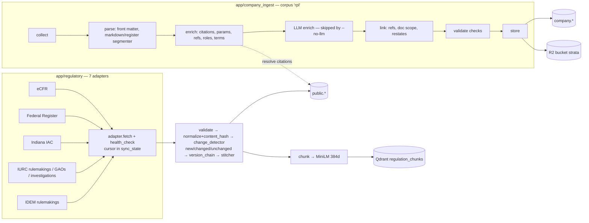
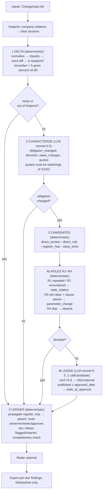
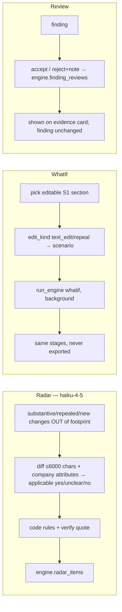
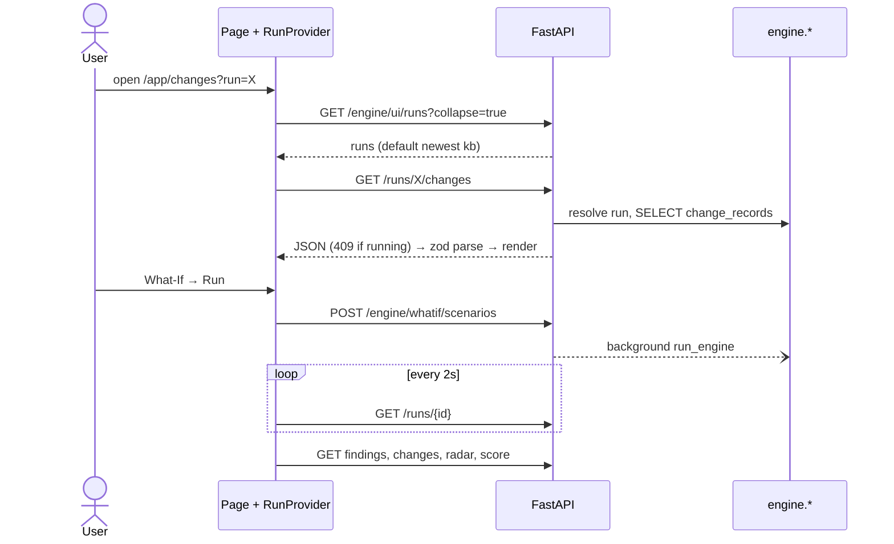

# Strata — Application Layer (single source of truth)

_Verified against code + live Neon/Qdrant/R2 on 2026-10-07/08. Counts are a snapshot; re-query to refresh._

## 1. What it does (one paragraph)
When government rules change between snapshot **S1** (IAC 2024-12-31 / CFR 2025-01-02) and **S2** (IAC 2025-12-31 / CFR 2026-10-02), Strata shows a company **which clauses in which documents** are affected, **why** (verified quotes from both rule versions + the clause), **what must change**, and **who must act**. It **flags only — never edits** company documents. Demo company: synthetic Rockridge Power & Light (RPL, `company_id='rpl'`), 12 documents, all compliant with S1. S2 is write-on-change: a section absent from S2 is *unchanged*, never repealed. No SEC/EDGAR source exists.

## 2. Big picture

| Layer | Tech | Location |
|---|---|---|
| Frontend | Next.js 15, react-query, zod, nuqs | `frontend/` |
| API | FastAPI, async SQLAlchemy, no auth | `backend/app/api`, `main.py` |
| Engine | Python, Anthropic LLM | `backend/app/engine` |
| Ingestion | adapters / company_ingest | `backend/app/regulatory`, `company_ingest` |
| Storage | Neon Postgres, Qdrant Cloud (384d MiniLM), Cloudflare R2 | `app/db.py`, `app/services` |
| Deploy | Render web + daily cron; `alembic upgrade head` on start | `backend/render.yaml` |

## 3. Data layer

**Triggers:** `POST /jobs/ingest` (all 7 adapters, failures isolated) ← Render cron `0 6 * * *`. Company ingest manual: `python -m app.company_ingest.cli.ingest [--no-llm --no-datasets --rebuild --dry-run]`. Engine: `POST /engine/runs` or `scripts/run_engine.py`, `score_run.py`, `run_radar.py`.

**Live tables**
| Table | Purpose | Rows |
|---|---|---|
| public.code_sections | versioned CFR/IAC sections | 4,603 |
| public.regulatory_actions | FR rules, IURC/IDEM rulemakings, GAOs, investigations | 1,206 |
| public.action_relationships | supersedes 257 / related_to 579 / corrects 7 | 843 |
| public.agencies / sync_state | ferc, epa, iurc, idem, idol, ifpbsc / per-adapter cursor | 6 / 7 |
| company.clauses | atomic clauses | 2,334 |
| company.clause_parameters / defined_terms / term_usages | extracted numbers, glossary | 2,948 / 67 / 693 |
| company.clause_citations / clause_links / document_scope | clause→rule, clause↔clause, doc×section | 1,550 / 4,675 / 285 |
| company.company_documents / people / attributes | 12 docs (all Approved) / org chart / facts | 12 / 27 / 22 |
| company.datasets, parameter_checks, llm_extractions | never run (`--no-llm --no-datasets`) | 0 |
| engine.runs / candidates / change_records | | 24 / 6,991 / 5,587 |
| engine.findings / doc_rollups / radar_items | | 1,240 / 252 / 354 |
| engine.llm_calls / score_reports / whatif_scenarios / finding_reviews | | 1,606 / 5 / 4 / 0 |
| Qdrant `regulation_chunks` | 7,898 code_section + 1,207 action points | 9,105 |
| Qdrant `company_clauses` | defined in code, **absent live (404)** | — |
| R2 `strata` | company/rpl/*, engine run artifacts | 2,769 obj, ~222 MB |

**Law KB metrics**
| code_sections | approved | repealed | | actions by source | n |
|---|---|---|---|---|---|
| idem Air / Water (IAC) | 1,153 / 558 | 287 / 74 | | FR epa (451 final, 433 proposed, 64 other) | 948 |
| ifpbsc (IAC) | 781 | 604 | | FR ferc | 42 |
| iurc (IAC) | 582 | 65 | | iurc investigations / GAOs / rulemakings | 138 / 42 / 19 |
| idol (IAC) | 90 | 79 | | idem rulemakings | 17 |
| epa / ferc (CFR) | 267 / 63 | — | | | |

Coverage: 1,081 sections with prior version, 1,109 repealed, 9 empty bodies. Citations: resolved 1,284 + resolved_rule 73; not_in_kb 60; not_monitored 78; out_of_scope_title 21; external 34; 75 distinct sections cited. Links: restates 3,048; references 1,627. Clause kinds: other 1,047, appendix 352, procedure 231, definitions 222, roles 110, regulatory_basis 109, records 109. Alembic head `e5a1c7d9b304`.

## 4. Engine (the "magic")
`run_engine(kind)`; kind = `kb` (S1 vs S2) | `baseline` (S1 vs S1, must yield 0 real findings) | `whatif` (one edited section). Orchestrator `engine/run.py`.

Guardrails: unverified quotes never stand as a finding (downgraded to informational); LLM calls cached by sha256(stage,model,prompt) in `engine.llm_calls` (hits free, don't count to cap); per-run call cap **900 kb / 300 whatif**; concurrency 8 (radar 16). Rule decisions execute inside the judge stage first, LLM only for the remainder.


**Vocabulary**
| Item | Values |
|---|---|
| Change classes | repealed, renumbered, new_section, substantive; noise = cosmetic, metadata_only, punctuation_only, cross_ref_only |
| Dispositions | findings_emitted, no_affected_clauses, excluded_noise, not_in_footprint, needs_review |
| Finding types | parameter_change, required_content_change, conflict, stale_citation, new_requirement_gap, stale_at_approval (code-assigned), informational |
| Directions | tightened, relaxed, new_requirement, removed_requirement, clarified, style_only, mixed |
| Verdicts | action_required, optional_relaxed, update_citation, review/info |
| Severity | stale_citation & informational = low; R3 = high; else LLM |
| Schemas | `Characterization`, `JudgeResult{affected,finding_type,severity,required_change,quotes,rationale,confidence}`, `RadarResult` |
| Config | `ENGINE_*` env: models, MIN_CONFIDENCE 0.6, RENUMBER_JACCARD 0.80, JUDGE_MAX_SECTION_CHARS 8000, JUDGE_WINDOW_CHARS 1500, MAX_LLM_CALLS_* |

**Live engine metrics**
| Metric | Value |
|---|---|
| Runs | 24: 5 kb, 2 baseline, 16 whatif done, 1 whatif failed |
| Avg duration | kb 136.6 s · whatif 15.5 s · baseline 3.6 s |
| Latest KB run (`05b50712`) | 33.4 s, 0 fresh LLM calls (cache) |
| Changes (1,114) | cosmetic 1004, substantive 63, new_section 33, cross_ref_only 10, repealed 3, punct 1 |
| Funnel | in footprint 9 substantive + 87 cosmetic → 9 characterized → 1,234 candidates (865 direct_section, 77 direct_rule, 292 register_hop) → 7 affected, 718 cleared, 411 judged by LLM |
| Findings (latest KB) | 7: stale_at_approval 3, required_content_change 1, informational 3 — all quotes verified |
| Documents | 12: 2 flagged, 10 cleared |
| Radar | 90: yes 20, unclear 17, no 53 |
| All-time findings | 1,240: informational 901, stale_citation 186, parameter_change 139, stale_at_approval 10, required_content_change 4 |
| LLM calls logged | judge 1,492 (avg 831 ms), radar 99 (avg 25.5 s), characterize 15 (avg 2.3 s) |
| Not stored | token counts and cost; reviews 0 rows |

## 5. API → UI
```mermaid
flowchart LR
  B[Browser] --> N[Next.js app/app/**] --> RC[RunProvider ?run=] --> Q[react-query queries.ts] --> C{client.ts<br/>NEXT_PUBLIC_STRATA_DATA}
  C -- mock --> M[lib/api/mock fixtures]
  C -- http --> F[FastAPI]
  F --> U1[/engine/ui/*] & U2[/engine/* whatif radar reviews] & U3[/company/*] & U4[/actions, /regulations…]
  U1 & U2 & U3 & U4 --> PG[(Postgres)]
  U2 -. BackgroundTask .-> E[run_engine → Anthropic]
```
One global switch: `http` = all pages live, unset/`mock` = fixtures with fake latency. Runs still running return **409**; UI polls `GET /runs/{id}` every 2 s. Default run = newest succeeded `kb` run.

| Screen (route) | Endpoints (`/engine/ui` unless noted; `{r}`=`/runs/{rid}`) | Behind the scenes |
|---|---|---|
| Run selector | `/runs?collapse=true`, `/runs/{rid}` | lists `engine.runs`; poll if running |
| Overview `/app` | `{r}/score,/rollups,/findings`, `/company/documents` | KPIs: changes→noise→real→findings→flagged vs cleared docs |
| Changes `/changes[/id]` | `{r}/changes[/id],/candidates,/findings`, `/kb/agencies` | classified change records + clauses reaching each via 4 paths |
| Findings `/findings/[id]` | `/findings/{id}`; `POST /engine/findings/{id}/reviews` | evidence card (verified quotes, verdict, route); review |
| Company `/company` | `/company/profile,/people,/documents` | attributes, org, doc inventory |
| Documents `/documents[/id]` | `/company/documents[/id/clauses]`, `{r}/rollups`, `{r}/documents/{id}/annotations` | status board by vertical; per-clause verdicts |
| Matrix `/matrix` | `{r}/matrix` | docs × changes verdict grid |
| Radar `/radar` | `{r}/radar` | applicability of out-of-footprint changes |
| Regulations `/regulations[/agency\|sections\|actions]` | `/kb/agencies,/kb/sections[/ss/cit[/versions]]`; `GET /actions[/ss/id]` | KB browse; line diff computed **client-side** |
| Trust `/trust` | `/runs`, `{r}/score` | precision/recall, baseline, routing scorecard |
| What-If `/what-if[/id]` | `/scenarios`, `/whatif/sections`, `POST /engine/whatif/scenarios[/id/run]`, `/runs/{rid}` | edit/repeal → engine on edited text → poll → results; presets reuse `last_run_id`; custom runs need `NEXT_PUBLIC_STRATA_ALLOW_CUSTOM_WHATIF=1` |
| Global search | `/kb/sections?search=` + client index | no `/search` API used |

Unused by UI but live: `/regulations`, `/diff`, `/timeline`, `/impact`, `/search`, `/jobs`, older `/engine/*` reads (`/runs/{id}/documents,/ledger,/scorecard`, `/findings/{id}`).


Other facts: **no auth**, CORS via `ENGINE_CORS_ORIGINS`. Env: backend `DATABASE_URL, QDRANT_URL/API_KEY, R2_*, LLM_*, EMBED_*, ENGINE_*`; frontend `NEXT_PUBLIC_STRATA_DATA, _API_URL, _ALLOW_CUSTOM_WHATIF`. Tests: pytest `backend/tests/{api_company,company_ingest,engine}`; vitest `frontend/tests/unit`; Playwright config present.

## 6. Known gaps (as of snapshot)
- Cost/tokens not stored; `finding_reviews` empty; `company_clauses` Qdrant collection missing; company LLM/dataset stages never run.
- Per PRD (not re-verified live): CFR citations are unresolved at section level so CFR changes go to radar; no definition-ripple path.
- `development_docs` PRD figures were measured earlier; this doc reflects live DB.
- UI routers, company routes, and many frontend files were uncommitted at investigation time.
